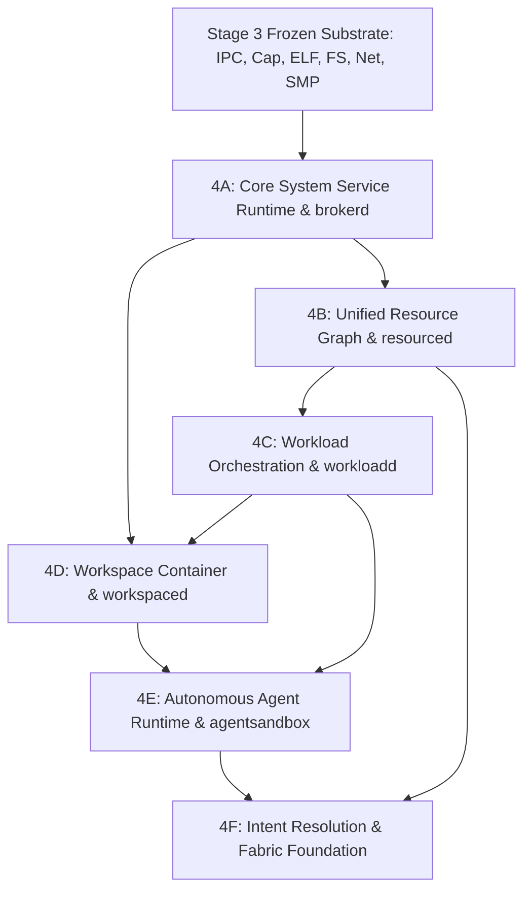

# STAGE 4 ARCHITECTURE SPECIFICATION (REV 1)

## System Architecture, Semantic Substrate, and Dependency Audit

**Status:** 🟡 PROPOSED (Rev1) — AWAITING ADVERSARIAL ARCHITECTURAL REVIEW  
**Author:** ZeroOS Architecture Team  
**Date:** 2026-09-18  
**Target Milestone:** Stage 4 (Semantic Substrate & System Services)  

---

## 1. Executive Summary

Project Zero has concluded **Stage 3** (Stages 3A through 3N), delivering an authoritative, deterministic, mechanically verified, bare-metal capability microkernel operating in 64-bit Long Mode across multiple processor cores (SMP). The kernel provides low-level execution primitives: threads, priority scheduling, preemption, synchronization primitives, memory-isolated processes, synchronous and shared-memory IPC, an unforgeable capability delegation/revocation tree, Ring 3 fast syscalls, native ELF64 execution, an atomically crash-consistent persistent filesystem (ZeroFS), a strongly typed device/MMIO/DMA model, and an RFC 793 compliant network stack.

However, a profound architectural gap exists between this bare-metal kernel foundation and the foundational thesis of ZeroOS:
> *People do not want another AI chatbot or application switcher. They want a computer that understands what they are doing, remembers the context of their work, and can continue working without them constantly managing applications.*

Stage 3 answered the question: **How does the machine safely execute code, isolate memory, and transfer authority?**  
Stage 4 answers the question: **How does the operating system organize human intent, manage persistent context, orchestrate multi-process workloads, govern autonomous agents, and pool heterogeneous resources without compromising capability security or kernel determinism?**

This document establishes the authoritative architectural blueprint for **Stage 4: The Semantic Substrate & System Services Layer**. It defines the strict boundary separating the frozen Stage 3 kernel from user-space services, formalizes the models for **Resources**, **Workloads**, **Workspaces**, **Agents**, and **Intent**, establishes a comprehensive dependency graph, and outlines an incremental, mathematically grounded progression of sub-stages for Stage 4 implementation.

---

## 2. Stage 3 → Stage 4 Boundary

### 2.1 The Frozen Stage 3 Substrate
Stage 3 is formally **COMPLETE, VERIFIED, COMMITTED, and FROZEN**. The following milestone boundaries are permanent and authoritative:

```text
+-------------------------------------------------------------------------+
|                  STAGE 3: NATIVE OS KERNEL SUBSTRATE                    |
|                                                                         |
|  3A: Threads                 3B: Core Scheduler   3C: Preemption        |
|  3D: Synchronization Prims   3E: Thread Lifecycle 3F: Processes         |
|  3G: IPC Channels & SHM      3H: Capabilities     3I: Ring 3 Syscalls   |
|  3J: User Memory & ELF       3K: Storage & ZeroFS 3L: Device/DMA Model  |
|  3M: Network Stack & Sockets 3N: SMP / Multi-Core Bootstrap & IPI       |
+-------------------------------------------------------------------------+
```

### 2.2 Boundary Invariants
1. **No Kernel Re-opening**: No sub-stages such as `3O` or `3P` shall be created.
2. **Frozen Data Structures & ABIs**:
   - `Process` struct: exactly 128 bytes.
   - `KernelThread` struct: exactly 176 bytes.
   - `PerCpu` struct: exactly 48 bytes.
   - `HandleTable` struct: exactly 520 bytes (32 slots × 16 bytes + 8 bytes metadata).
   - `CapabilityNode` struct: exactly 24 bytes (intrusive tree node).
   - `KernelObjectSlot` struct: exactly 40 bytes.
   - `SyscallFrame` struct: exactly 144 bytes.
3. **Zero Dynamic Kernel Heap**: The kernel possesses no dynamic heap allocator. All kernel data structures reside in fixed, static `.bss` allocations verified to fit strictly within the 4 MiB kernel bootstrap window (`__kernel_end <= 0xFFFFFFFF80400000`).
4. **Frozen 13-Level Monotonic Lock Hierarchy**:
   $$\text{BLOCK\_DEV (1)} < \text{FILE\_MGR (2)} < \text{DEV\_REG (3)} < \text{DMA\_TRK (4)} < \text{IRQ (5)} < \text{NET (6)} < \text{IPC (7)} < \text{CAP\_TREE (8)} < \text{PROC\_TBL (9)} < \text{SCHED (10)} < \text{TLB (10.5)} < \text{ASPACE (11)} < \text{PROC (12)} < \text{CPU IF=0 (13)}$$
5. **Architectural Transition**: Stage 4 introduces a new architectural tier residing primarily in **Ring 3 User Space** and structured as unprivileged or supervisor system services. The kernel remains a lean, capability-verifying nucleus.

---

## 3. The ZeroOS Thesis & The North Star

### 3.1 The Fundamental Problem of Traditional Computing
Traditional operating systems (POSIX, Windows NT) force the human user to act as an ambient, manual application router:
1. The user must manually decompose an intent ("Prepare financial projection for Project X") into isolated application invocations (open spreadsheet, open terminal, run python script, open presentation editor, export PDF).
2. The user must manually maintain context across disconnected tools (copying file paths, re-entering parameters, managing scratch directories).
3. The system possesses zero awareness of the task's progress, dependencies, or semantic goal; when an application exits, the OS only knows that PID $N$ terminated with code $0$.
4. Contemporary "AI integrations" exacerbate this problem by slapping chatbot sidebars onto desktop environments, forcing the user to copy-paste data between an ungrounded conversational agent and local application windows.

### 3.2 The ZeroOS North Star
ZeroOS inverts this paradigm. The fundamental unit of computing is the **User Environment and Workspace**, not the individual application or isolated physical machine.

```text
                               +-----------------------------+
                               |         USER INTENT         |
                               +--------------+--------------+
                                              |
                               +--------------v--------------+
                               |          WORKSPACE          |
                               | (Context, State, Authority) |
                               +--------------+--------------+
                                              |
                               +--------------v--------------+
                               |     WORKLOADS + AGENTS      |
                               | (Goal-Oriented Execution)   |
                               +--------------+--------------+
                                              |
                               +--------------v--------------+
                               |      CAPABILITY SYSTEM      |
                               |  (Attenuated Access Tokens) |
                               +--------------+--------------+
                                              |
                               +--------------v--------------+
                               |      FABRIC SCHEDULER       |
                               | (Multi-Variable Cost Model) |
                               +--------------+--------------+
                                              |
                               +--------------v--------------+
                               |       RESOURCE GRAPH        |
                               | (CPU, GPU, NPU, RAM, Net)   |
                               +--------------+--------------+
                                              |
                               +--------------v--------------+
                               |    STAGE 3 KERNEL & HW      |
                               +-----------------------------+
```

Stage 4 must establish the middle and upper-middle tiers of this hierarchy: the **Resource Graph**, **Workloads**, **Workspaces**, and **Agents**, mediated by the **Capability System**.

---

## 4. Existing Stage 3 Primitives: Precise Inventory

To build Stage 4 rigorously, we first audit the exact authority, resources, lifecycles, ABI constraints, and user-space access for every primitive provided by Stage 3:

| Primitive | Resource Controlled | Authority Exposed | Lifecycle States | User Space Access? | ABI Constraints | Safe Stage 4 Foundation |
| :--- | :--- | :--- | :--- | :--- | :--- | :--- |
| **Thread** | CPU execution context, stack, registers | CPU time slice execution | `Ready`, `Running`, `Blocked`, `Suspended`, `Terminated`, `Reclaimed` | Indirect via process and kernel scheduler | 176 B `KernelThread`, static stacks | Fundamental unit of CPU scheduling; building block for user processes. |
| **Process** | Address space (`CR3`), handle table, thread group | Memory space ownership, handle namespace | `Creating`, `Ready`, `Running`, `Blocked`, `Terminating`, `Zombie`, `Reclaiming`, `Free` | Indirect via syscalls (`sys_exit`, `sys_yield`) | 128 B `Process`, 32 handle slots | Execution container for Stage 4 services, workloads, and sandboxed agents. |
| **Scheduler** | Multi-core CPU cores, runqueues | Priority allocation (`Critical`, `High`, `Normal`, `Idle`) | Deterministic tick-driven, work-stealing | Indirect via thread priorities | 3 priority FIFO queues per core, max 4 CPUs | Enforces hard real-time and fair-share execution across workloads. |
| **Preemption** | CPU quantum enforcement | Timer interrupt driven task switch | LAPIC periodic tick (10 ms) | Non-bypassable | Fixed tick quantum, IST1 double fault safety | Prevents rogue user code or runaway agent tasks from starving the OS. |
| **Synchronization** | Mutual exclusion, event signaling | `SpinLock`, `Mutex`, `Condvar`, `WaitQueue`, `Event` | Acquired, Released, Waiting, Signaled | `Event` exposed via kernel handles; others kernel-internal | Bounded waiter lists, lock hierarchy 1..13 | Thread coordination, async I/O completion, and user event notification. |
| **IPC Channels** | Inter-process message passing | Bounded message queue, sync rendezvous | Created, Connected, Listening, Closed | `sys_channel_create`, `send`, `recv`, `close` | 16-entry ring buffer, 64-byte typed messages | High-speed control bus connecting user-space system services and agents. |
| **IPC SHM** | Shared physical memory frames | Zero-copy shared memory buffer | Created, Mapped, Unmapped, Destroyed | `sys_shm_create`, `sys_shm_map`, `sys_shm_unmap` | 4 KiB frame alignment, PTE permissions | High-throughput data bus for telemetry, bulk storage, and media frames. |
| **Capabilities** | Access rights to all kernel objects | Unforgeable 64-bit token, rights bitmask | Derived, Delegated, Active, Revoked, Reclaimed | `sys_cap_derive`, handle delegation via IPC | 24 B `CapabilityNode`, max depth 8, static C-Lists | Mathematical security foundation; non-bypassable authority boundary. |
| **Syscalls** | Kernel service invocation | 10 exact primitives | Fast hardware `syscall`/`sysretq` boundary | Direct via assembly stub | 144 B `SyscallFrame`, `swapgs`, 16-byte stack align | Rigid gate between Ring 3 services and Ring 0 mechanisms. |
| **Address Space** | 4-level x86-64 page tables (`PML4`) | Virtual memory mappings, $W \oplus X$ | Allocated, Active, Inactive, Destroyed | Managed via ELF loader and SHM syscalls | Non-overlapping canonical VMA, 4 MiB bootstrap window | Enforces total address space isolation between system services and workloads. |
| **ELF Execution** | Static ELF64 binaries | Program image loading and execution | Validated, Mapped, Spawned, Terminated | Kernel ELF loader for init; user processes execute binaries | 64-bit ELF header, PT_LOAD segments | Native executable loading for Stage 4 system service daemons. |
| **Filesystem (ZeroFS)**| Persistent disk blocks, inodes, dirs | Directory traversal, file read/write/sync | Clean, Transactional, Committed, Crash-Recovered | Capability-gated directory/file handles | 4096 B blocks, 256 inodes, 1-block journal | Durable storage engine for workspace trees, agent memories, and logs. |
| **Device Model** | Physical HW controllers, MMIO, DMA | Hardware I/O, pinned memory buffers | `Discovered` $\to$ `Ready` $\leftrightarrow$ `Active` $\to$ `Released` | Capability-gated MMIO and DMA descriptors | Dedicated MMIO aperture (`0x0000_6000...`), pinned frames | Device abstraction for storage, networking, and future GPU/NPU engines. |
| **Networking** | NICs, Ethernet, IP, TCP/UDP, ARP | Packet transmission, port binding | Link down, Bound, Listening, Established, Closed | Capability-gated socket handles (`NET_SEND`, `RECV`)| 32 packet buffers, Stop-and-Wait TCP, 4-state ARP | Communication fabric for remote peer discovery and distributed execution. |
| **SMP** | Symmetric multi-processing (4 cores)| Inter-core execution, cross-CPU IPIs | AP Booting, Online, Quiescing, Failed | Managed by kernel scheduler and IPI router | 4 CPUs max, dedicated TSS/IST stacks | Parallel execution across multiple cores for concurrent agents and workloads. |

---

## 5. Identifying the Missing Abstraction Boundary

### 5.1 Kernel Primitives vs. System-Level Semantic Abstractions
The crucial architectural insight of Stage 4 is distinguishing between **low-level execution mechanisms** (which belong in the kernel) and **high-level semantic abstractions** (which belong in user-space system services):

```text
Low-Level Execution Mechanisms (KERNEL — Stage 3)
---------------------------------------------------------------------------------
  Thread        Process        CapabilityNode     IPC Channel     AddressSpace
  PTE / Frame   StorageInode   DeviceSlot         SocketSlot      CpuCore
=================================================================================
                               ▲
                      STAGE 4 BOUNDARY
                               ▼
=================================================================================
High-Level Semantic Abstractions (SYSTEM SERVICES / USER SPACE — Stage 4)
---------------------------------------------------------------------------------
  Resource Graph     Resource Lease     Workload DAG         Task Milestone
  Workspace          Context Graph      Autonomous Agent     Agent Goal
  Execution Plan     Intent Pipeline    Fabric Node Link     Spatial Viewport
```

### 5.2 Why Semantic Abstractions Do Not Belong in Ring 0
Placing semantic abstractions (such as Workspaces, Workloads, or Agents) into Ring 0 would violate the core tenets of Project Zero:
1. **Memory Safety & Static Bounds**: The Stage 3 kernel operates under a strict zero-dynamic-heap invariant with a 4 MiB bootstrap memory ceiling. Workloads and Context Graphs are dynamic, unbounded data structures (DAGs, trees, text buffers, vector embeddings) that require dynamic allocation. Placing them in the kernel would necessitate a kernel heap, introducing fragmentation and memory exhaustion vulnerabilities.
2. **Failure Isolation**: A bug in a complex workload dependency resolver or agent planning loop running in Ring 0 would trigger a kernel panic and crash the entire machine. In user space, a crashed service daemon is restarted cleanly by the service supervisor.
3. **Auditability & Mechanically Verifiable Security**: The kernel's sole duty is to enforce unforgeable capability tokens and hardware protection. By keeping semantic policy outside the kernel, the capability verification unit remains small, deterministic, and mathematically provable.

---

## 6. Dependency Graph for Stage 4

To determine the exact construction order of Stage 4, we establish the causal dependency chain across all required abstractions:



### 6.1 Formal Dependency Justifications
1. **`brokerd` depends on Stage 3 Substrate** because service discovery, handle exchange, and namespace binding require Stage 3 IPC channels, capability derivation (`sys_cap_derive`), and ELF binary execution.
2. **`resourced` depends on `brokerd` and Stage 3 Devices/SMP** because tracking and allocating CPU cores, memory frames, storage quotas, and network bandwidth requires communicating with kernel object tables via system service IPC.
3. **`workloadd` depends on `resourced`** because a Workload cannot be scheduled or admitted without an explicit **Resource Lease** (CPU shares, RAM limits, storage budget) enforced by the resource accounting engine.
4. **`workspaced` depends on `workloadd` and Stage 3 ZeroFS** because a Workspace represents a persistent context home on ZeroFS that hosts, coordinates, and isolates multiple active and dormant Workloads.
5. **`agentsandbox` depends on `workspaced` and `workloadd`** because an Agent cannot exist in a vacuum: it must execute within the security boundary of a Workspace, access workspace context, and dispatch actions by submitting Workloads.
6. **`intentd` / `fabricd` depends on `agentsandbox`, `workspaced`, and `resourced`** because human intent translation produces task plans that are mapped into Workspace context, decomposed into Agent goals, and scheduled across local or remote Fabric nodes based on the Resource Graph cost model.

---

## 7. The Workload Concept: Deep Evaluation

### 7.1 What is a Workload?
A **Workload** is NOT merely a renamed process. It is a **goal-oriented execution unit** that encapsulates:
- A **Task Graph (DAG)**: One or more cooperating processes, data pipelines, or batch execution steps.
- A **Resource Envelope**: Contractual bounds on CPU share, peak memory, temporary disk quota, and device access.
- A **Capability Root**: An attenuated capability token set derived strictly from the parent Workspace.
- An **Observable Lifecycle State Machine**: Explicit tracking from submission to completion or failure.
- A **Telemetry & Result Channel**: Standardized output payloads, performance metrics, and exit status.

### 7.2 Process vs. Workload Formal Comparison

| Dimension | Process (Stage 3) | Workload (Stage 4) |
| :--- | :--- | :--- |
| **Execution Domain** | Local CPU core and address space (`CR3`). | Multi-process, potentially distributed across fabric nodes. |
| **Lifetime** | Ephemeral; tied to thread execution and exit code. | Persistent or bounded; tracks milestones and task completion. |
| **Resource Authority** | Owns a single handle table with up to 32 slots. | Owns a multi-resource lease (CPU quotas, RAM caps, storage). |
| **Fault Boundary** | Crashing terminates the address space. | Crashing triggers workload-level retry, fallback DAG branch, or failure report. |
| **Semantic Goal** | None; blindly executes machine instructions. | Explicit; tied to a workspace objective or user task. |
| **Migration** | Non-migratable across machines (pinned to local kernel). | Migratable across fabric nodes via state checkpointing. |

### 7.3 Workload Architectural Classification: HYBRID
- **Kernel Role**: Provides the underlying raw execution containers (`Process`, `Thread`, `PML4`) and priority classes (`Critical`, `High`, `Normal`). The kernel remains completely unaware of "DAGs" or "task graphs".
- **System Service Role (`workloadd`)**: Owns the authoritative Workload Table, parses task graphs, manages process groups, tracks milestones, monitors resource consumption against leases, and handles restart/recovery policies.

---

## 8. Compute Fabric & Resource Graph: Deep Evaluation

### 8.1 Sufficiency of Stage 3 Hardware Primitives
Stage 3 provides the physical primitives:
- CPU cores via SMP (`MAX_CPUS = 4`).
- Physical memory frames via PMM / VMM.
- Storage volumes via ZeroFS.
- Hardware controllers via Device Registry and MMIO/DMA tables.
- Network endpoints via Sockets and Interfaces.

However, Stage 3 treats these resources as **disparate, hardcoded kernel tables**. There is no unified mechanism to express:
- Total system capacity vs. committed reservations.
- Multi-dimensional resource quotas (e.g., "Allow this workload at most 25% CPU, 64 MiB RAM, and 10 MiB disk").
- Locality, NUMA topology, or bus affinity.
- Heterogeneous accelerators (GPU/NPU compute vectors).
- Remote peer node capabilities and link properties.

### 8.2 The Unified Resource Graph (`resourced`)
Stage 4 establishes the **Resource Graph** in the user-space `resourced` daemon. Every allocatable entity is represented as a typed **Uniform Resource Descriptor (URD)**:

```text
+-------------------------------------------------------------------------+
|                    UNIFORM RESOURCE DESCRIPTOR (URD)                    |
+-------------------+--------------------+--------------------------------+
| Resource ID (u64) | Resource Type      | Capacity / Units               |
| (Globally Unique) | (CPU, RAM, DISK,   | (Cores, Bytes, FLOPS,          |
|                   |  NET, GPU, NPU)    |  Bandwidth bps)                |
+-------------------+--------------------+--------------------------------+
| Locality / Node   | Contention State   | Capability Mask Required       |
| (Local / Remote)  | (Free, Leased,     | (CAP_RES_CPU, CAP_RES_MEM,     |
|                   |  Overcommitted)    |  CAP_RES_DEV)                  |
+-------------------+--------------------+--------------------------------+
```

### 8.3 The Multi-Variable Cost Planner Foundation
The Resource Graph directly feeds the Personal Compute Fabric cost function:
$$C_i = w_T \cdot T_i + w_E \cdot E_i + w_P \cdot P_i$$
Where:
- $T_i$ (Latency) evaluates computation time vs. network serialization delay.
- $E_i$ (Energy) penalizes battery depletion on mobile nodes.
- $P_i$ (Privacy) enforces capability policy preventing sensitive data from leaving the local physical enclosure ($P_i = \infty$ if remote transfer is unauthorized).

---

## 9. Workspace: Deep Evaluation

### 9.1 Why a Workspace is NOT Just a Directory and Process Group
In a traditional OS, a "project" is merely a directory in a shared filesystem, and running tasks are independent processes under a shell. If the shell closes, processes become orphans; if a tool misbehaves, it can read anything the user owns; if the user steps away, the machine forgets what was in flight.

In ZeroOS, a **Workspace** is an authoritative, persistent **Context and Authority Container**:

```text
+-------------------------------------------------------------------------+
|                            WORKSPACE CONTAINER                          |
+-------------------------------------------------------------------------+
| 1. Cryptographic Identity                                               |
|    - Workspace UUID                                                     |
|    - User Root Identity Signature                                       |
+-------------------------------------------------------------------------+
| 2. Persistent Storage Subtree (ZeroFS)                                  |
|    - Root Directory Capability                                          |
|    - Configuration, Code, Assets, and Checkpoints                       |
+-------------------------------------------------------------------------+
| 3. Capability Security Envelope                                         |
|    - Maximum permitted authority ceiling                                |
|    - Monotonically attenuates all internal workloads and agents         |
+-------------------------------------------------------------------------+
| 4. Context Graph & Semantic Memory                                      |
|    - File mutation history, active task journals                        |
|    - Semantic entity embeddings and relationship graph                  |
+-------------------------------------------------------------------------+
| 5. Active Residency Set                                                 |
|    - Registered Workloads (Active, Paused, Completed)                   |
|    - Resident Autonomous Agents (Sandboxed)                             |
+-------------------------------------------------------------------------+
| 6. Spatial Viewport State                                               |
|    - Projection layout, windowless surfaces, focus telemetry            |
+-------------------------------------------------------------------------+
```

### 9.2 Workspace Lifecycle
```text
  [Created] ───(Mount ZeroFS Subtree)───> [Active / Loaded]
                                                 │   ▲
                     (System Sleep / Low Power)  │   │  (User Resume)
                                                 ▼   │
                                            [Suspended]
                                                 │
                                                 ▼ (Explicit Close)
                                             [Archived]
                                                 │
                                                 ▼ (Explicit Purge)
                                            [Destroyed]
```
When a Workspace transitions to `Suspended` or `Archived`, all child Workloads are checkpointed, active processes are cleanly torn down via kernel exit rendezvous, and memory is reclaimed, while the persistent state on ZeroFS remains durable.

---

## 10. Agent: Deep Evaluation

### 10.1 Rejection of the "Chatbot" Fallacy
ZeroOS explicitly rejects:
- Unbounded chatbot wrappers with ambient shell access.
- Application-level assistants that prompt the user without system grounding.
- Unverifiable AI agents capable of arbitrary system-call execution.

### 10.2 The ZeroOS OS-Level Agent
In ZeroOS, an **Agent** is an **autonomous, capability-sandboxed system workload actor**. It operates inside a Workspace under the **Principle of Strict Containment**:

```text
                       +-----------------------------+
                       |    WORKSPACE CONTEXT BUS    |
                       +--------------+--------------+
                                      |
               +----------------------v----------------------+
               |          AGENT PERCEPTION LOOP              |
               | (WaitQueue: File Events, IPC Signals, Ticks)|
               +----------------------+----------------------+
                                      |
               +----------------------v----------------------+
               |             GOAL & PLANNER ENGINE           |
               |      (Evaluates Goals against Context)      |
               +----------------------+----------------------+
                                      |
                 +--------------------+--------------------+
                 |                                         |
     (Within Delegated Authority)             (Exceeds Delegated Authority)
                 |                                         |
+----------------v----------------+       +----------------v----------------+
| SUBMIT WORKLOAD SPECIFICATION   |       | ESCALATION REQUEST (BROKER)     |
| (Typed DAG to workloadd)        |       | (Cryptographic User Prompt)     |
+---------------------------------+       +---------------------------------+
```

### 10.3 Invariants for Autonomous Agents
1. **Zero Ambient Authority**: An agent possesses no raw system calls to create arbitrary processes, format disks, or open raw network sockets.
2. **Capability-Mediated Actions**: Every action taken by an agent is dispatched as a structured Workload submitted to `workloadd`, verified against the Agent's delegated capability token.
3. **The Two-Man Rule (Escalation)**: Any operation that crosses a privacy boundary, accesses external networks, or permanently mutates persistent files outside the workspace envelope requires explicit visual confirmation from the user via the system compositor.

---

## 11. Human Intent Model

### 11.1 The Intent-to-Execution Pipeline
Before ZeroOS can safely accept a natural language declaration such as *"Finish this project"* or *"Prepare the weekly report"*, the system architecture must translate that intent into deterministic, mechanically verifiable operations:

$$\begin{aligned}
\text{1. User Intent} &\quad \longrightarrow \quad \text{Expressed via natural language, voice, or gesture.} \\
\text{2. Context Grounding} &\quad \longrightarrow \quad \text{Resolved against active Workspace Context Graph.} \\
\text{3. Plan Decomposition} &\quad \longrightarrow \quad \text{Synthesized into a deterministic DAG of Task Milestones.} \\
\text{4. Capability Preflight} &\quad \longrightarrow \quad \text{Validated against Workspace Capability Envelope.} \\
\text{5. Resource Lease} &\quad \longrightarrow \quad \text{Acquired from Resource Graph via \texttt{resourced}.} \\
\text{6. Workload Dispatch} &\quad \longrightarrow \quad \text{Submitted to \texttt{workloadd} for execution.} \\
\text{7. Execution & Telemetry} &\quad \longrightarrow \quad \text{Executed by Stage 3 kernel; results stream to Workspace.}
\end{aligned}$$

### 11.2 Kernel vs. User-Space Responsibilities for Intent
- **Ring 0 Kernel**: Exactly ZERO intent logic. The kernel remains an intent-agnostic, capability-verifying execution machine.
- **User-Space Daemons**:
  - `intentd`: Resolves natural language into structured task specifications using local inference models.
  - `workspaced`: Provides grounded context and historical embeddings.
  - `brokerd`: Enforces user visual confirmation prompts whenever intent requires capability escalation.

---

## 12. Security & Capability Model

### 12.1 End-to-End Authority Hierarchy
Stage 4 maintains strict mathematical traceability back to the Stage 3H Capability System (ADR-0017):

```text
                      +-----------------------------+
                      |     USER ROOT AUTHORITY     |
                      |  (Cryptographic Private Key)|
                      +--------------+--------------+
                                     |
                      +--------------v--------------+
                      |      WORKSPACE CAPABILITY   |
                      |   (Root Authority Envelope) |
                      +--------------+--------------+
                                     |
               +---------------------+---------------------+
               |                                           |
+--------------v--------------+             +--------------v--------------+
|       AGENT CAPABILITY      |             |      WORKLOAD CAPABILITY    |
|   (Attenuated Goal Rights)  |             |  (Task-Scoped Resource Rights)
+--------------+--------------+             +--------------+--------------+
               |                                           |
               +---------------------+---------------------+
                                     |
                      +--------------v--------------+
                      |     STAGE 3 KERNEL C-LIST   |
                      | (Process HandleTable Slots) |
                      +--------------+--------------+
                                     |
                      +--------------v--------------+
                      |  KERNEL OBJECT / HARDWARE   |
                      +-----------------------------+
```

### 12.2 Authority Invariants
1. **Monotonic Attenuation (`I-STAGE4-CAP-1`)**: Every derived capability satisfies:
   $$(\text{child\_rights} \ \& \ \neg\text{parent\_rights}) == 0$$
   Attempts to amplify authority result in immediate fail-closed rejection.
2. **Instant Revocation Cascades (`I-STAGE4-CAP-2`)**: Invoking `Revoke` on a Workspace Capability traverses the Stage 3H capability tree, instantly invalidating all child Workload and Process handles across all process handle tables.
3. **No Cross-Workspace Leakage (`I-STAGE4-CAP-3`)**: A process or agent executing in Workspace A cannot access objects, files, or IPC channels of Workspace B unless an explicit inter-workspace delegation capability is granted by the user.

---

## 13. Lifecycle & Failure Analysis

### 13.1 State Machines for Stage 4 Entities

#### Workload Lifecycle:
$$\text{Submitted} \longrightarrow \text{Admitted} \longrightarrow \text{Scheduled} \longrightarrow \text{Running} \rightleftarrows \text{Suspended} \longrightarrow \begin{cases} \text{Completed} \\ \text{Failed} \\ \text{Cancelled} \end{cases} \longrightarrow \text{Reclaimed}$$

#### Agent Lifecycle:
$$\text{Instantiated} \longrightarrow \text{Idle (Listening)} \longrightarrow \text{Planning} \longrightarrow \text{Executing} \rightleftarrows \text{Blocked} \longrightarrow \begin{cases} \text{Terminated} \\ \text{Faulted} \end{cases}$$

#### Resource Lease Lifecycle:
$$\text{Requested} \longrightarrow \text{Reserved} \longrightarrow \text{Committed / Active} \longrightarrow \text{Expired / Released}$$

### 13.2 Failure Containment Matrix

| Failure Event | Containment Boundary | Recovery Action | System Impact |
| :--- | :--- | :--- | :--- |
| **Worker Process Crash** | Contained to process slot by Stage 3F/3H. | `workloadd` detects exit code; retries task or aborts DAG. | Zero kernel impact; sibling processes unaffected. |
| **Agent Crash / Panic** | Contained to unprivileged agent sandbox. | `workspaced` restarts agent from last persistent checkpoint. | Workspace state preserved; no data loss. |
| **Workload Manager Crash**| Contained to `workloadd` address space. | `init` restarts `workloadd`; recovers active workloads from journal.| Transient scheduling pause; kernel continues running. |
| **Resource Exhaustion** | Contained to `resourced` admission filter. | Workload submission rejected with `Err(ResourceExhausted)`. | System remains responsive; existing workloads protected. |
| **Storage Device Fault** | Contained to ZeroFS driver (ADR-0020). | Volume transitions to fail-closed ReadOnly; journal intact. | Prevents disk corruption; active writes fail gracefully. |
| **Network Node Severance**| Contained to Fabric Manager (`fabricd`).| Migrates stateless tasks to local node; pauses remote tasks. | Graceful degradation to single-node operation. |

---

## 14. Kernel vs. User-Space Boundary: Complete Classification

Every architectural abstraction in ZeroOS is definitively assigned to its appropriate execution tier:

```text
+-----------------------------------------------------------------------------+
|                               USER SPACE                                    |
|  - Spatial UI Compositor & Render Engine                                    |
|  - Intent Parser & Natural Language Grounding                               |
|  - Autonomous Agent Goal Planners                                           |
|  - User Applications, Compilers, and Analysis Tools                         |
+-----------------------------------------------------------------------------+
                                       ▲
                                       │ Typed Capability IPC
                                       ▼
+-----------------------------------------------------------------------------+
|                            SYSTEM SERVICES DOMAIN                           |
|  - Service Init & Supervisor (`init`)                                       |
|  - Capability Broker & Namespace Directory (`brokerd`)                      |
|  - Unified Resource Graph & Quota Manager (`resourced`)                     |
|  - Workload Orchestration & Task DAG Engine (`workloadd`)                   |
|  - Workspace Container & Context Engine (`workspaced`)                      |
|  - Compute Fabric Planner & Remote Node Manager (`fabricd`)                 |
+-----------------------------------------------------------------------------+
                                       ▲
                                       │ Fast Syscalls (10 Core Primitives)
                                       ▼
+-----------------------------------------------------------------------------+
|                         KERNEL NUCLEUS (RING 0)                             |
|  - Threads, Runqueues, and Preemptive SMP Scheduler                         |
|  - Address Spaces, Page Tables, and $W \oplus X$ Memory Protection          |
|  - Capability Table & Derivation/Revocation Tree                            |
|  - Fast Synchronous IPC & Shared Memory Channels                            |
|  - Low-Level Device Interrupt Routing, MMIO Apertures, and DMA Pins         |
|  - ZeroFS Atomic Storage Engine & Raw Sockets                               |
+-----------------------------------------------------------------------------+
```

---

## 15. Cross-Subsystem Interfaces

Stage 4 establishes standardized, typed IPC protocols connecting system services:

1. **`brokerd` Protocol (`SYS_PROTO_BROKER`)**:
   - `RegisterService(service_name, endpoint_cap)`
   - `LookupService(service_name) -> endpoint_cap`
   - `EscalateAuthority(request_desc) -> user_decision_token`
2. **`resourced` Protocol (`SYS_PROTO_RESOURCE`)**:
   - `QueryCapacity() -> ResourceGraphSnapshot`
   - `AcquireLease(requirements) -> LeaseCapability`
   - `ReleaseLease(lease_cap)`
3. **`workloadd` Protocol (`SYS_PROTO_WORKLOAD`)**:
   - `SubmitWorkload(dag_spec, lease_cap, workspace_cap) -> WorkloadHandle`
   - `QueryWorkloadStatus(workload_handle) -> WorkloadStatus`
   - `CancelWorkload(workload_handle)`
4. **`workspaced` Protocol (`SYS_PROTO_WORKSPACE`)**:
   - `OpenWorkspace(workspace_id, auth_token) -> WorkspaceCapability`
   - `QueryContext(workspace_cap, query_spec) -> ContextGraph`
   - `CheckpointWorkspace(workspace_cap)`

---

## 16. Proposed Stage 4 Incremental Sub-Stages

To maintain Project Zero's rigorous engineering discipline, Stage 4 is partitioned into six verifiable, dependency-ordered sub-stages:

### Stage 4A: Core System Service Runtime & Capability Directory
- **Scope**: User-space init expansion, standard system service IPC rendezvous protocol, namespace registry (`brokerd`), and capability delegation infrastructure.
- **Verification**: Multi-process service registration, capability exchange, and isolated service crash recovery.

### Stage 4B: Unified Resource Graph & Local Node Accounting
- **Scope**: Uniform Resource Descriptors (URD) for CPU cores, RAM, storage, network, and devices. Local node resource tracking, reservation leases, and quota enforcement (`resourced`).
- **Verification**: Deterministic admission control, multi-variable quota enforcement, and out-of-resource containment.

### Stage 4C: Workload Orchestration Subsystem
- **Scope**: Workload abstraction, task DAG execution engine, process group management, workload lifecycle state machine, and failure containment (`workloadd`).
- **Verification**: Multi-stage DAG execution, dependency resolution, task failure handling, and clean resource reclamation.

### Stage 4D: Workspace Subsystem & Context State Engine
- **Scope**: Workspace container model, persistent state on ZeroFS, capability envelopes, structured context graph, and multi-workload residency (`workspaced`).
- **Verification**: Workspace creation, persistent context querying, capability revocation cascades, and state suspension/resumption.

### Stage 4E: Agent Runtime & Supervision Model
- **Scope**: Sandboxed autonomous agent runtime (`agentsandbox`), perception loop over waitable event queues, capability-gated tool dispatch, and the user escalation protocol (Two-Man Rule).
- **Verification**: Sandboxed agent execution, unauthorized action interception, user visual escalation prompt flow, and persistent memory updates.

### Stage 4F: Intent Resolution & Fabric Scheduling Foundation
- **Scope**: Grounded intent parser (`intentd`), deterministic execution plan generation, local vs. remote compute planner cost function, and peer node discovery protocol (`fabricd`).
- **Verification**: Intent translation to verified workload DAGs, compute planner cost evaluations, and simulated remote node dispatch.

---

## 17. Non-Goals

To maintain focus and prevent speculative architectural bloat, Stage 4 explicitly excludes:
1. **Modifying the Frozen Stage 3 Kernel**: No kernel C-code or Rust additions, no new syscalls beyond the 10 frozen primitives, and no changes to kernel ABI structures.
2. **General-Purpose POSIX Emulation**: ZeroOS does not implement POSIX `/proc`, `/sys`, Unix signals, or fork/exec semantics.
3. **Full GUI Desktop Environment**: Stage 4 builds the semantic and service substrate; a full spatial presentation manager and display compositor belong in subsequent user-experience milestones.
4. **Cloud-Dependent AI Infrastructure**: ZeroOS is local-first. Stage 4 does not depend on external commercial cloud APIs or remote centralized servers.
5. **Commercial Multi-Tenant Isolation**: ZeroOS is a Personal Computing Fabric. The threat model addresses untrusted software, buggy drivers, and rogue agents within a user's personal domain, not competing commercial tenants.

---

## 18. Architectural Invariants

- `I-STAGE4-1 (Kernel Purity)`: Stage 4 adds zero dynamic heap memory to Ring 0 and introduces zero modifications to frozen Stage 3 kernel data structures.
- `I-STAGE4-2 (Non-Ambient Authority)`: No system service, workload, or agent shall execute privileged operations without holding an explicit, unforgeable capability token.
- `I-STAGE4-3 (Monotonic Attenuation)`: All derived capabilities must strictly attenuate rights; authority amplification attempts shall trigger immediate fail-closed termination.
- `I-STAGE4-4 (Workload Resource Leases)`: No workload may be admitted or executed without a verified, unexpired Resource Lease issued by `resourced`.
- `I-STAGE4-5 (Agent Containment)`: An agent cannot open raw network sockets, access arbitrary files, or execute unscheduled binaries outside its capability envelope.
- `I-STAGE4-6 (Two-Man Rule Escalation)`: Any agent operation exceeding its delegated capability mask must be intercepted and approved by the user via the system capability broker.
- `I-STAGE4-7 (Fault Containment)`: The crash, panic, or unhandled exception of any user-space service, workload, or agent shall not crash the kernel or corrupt persistent ZeroFS structures.
- `I-STAGE4-8 (Deterministic Intent Planning)`: Natural language intent must be converted to a deterministic, inspectable DAG before execution; no autonomous model may directly execute imperative system commands without plan verification.

---

## 19. Open Architectural Questions

The following questions are identified for resolution during the **Adversarial Architecture Review**:

1. **Kernel Accounting Hooks vs. Pure User-Space Accounting**:
   - *Question*: Can `resourced` accurately enforce CPU time quotas and memory limits across multi-process workloads purely using Stage 3's existing thread priority classes (`Critical`, `High`, `Normal`) and process lifecycles, or will a future lightweight, mechanical kernel accounting hook (e.g., CPU cycle budget per process group) be required?
2. **Fast-Path IPC Scalability for Multi-Service DAGs**:
   - *Question*: In a complex workload DAG involving `workspaced`, `resourced`, `workloadd`, and worker processes, will the cumulative latency of synchronous IPC round-trips impact real-time responsiveness? Should Stage 4 standardize on shared-memory ring buffers (`sys_shm_map`) for all inter-service control buses?
3. **Workspace Context Serialization & Indexing Engine**:
   - *Question*: How should semantic context embeddings and entity graphs be stored within ZeroFS? Should ZeroFS support a specialized sparse/indexed inode layout in user space, or is a standard directory of versioned append-only files sufficient?
4. **Escalation UI Trust Path**:
   - *Question*: When `brokerd` prompts the user for visual confirmation (Two-Man Rule), how is the prompt rendered to prevent a compromised user-space process from spoofing or front-running the confirmation surface?

---

## 20. Traceability to Stage 3

| Stage 4 Requirement | Stage 3 Foundation Primitive | Traceability & Contract |
| :--- | :--- | :--- |
| **Service Discovery & IPC Bus** | Stage 3G IPC Channels (`sys_channel_*`) | Point-to-point typed message channels with 16-entry ring buffers. |
| **High-Throughput Telemetry / SHM**| Stage 3G Shared Memory (`sys_shm_*`) | Zero-copy shared page frames mapped across address spaces. |
| **Security & Delegation** | Stage 3H Capability Tree (`sys_cap_derive`) | Unforgeable 64-bit IDs, monotonic rights attenuation, Option B reparenting. |
| **Execution Containers** | Stage 3F Processes & 3J ELF Loader | Memory-isolated address spaces executing native ELF64 binaries. |
| **Persistent Context & Storage** | Stage 3K ZeroFS Persistent Filesystem | Capability-gated directory/file operations with crash-consistent journaling.|
| **Hardware & Accelerator Access** | Stage 3L Device Model & MMIO/DMA | Strongly typed device slots with pinned physical frames and uncacheable MMIO. |
| **Remote Peer Discovery** | Stage 3M Networking Stack | Socket operations, Stop-and-Wait TCP, ARP resolution, and packet slicing. |
| **Parallel Agent Execution** | Stage 3N SMP / Multi-Core | 4-core partitioned runqueues, IPI rescheduling, and synchronous TLB shootdowns.|

---

## 21. Document History

- **2026-09-18**: Rev 1 authored. Established Stage 3 boundary, ZeroOS thesis recovery, primitive audit, missing abstraction definition, dependency graph, Resource/Workload/Workspace/Agent/Intent models, ADR-0024, and proposed 4A–4F sub-stages. Awaiting adversarial architectural review.
