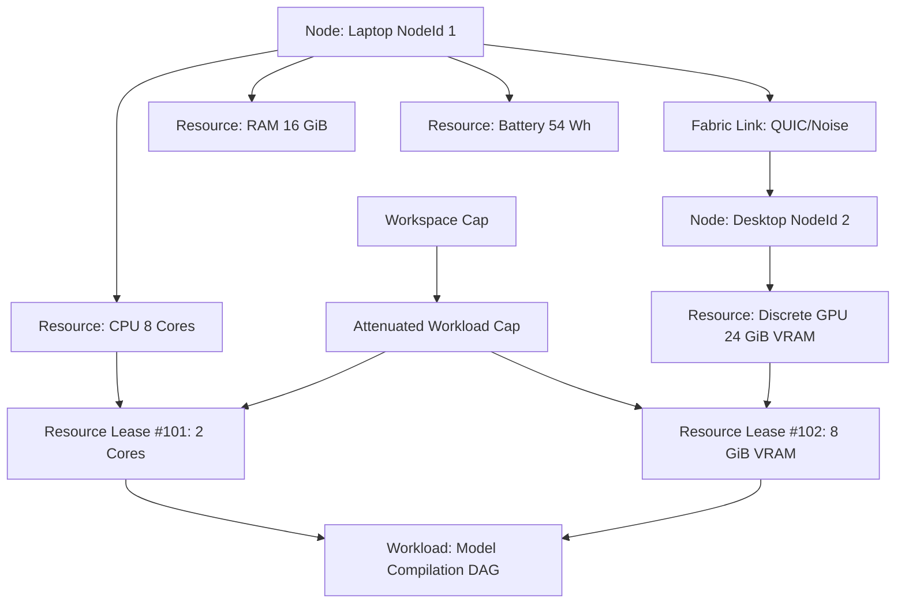
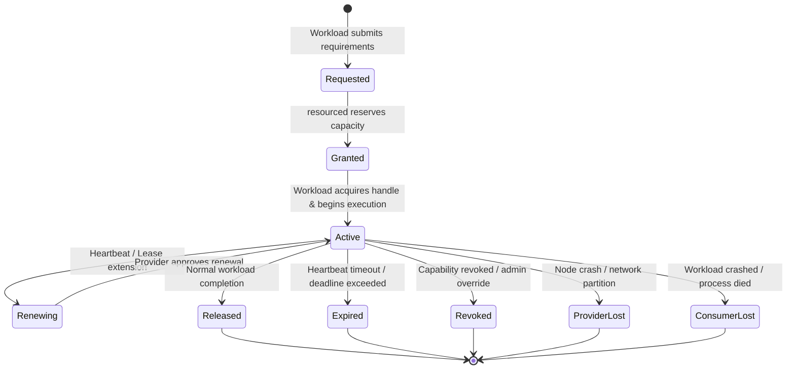
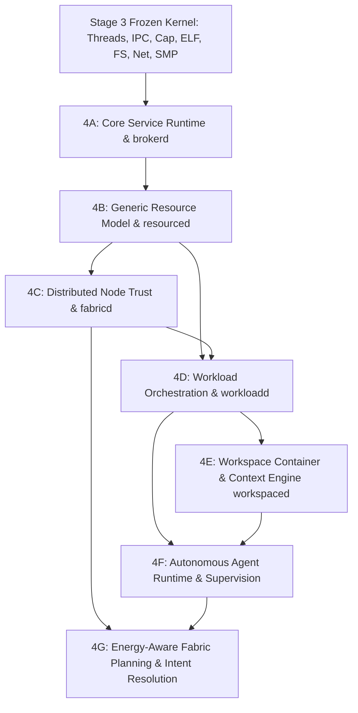

# STAGE 4 ARCHITECTURE SPECIFICATION (REV 2)

## Distributed Compute Fabric, Unified Resource Sharing, Energy Optimization & Semantic Substrate

**Status:** 🟡 PROPOSED (Rev2) — AWAITING ADVERSARIAL ARCHITECTURAL REVIEW  
**Author:** ZeroOS Architecture Team  
**Date:** 2026-09-18  
**Target Milestone:** Stage 4 (Distributed Compute Fabric & Semantic Substrate)  

---

## 1. Stage 4 Boundary

Stage 4 is defined authoritatively as:

> **Stage 4 is the user-space system-services, compute-fabric, and resource-orchestration layer that transforms the deterministic Stage 3 capability microkernel into a unified, distributed, energy-aware workload, resource, workspace, and agent environment.**

Stage 4 is constructed on three mandatory, interdependent architectural pillars:
1. **Distributed OS & Personal Compute Fabric**: Unifying heterogeneous physical nodes (laptops, desktops, smartphones, ambient displays) into a cryptographically authenticated, peer-to-peer compute and state mesh.
2. **Generic Resource Sharing & Leases**: Modeling every compute vector (CPU, GPU, NPU, RAM, storage, network, hardware peripherals, sensors, energy) as a typed, graph-connected resource governed by capabilities and bounded leases.
3. **First-Class Energy & Battery Optimization**: Treating energy and thermal budgets not as passive power-management callbacks, but as primary mathematical constraints in local scheduling and distributed fabric offloading.

Stage 4 executes exclusively in **Ring 3 User Space**. It introduces zero modifications to the frozen Stage 3 kernel nucleus, preserves the zero-dynamic-kernel-heap invariant, and complies strictly with the Stage 3 capability and IPC contracts.

---

## 2. Stage 3 Frozen Boundary (Hard Freeze)

Stage 3 (Stages 3A through 3N) is **COMPLETE, VERIFIED, COMMITTED, AND AUTHORITATIVELY FROZEN**. 

### 2.1 Frozen Kernel Subsystems
- **3A–3E**: Kernel threads (`KernelThread`, 176 B), priority round-robin scheduler (3 priority queues: Critical, High, Normal, plus Idle), preemptive LAPIC timer ticks (10 ms quantum), synchronization primitives (`SpinLock`, `Mutex`, `Condvar`, `WaitQueue`, `Event`), and thread lifecycle state machine.
- **3F–3J**: Isolated processes (`Process`, 128 B, PML4 `AddressSpace`), synchronous/asynchronous IPC channels (`ChannelSlot`, 64-byte typed messages), shared memory (`sys_shm_*`), capability derivation/revocation tree (`CapabilityNode`, 24 B, Option B reparenting, bounded depth 8), fast syscalls (`SyscallFrame`, 144 B, exactly 10 core primitives), and native ELF64 binary execution.
- **3K–3N**: Atomically crash-consistent persistent filesystem (ZeroFS, 4096-byte blocks, 1-block write-ahead journal), strongly typed device and hardware model (MMIO aperture `0x0000_6000...`, two-tier DMA buffer frame pin tracking), RFC 793 TCP/IP networking, and SMP multicore bootstrap (4 CPUs max, IPI reschedule/stop/TLB shootdown, 13-level lock hierarchy).

### 2.2 Stage 3 Dependency Conflicts: NONE
An audit of Stage 4 requirements against the Stage 3 contracts confirms that **zero `STAGE3_DEPENDENCY_CONFLICT` conditions exist**:
- Stage 3 IPC (channels + SHM) provides Turing-complete, high-throughput, capability-verified inter-process messaging.
- Stage 3 Capabilities provide mathematically complete monotonic rights attenuation and recursive revocation.
- Stage 3 Syscalls provide the complete primitive set for process lifecycle and memory mapping.
- Stage 3 Networking (raw frames, UDP, TCP sockets) provides the complete transport substrate for distributed fabric connections.

Stage 4 builds strictly **above** Stage 3.

---

## 3. ZeroOS North-Star Relationship

ZeroOS rejects the conventional model where a human user acts as an ambient manual application switcher. It also rejects the "chatbot" paradigm where an LLM is bolted onto an OS as an ungrounded, unconstrained script runner.

### 3.1 The Architectural Chain
```text
                     USER INTENT (Human Goal)
                                 ↓
                     WORKSPACE (Context & State)
                                 ↓
                     WORKLOADS + AGENTS (Execution & Perception)
                                 ↓
                     CAPABILITY SYSTEM (Authority Boundary)
                                 ↓
                     FABRIC SCHEDULER (Multi-Variable Optimization)
                                 ↓
                     RESOURCE GRAPH (Local & Remote Nodes)
                                 ↓
     CPU / GPU / NPU / RAM / STORAGE / NETWORK / DEVICES / SENSORS / ENERGY
```

### 3.2 The Fundamental Distinction: SMP vs. Distributed Fabric
A fatal design error in distributed systems is conflating multi-core execution with distributed computing:
- **SMP (Stage 3N)**: Multiple CPU cores executing inside a **single shared-memory kernel instance**, sharing a physical clock, coherent cache lines, and a unified physical address space. Synchronization occurs via atomic instructions and bus locks. Failure of a core or memory bank panics the machine.
- **Distributed Fabric (Stage 4)**: Multiple **independent ZeroOS kernel instances** running on physically separated machines across untrusted, high-latency, packet-switched network links with independent clocks, discrete battery states, and disparate failure domains. Synchronization occurs via authenticated cryptographic IPC. Failure of a node is a normal runtime condition.

---

## 4. Architectural Principles

1. **Separation of Authority from Allocation**: Capabilities grant unforgeable permission to access an object. Leases grant bounded, metered physical capacity to consume that resource. A lease cannot exist without an authorizing capability.
2. **Failure as a Steady-State Condition**: Hardware detachment, battery exhaustion, wireless packet loss, network partitions, and remote peer disappearance are treated as expected state transitions, never as kernel panics.
3. **Energy as a First-Class Computational Dimension**: Computation is parameterized by joules and milliwatts. Offloading decisions explicitly evaluate whether network transmission consumes more battery than local computation.
4. **Data Sovereignty & Privacy by Construction**: User data cannot leave a physical device unless an unforgeable capability explicitly grants `CAP_NET_EXPORT` rights over that specific memory or storage object.
5. **Deterministic Semantic Orchestration**: High-level semantic planners operate exclusively on deterministic DAGs and structured state. No unverified, non-deterministic model output is ever allowed to execute imperative system operations directly.

---

## 5. Generic Resource Abstraction

Stage 4 models all computational, physical, and environmental assets under a generic, unified abstraction. A resource is not merely a device or memory pointer; it is a capability-governed, metered, observable entity.

### 5.1 Resource Categorization
Every resource belongs to one of nine canonical types:
1. **`ComputeCpu`**: Schedulable CPU execution capacity (measured in Cores, MIPS, or CPU share units).
2. **`ComputeGpu`**: Parallel matrix, rasterization, or shader hardware (measured in TFLOPS, Compute Units, VRAM bytes).
3. **`ComputeNpu`**: Neural acceleration cores (measured in TOPS, INT8/FP16 throughput).
4. **`MemoryRam`**: Physical and virtual volatile memory frames (measured in 4 KiB frames or bytes).
5. **`StorageVolume`**: Persistent, crash-consistent block storage on ZeroFS (measured in bytes and IOPS).
6. **`NetworkLink`**: Network interface capacity, egress/ingress bandwidth, and packet queues (measured in bps, latency RTT).
7. **`HardwareDevice`**: Dedicated peripherals, accelerators, display controllers (MMIO apertures, DMA channels).
8. **`SensorStream`**: Cameras, microphones, IMUs, GPS receivers (frequency Hz, sample resolution).
9. **`EnergyBudget`**: Battery reserve, charging source, and thermal dissipation headroom (mAh, milliwatts, °C).

---

## 6. Canonical Resource Descriptor

The `ResourceDescriptor` is the authoritative structure representing any allocatable asset in ZeroOS.

```rust
#[repr(C)]
pub struct ResourceDescriptor {
    // 1. Identity & Provenance (16 bytes)
    pub resource_id: ResourceId,          // 8 B: Globally unique monotonic ID
    pub provider_node: NodeId,            // 8 B: Cryptographic Node UUID hash

    // 2. Typing & Granularity (8 bytes)
    pub resource_type: ResourceType,      // 2 B: Enum (Cpu, Gpu, Npu, Ram, Storage, Net, Dev, Sensor, Energy)
    pub allocation_granularity: u16,      // 2 B: Quantum of allocation (e.g. 1 core, 4 KiB frame, 1 MB disk)
    pub flags: u32,                       // 4 B: Flags (SHARED, EXCLUSIVE, PINNED, VOLATILE, REMOTE)

    // 3. Capacity & Metering (32 bytes)
    pub total_capacity: u64,              // 8 B: Absolute physical capacity
    pub allocated_capacity: u64,          // 8 B: Capacity currently leased
    pub reserved_capacity: u64,           // 8 B: Capacity held for high-priority/real-time reserve
    pub available_capacity: u64,          // 8 B: total - (allocated + reserved)

    // 4. Locality & Topology (16 bytes)
    pub locality_tier: LocalityTier,      // 1 B: Enum (OnDie, OnBus, LocalNode, LocalLan, RemoteWan)
    pub numa_node: u8,                    // 1 B: NUMA domain index
    pub bus_address: u16,                 // 2 B: PCIe BDF or device slot index
    pub network_rtt_us: u32,              // 4 B: Latency to access this resource in microseconds (0 for local)
    pub bandwidth_mbps: u32,              // 4 B: Bus or network link bandwidth (Mbps)
    pub _reserved_topo: [u8; 4],

    // 5. Energy & Thermal Profile (16 bytes)
    pub idle_power_mw: u32,               // 4 B: Static dissipation in milliwatts
    pub peak_power_mw: u32,               // 4 B: Peak operational dissipation in milliwatts
    pub current_temp_c: u16,              // 2 B: Current temperature in Celsius
    pub thermal_headroom_c: u16,          // 2 B: Temperature delta until thermal throttling
    pub energy_cost_microjoules: u32,     // 4 B: Estimated energy per unit of computation/transfer

    // 6. Authorization & Ownership (16 bytes)
    pub owning_workspace: WorkspaceId,    // 8 B: Workspace boundary (0 = global node pool)
    pub required_rights: CapabilityRights,// 8 B: Capability mask required to lease this resource

    // 7. Health & Dynamic State (8 bytes)
    pub health_status: ResourceHealth,    // 1 B: Enum (Healthy, Degraded, Throttling, Faulted, Offline)
    pub active_lease_count: u16,          // 2 B: Number of concurrent active leases
    pub generation: u32,                  // 4 B: Incremented on capacity/state mutations
    pub _pad: u8,
}
```

### 6.1 Field Classification
- **Identity**: `resource_id`, `provider_node`.
- **Capacity**: `total_capacity`, `allocated_capacity`, `reserved_capacity`, `available_capacity`, `allocation_granularity`.
- **Dynamic State**: `health_status`, `active_lease_count`, `generation`.
- **Authorization**: `owning_workspace`, `required_rights`.
- **Topology**: `locality_tier`, `numa_node`, `bus_address`, `network_rtt_us`, `bandwidth_mbps`.
- **Energy**: `idle_power_mw`, `peak_power_mw`, `current_temp_c`, `thermal_headroom_c`, `energy_cost_microjoules`.
- **Health**: `health_status`.

---

## 7. The Resource Graph

The Resource Graph is an authoritative directed acyclic graph (DAG) maintained in user space by `resourced`. It models the physical and logical relationships between nodes, hardware subsystems, capability boundaries, active leases, and consuming workloads.



### 7.1 Authoritative Graph Invariants
- **`I-GRAPH-1` (Unique Identity)**: Every node, resource, lease, and workload possesses a globally unique, non-colliding 64-bit identifier.
- **`I-GRAPH-2` (Hierarchical Containment)**: A resource belongs to exactly one authoritative `ProviderNode`.
- **`I-GRAPH-3` (Acyclic Derivation)**: No lease may depend upon its own consuming workload.

---

## 8. Resource Ownership and Authority

### 8.1 Who Owns a Resource?
A physical resource is owned by the **Local Node Nucleus** and registered into the user-space `resourced` daemon during system bootstrap. If a resource resides within a designated Workspace, that Workspace holds primary lease rights.

### 8.2 The Core Invariant: Capability vs. Lease
ZeroOS strictly decouples **Authority** from **Allocation**:

$$\text{Capability} \neq \text{Lease}$$

- **Capability**: Grants unforgeable, mathematical **authority** to access a type of object or hardware interface. (e.g., "This process holds the right to execute code on GPU 0").
- **Lease**: Grants a time-bounded, metered **capacity allocation** of that object. (e.g., "This workload is allocated 4 GiB of GPU VRAM from tick $T_1$ to tick $T_2$").

$$\mathbf{Invariant\ I-RES-AUTH-1:}\quad \text{Lease Authority} \subseteq \text{Capability Authority}$$
A resource lease cannot be granted unless the requesting entity presents a valid, unrevoked capability whose rights bitmask covers the resource's `required_rights`. A lease can **never amplify** capability rights.

---

## 9. Resource Lease Semantics

A Resource Lease represents a contractual commitment by a provider node to make a specific quantum of a resource available to a consumer workload.



### 9.1 Lease Lifecycle States
1. **`Requested`**: Workload presents a capability and resource requirement tuple $(\text{ResourceType}, \text{Quantity}, \text{Duration})$.
2. **`Granted`**: `resourced` validates capability, verifies available capacity, decrements `available_capacity`, and issues a signed `LeaseToken`.
3. **`Active`**: The workload activates the lease by binding it to execution tasks.
4. **`Renewing`**: For long-running workloads, periodic heartbeats renew the lease before expiration.
5. **`Released`**: Workload cleanly terminates; capacity is returned to `available_capacity`.
6. **`Expired`**: Heartbeat failed; lease is forcibly reclaimed.
7. **`Revoked`**: The parent capability was revoked; lease terminates immediately.
8. **`ProviderLost`**: Provider node disconnected or crashed; consumer transitions to recovery.
9. **`ConsumerLost`**: Consumer process died; provider reclaims capacity without leak.

---

## 10. Local Resource Management (`resourced`)

The local node daemon `resourced` is the single authoritative manager for on-node assets:
- **CPU Accounting**: Interacts with Stage 3 scheduling priorities (`Critical`, `High`, `Normal`). Workloads exceeding their leased CPU share are throttled down to `Normal` or `Idle`.
- **Memory Tracking**: Manages physical frame budgets via Stage 3 shared memory (`sys_shm_*`) and ELF allocation limits.
- **Device & DMA Management**: Tracks pinned frames in Stage 3L's `PHYSICAL_FRAME_PIN_TABLE` and MMIO apertures.
- **ZeroFS Quota Enforcement**: Tracks disk block allocations per workspace to prevent storage exhaustion.

---

## 11. Distributed Node Model

A ZeroOS node is an autonomous machine running a verified Stage 3 microkernel, core system services, and a `fabricd` daemon.

```text
+-------------------------------------------------------------------------+
|                              ZEROOS NODE                                |
+-------------------------------------------------------------------------+
| Node Identity: NodeId (SHA-256 of Permanent Asymmetric Public Key)      |
| Node Hardware Profile: FormFactor (Laptop | Phone | Desktop | Server)   |
| Power Source: Battery (Charge %, Discharge Rate) | AC Wall Power        |
| Thermal Headroom: Nominal | Warm | Throttling | Critical                |
| Local Fabric Daemon: fabricd (Encrypted P2P Mesh via Stage 3M Sockets)  |
+-------------------------------------------------------------------------+
```

### 11.1 Node Form Factors & Roles
- **Mobile Nodes (Phone / Tablet)**: Battery-constrained, thermal-constrained, intermittent wireless connectivity. Primarily resource consumers; provide sensor streams and user interaction.
- **Portable Nodes (Laptop)**: Moderate battery capacity, multi-core CPU, integrated/discrete GPU. Flexible role; consumer or local compute provider.
- **Stationary Nodes (Desktop / Workstation / Home Server)**: Continuous AC wall power, high-performance discrete GPU, high-capacity storage, multi-gigabit wired Ethernet. Dedicated resource donors.

---

## 12. Node Identity, Authentication & Trust

### 12.1 Cryptographic Identity
Every node possesses an immutable **Hardware-Rooted Identity Keypair** ($K_{\text{node}}^{\text{priv}}, K_{\text{node}}^{\text{pub}}$) generated inside a hardware security module (TPM 2.0 / Apple SE / ARM CryptoCell) or sealed in local ZeroFS secure storage:
$$\text{NodeId} = \text{Truncate}_{64}(\text{BLAKE2s}(K_{\text{node}}^{\text{pub}}))$$

### 12.2 Pairing & Trust Handshake
Nodes do not trust each other implicitly over LAN. Joining a user's Personal Fabric requires an **Out-of-Band (OOB) Cryptographic Pairing Protocol**:
1. **Discovery**: Nodes discover each other via encrypted UDP beacons over Stage 3M sockets.
2. **Visual Verification**: Both nodes display a visual Short Authentication String (SAS) or QR code.
3. **Mutual Signature**: The Master Node signs the new node's public key with the **User Root Identity Key**.
4. **Session Transport**: All inter-node traffic executes over the **Noise Protocol Framework** (`Noise_IKpsk2_25519_ChaChaPoly_BLAKE2s`), providing mutual authentication, replay protection, and forward secrecy.

---

## 13. Remote Resource Model

Remote resources are NOT merely local resources with different pointer addresses. Accessing a remote resource incurs network latency, serialization overhead, and partial failure risks.

### 13.1 Representation of Remote Resources
A remote resource is modeled as a **Proxy Resource Descriptor**:
- `provider_node`: Remote `NodeId`.
- `locality_tier`: `LocalityTier::LocalLan` or `RemoteWan`.
- `network_rtt_us`: Continuous round-trip measurement updated via network telemetry probes.
- `bandwidth_mbps`: Measured throughput.
- `proxy_channel`: Stage 3 IPC channel bound to `fabricd` tunnel.

---

## 14. Capability Delegation Across Nodes

### 14.1 Cryptographic Capability Tokens (Macaroons / Signed Tokens)
Stage 3H capability handles are local integers valid only within a specific local `Process` handle table. They cannot be sent across raw network sockets.

To cross physical node boundaries, capabilities are serialized into **Cryptographically Signed Delegation Tokens (CSDT)**:
$$\text{CSDT} = \text{Sign}_{K_{\text{node}}^{\text{priv}}}\Big(\text{CapID}, \text{ParentCapID}, \text{WorkspaceUUID}, \text{TargetNodeID}, \text{RightsMask}, \text{ValidUntilTick}, \text{Nonce}\Big)$$

### 14.2 Remote Verification Rules
When Node B receives a CSDT from Node A:
1. `fabricd` on Node B verifies the cryptographic signature against Node A's trusted public key.
2. `fabricd` verifies that Node A's certified trust scope permits delegating the requested rights.
3. `fabricd` requests the local Node B `resourced` to allocate a corresponding local capability node in Stage 3H, with rights strictly attenuated to the CSDT rights mask.
4. **No Authority Amplification**:
   $$\mathbf{Invariant\ I-REMOTE-CAP-1:}\quad \text{Rights}(\text{Node B Local Cap}) \subseteq \text{Rights}(\text{CSDT}) \subseteq \text{Rights}(\text{Node A Cap})$$

---

## 15. Distributed Workload Model

A **Workload** is the fundamental unit of intended computation in ZeroOS.

```text
+-------------------------------------------------------------------------+
|                           WORKLOAD STRUCTURE                            |
+-------------------------------------------------------------------------+
| 1. WorkloadId (u64 globally unique)                                     |
| 2. Owning Workspace (WorkspaceId)                                       |
| 3. Goal Descriptor (Semantic task declaration & expected outputs)       |
| 4. Task Directed Acyclic Graph (DAG):                                   |
|    - Task 1: Ingestion / Parse (Locality: Local Node)                   |
|    - Task 2: Heavy Neural Inference (Locality: Remote Desktop GPU)      |
|    - Task 3: Aggregation & Synthesis (Locality: Local Node)             |
| 5. Resource Lease Envelope (Set of acquired LeaseTokens)                |
| 6. Capability Root (Attenuated Workspace Capability)                    |
| 7. Execution Placement (Node allocation mapping)                        |
| 8. Failure & Retry Policy (MaxRetries, CheckpointInterval, FallbackLocal)|
| 9. Energy Constraint Policy (MaxEnergyJoules, AbortOnBatteryPercent)    |
| 10. Lifecycle State: Submitted | Admitted | Scheduled | Running | ...   |
+-------------------------------------------------------------------------+
```

---

## 16. Workload vs. Process Formal Distinction

$$\mathbf{Process} \neq \mathbf{Workload}$$

| Architectural Dimension | Process (Stage 3) | Workload (Stage 4) |
| :--- | :--- | :--- |
| **Definition** | Hardware-enforced virtual address space & execution container. | Semantic, goal-directed computation graph. |
| **Physical Scope** | Strictly local to one kernel instance on one physical machine. | Distributed; can span multiple processes and multiple nodes. |
| **Duration & Lifecycle** | Ephemeral; begins at ELF load, ends at exit code. | Milestone-driven; can pause, suspend, resume, and checkpoint. |
| **Resource Binding** | Fixed handle table (up to 32 slots). | Dynamic, renegotiable multi-resource lease envelope. |
| **Fault Semantics** | Unhandled exception terminates process immediately. | Process crash triggers workload-level retry or migration. |
| **Energy Awareness** | Completely unaware of battery or thermal state. | Constrained by energy budgets; adapts placement to power state. |

---

## 17. Workspace Model

A **Workspace** is the user-level persistent context container. It guarantees that all assets, memory, context, active workloads, and security policies relating to a user project remain unified.

### 17.1 Workspace Contents
1. **Cryptographic Identity**: Unique UUID signed by User Root Key.
2. **ZeroFS Directory Subtree**: Dedicated root directory holding all code, assets, databases, and checkpoint journals.
3. **Capability Security Envelope**: Defines the absolute upper bound of rights any workload or agent within this workspace may hold.
4. **Context Graph**: Real-time semantic memory, file relationship index, and task history.
5. **Residency Table**: Active workloads and resident agents.

### 17.2 Workspace Policy Invariant
$$\mathbf{Invariant\ I-WORKSPACE-1:}\quad \forall W \in \text{Workloads}(\text{Workspace}_k),\quad \text{Rights}(W) \subseteq \text{Envelope}(\text{Workspace}_k)$$
No workload or agent may access resources or perform actions forbidden by its parent Workspace policy.

---

## 18. Agent Model

An **Agent** in ZeroOS is an autonomous, goal-directed, capability-sandboxed system workload actor.

```text
+-------------------------------------------------------------------------+
|                        AUTONOMOUS AGENT RUNTIME                         |
+-------------------------------------------------------------------------+
| 1. AgentId & Name                                                       |
| 2. Parent Workspace Membership                                          |
| 3. Delegated Capability Envelope (Strictly attenuated from Workspace)   |
| 4. Context Perception Loop:                                             |
|    - WaitQueue on IPC Channels (User instructions, task results)        |
|    - WaitQueue on ZeroFS Directory Watch (File modifications)           |
|    - WaitQueue on System Timers (Periodic background review)            |
| 5. Internal State & Memory Store (Persistent SQLite/ZeroFS context)     |
| 6. Goal & Planning Engine:                                              |
|    - Decomposes goals into candidate Workload DAGs                      |
| 7. Execution Interface:                                                 |
|    - Submits structured Workload specifications to workloadd            |
|    - CANNOT directly invoke arbitrary syscalls or open raw sockets      |
| 8. Escalation Channel:                                                  |
|    - Communicates with brokerd for Two-Man Rule user confirmation       |
+-------------------------------------------------------------------------+
```

---

## 19. Intent Model

### 19.1 The Path from Intent to Execution
Intent processing translates natural language or multimodal human intent into deterministic, capability-governed machine execution:

$$\begin{aligned}
\text{1. Human Intent} &\quad \longrightarrow \quad \text{"Compile the OS kernel and run QEMU test matrix."} \\
\text{2. Context Resolution} &\quad \longrightarrow \quad \text{\texttt{workspaced} identifies target source files on ZeroFS.} \\
\text{3. Plan Generation} &\quad \longrightarrow \quad \text{\texttt{intentd} generates 2-stage DAG: [Stage 1: Build] $\to$ [Stage 2: Test].} \\
\text{4. Preflight & Policy} &\quad \longrightarrow \quad \text{\texttt{brokerd} validates DAG against Workspace Capability Envelope.} \\
\text{5. Fabric Cost Plan} &\quad \longrightarrow \quad \text{\texttt{fabricd} determines Build is 10x faster on Desktop; dispatches.} \\
\text{6. Lease Acquisition} &\quad \longrightarrow \quad \text{\texttt{resourced} reserves 8 CPU cores on Desktop and local storage.} \\
\text{7. Execution} &\quad \longrightarrow \quad \text{Tasks execute via Stage 3 native processes; telemetry streams back.}
\end{aligned}$$

---

## 20. Energy and Battery as First-Class Resources

Traditional operating systems treat power management as an opaque kernel governor (e.g., ACPI C-states, CPU frequency scaling) that throttles clock speeds when the battery is low.

In ZeroOS, **Energy is a first-class scheduled resource**:
- Every node advertises its energy state in its `ResourceDescriptor`.
- Every computational operation has an estimated energy cost (microjoules per byte, microjoules per compute cycle).
- The system explicitly optimizes for **Total Personal Fabric Energy Preservation**.

```text
+-------------------------------------------------------------------------+
|                       ENERGY RESOURCE DESCRIPTOR                        |
+-------------------+--------------------+--------------------------------+
| Battery Capacity  | Current Charge     | State of Charge                |
| (mWh)             | (mWh and %)        | (Discharging, AC Charging)     |
+-------------------+--------------------+--------------------------------+
| Discharge Rate    | Thermal State      | Energy Cost per Local Task     |
| (mW)              | (°C, Headroom)     | (Microjoules / compute quantum)|
+-------------------+--------------------+--------------------------------+
| Transceiver Power | Energy Cost per MB | Battery Life Target            |
| (Wi-Fi/Cellular mW)| (Microjoules/MB TX)| (Estimated hours remaining)    |
+-------------------+--------------------+--------------------------------+
```

---

## 21. Energy-Aware Scheduling

Local scheduling decisions in `resourced` and Stage 3 enforce dynamic energy thresholds:
1. **Nominal State (Battery $> 40\%$, or on AC)**: Full throughput; runqueues execute proportional fair-share.
2. **Conserve State (Battery $15\% - 40\%$)**: Background indexing, batch compilation, and speculative agent planning are paused or scheduled exclusively during AC charging.
3. **Critical State (Battery $< 15\%$)**: All non-interactive background workloads suspended. Only UI render threads and critical user input remain in runqueues. Heavy compute is forcefully offloaded to AC-powered peers or rejected.

---

## 22. Fabric Cost Planning & Optimization

The Fabric Planner in `fabricd` evaluates candidate execution nodes using an authoritative multi-variable cost function:

$$\mathbf{Cost}(T, \text{Node}_i) = w_T \cdot T_{\text{latency}} + w_E \cdot E_{\text{energy}} + w_P \cdot P_{\text{privacy}} + w_C \cdot C_{\text{capacity}}$$

### 22.1 Variable Definitions
- **$T_{\text{latency}}$ (Total Latency in ms)**:
  $$T_{\text{latency}} = 2 \times \text{RTT}_i + \frac{\text{Payload}_{\text{in}}}{\text{Bandwidth}_{\text{up}}} + \frac{\text{WorkloadComplexity}}{\text{ComputePower}_i} + \frac{\text{Payload}_{\text{out}}}{\text{Bandwidth}_{\text{down}}}$$
- **$E_{\text{energy}}$ (Energy Impact on Local Battery)**:
  - If local node runs the task: $E_{\text{energy}} = \text{LocalComputePower} \times \text{ExecutionTime}$.
  - If remote node runs the task: $E_{\text{energy}} = \text{TransceiverTxPower} \times \text{TransmissionTime}$.
  - **Net Energy Savings**: If $E_{\text{tx}} < E_{\text{compute}}$, remote execution preserves local battery life!
- **$P_{\text{privacy}}$ (Data Sovereignty Cost)**:
  - $P = 0$: If data is permitted to leave device according to capability mask.
  - $P = \infty$: If data lacks `CAP_NET_EXPORT` authority (Strictly Local Only).
- **$C_{\text{capacity}}$ (Remote Node Contention)**:
  - Penalty based on current remote node queue depth and thermal state.

---

## 23. Concrete Execution Scenarios

### Scenario A — Phone Battery Constrained
- **Context**: Phone has 18% battery; user requests fine-tuning a local semantic model or compiling a binary.
- **Planner Evaluation**: Local compute would consume 4% of battery and generate high thermal throttling. Remote desktop is on AC wall power with a discrete GPU. Network link is local 5 GHz Wi-Fi (RTT 4 ms, 600 Mbps).
- **Decision**: Transmitting 15 MB source code consumes 0.05% battery. The planner issues a CSDT, leases remote GPU capacity, and executes on Desktop. Results stream back. Net battery saved: 3.95%.

### Scenario B — Privacy Constrained
- **Context**: Laptop has access to remote cloud/peer GPU, but the workspace holds sensitive biometric or cryptographic keys.
- **Planner Evaluation**: Workload capability envelope lacks `CAP_NET_EXPORT`. $P_{\text{privacy}} = \infty$.
- **Decision**: Remote offload is rejected unconditionally. Workload executes locally on CPU, even if slower.

### Scenario C — Latency Constrained (Interactive UI)
- **Context**: User is drawing on a touchscreen or typing in an editor ($< 16$ ms input-to-photon deadline).
- **Planner Evaluation**: Network RTT is 25 ms. $T_{\text{latency}} = 25\text{ ms} + \text{render} > 16\text{ ms}$.
- **Decision**: Remote rendering rejected. Task executes strictly on local display engine.

### Scenario D — Remote Resource Disappearance Mid-Execution
- **Context**: Workload is running on remote desktop GPU; desktop experiences a power outage or crash.
- **Failure Protocol**:
  1. `fabricd` on laptop misses 3 consecutive heartbeats (300 ms).
  2. Desktop node marked `Unreachable`.
  3. Workload manager checks checkpoint journal: rolls back to last durable checkpoint.
  4. Workload status transitioned to `DegradedLocal`; resumes on local CPU or pauses pending user confirmation.
  5. Zero local system crash.

### Scenario E — Network Partition
- **Context**: Laptop and phone are collaborating; user walks out of Wi-Fi range.
- **Partition Protocol**:
  1. Remote leases expire naturally on provider node (`ProviderLost`); capacity reclaimed.
  2. Local proxy resources on consumer node transition to `Suspended`.
  3. Workloads pause execution; state is preserved in local ZeroFS storage.
  4. On reconnect: mutual authentication handshake verifies monotonic counter, resynchronizes state delta, and resumes workloads.

---

## 24. Security Model & Audit

### 24.1 Authority Audit Matrix

| Subject | Action | Target Object | Duration | Authority Token Required | Failure Semantics |
| :--- | :--- | :--- | :--- | :--- | :--- |
| **Workload** | Acquire Lease | Local CPU/RAM | Leased duration | `CAP_RES_ACQUIRE` | Rejected (`Err(ResourceExhausted)`) |
| **Workload** | Map Memory | Stage 3 SHM Frame | Process lifetime | `CAP_SHM_MAP` | Syscall error (`PermissionDenied`) |
| **Agent** | Submit Task | `workloadd` DAG | Task duration | `CAP_WORKLOAD_SUBMIT` | Intercepted; requires escalation |
| **fabricd** | Delegate Cap | Remote Node | Token TTL (e.g. 5m)| `CAP_DELEGATE` + `CAP_NET_EXPORT` | Dropped; network send rejected |
| **Remote Peer**| Execute Task | Local GPU | Lease duration | Valid CSDT signed by Master | Access denied; connection severed |

### 24.2 Security Invariants
- **`I-SEC-1` (Zero Ambient Authority)**: No process or service holds implicit execution rights.
- **`I-SEC-2` (No Authority Amplification)**: Leases cannot grant permissions omitted by capabilities.
- **`I-SEC-3` (Two-Man Rule Escalation)**: Agent operations exceeding workspace bounds must be confirmed by the human user via a trusted visual confirmation prompt.

---

## 25. Service Boundaries & System Architecture

Stage 4 defines eight specialized user-space daemons:

```text
+-----------------------------------------------------------------------------+
|                               USER SPACE DOMAIN                             |
|                                                                             |
|   +-------------+  +-------------+  +-------------+  +-------------+        |
|   |   intentd   |  |  agents     |  |  workspaced |  |  spatiald   |        |
|   | (Plan Gen)  |  | (Goal Loops)|  | (Context)   |  | (Compositor)|        |
|   +------+------+  +------+------+  +------+------+  +------+------+        |
|          |                |                |                |               |
|   +------v----------------v----------------v----------------v------+        |
|   |                           brokerd                              |        |
|   |       (Service Discovery, Namespace, Capability Delegation)    |        |
|   +------+--------------------------------------------------+------+        |
|          |                                                  |               |
|   +------v------+                                    +------v------+        |
|   |  workloadd  |                                    |   fabricd   |        |
|   | (Task DAGs) |                                    | (P2P Mesh)  |        |
|   +------+------+                                    +------+------+        |
|          |                                                  |               |
|   +------v--------------------------------------------------v------+        |
|   |                          resourced                              |        |
|   |              (Generic Resource Graph, Quotas & Leases)          |        |
|   +---------------------------------+-------------------------------+        |
+-------------------------------------|---------------------------------------+
                                      | Syscalls / IPC
+-------------------------------------v---------------------------------------+
|                    STAGE 3 KERNEL NUCLEUS (FROZEN RING 0)                   |
+-----------------------------------------------------------------------------+
```

### 25.1 Detailed Service Audit
1. **`init`**: Bootstraps system services, monitors daemons, handles service restarts.
2. **`brokerd`**: The capability broker. Manages service registration, handle passing, and user escalation prompts.
3. **`resourced`**: The resource authority. Maintains the Resource Graph, issues leases, enforces quotas, and monitors energy/thermals.
4. **`workloadd`**: The workload orchestrator. Manages multi-process task DAGs, process groups, and milestone lifecycles.
5. **`workspaced`**: The context container. Manages workspace files on ZeroFS, persistent memory indexes, and capability envelopes.
6. **`fabricd`**: The distributed fabric manager. Handles node pairing, Noise transport tunnels, remote capability exchange, and latency/energy compute planning.
7. **`intentd`**: The intent resolver. Translates natural language goals into deterministic workload DAGs.
8. **`agentsandbox`**: Unprivileged execution runtime for autonomous agents.

---

## 26. Revised Stage 4 Dependency Graph

The revised dependency chain derived from architectural prerequisites is:



---

## 27. Proposed Stage 4 Incremental Phases

Stage 4 is partitioned into seven distinct, verifiable phases:
- **Phase 4A**: Core Service Runtime, IPC rendezvous, and `brokerd` capability directory.
- **Phase 4B**: Generic Resource Descriptors, local Resource Graph, and `resourced` lease engine.
- **Phase 4C**: Distributed Node Identity, Noise protocol pairing, and `fabricd` transport mesh.
- **Phase 4D**: Workload abstraction, multi-process task DAG execution, and `workloadd`.
- **Phase 4E**: Workspace container subsystem, ZeroFS context graph, and `workspaced`.
- **Phase 4F**: Sandboxed Autonomous Agent runtime and Two-Man Rule escalation broker.
- **Phase 4G**: Energy-aware Fabric cost planner and deterministic Intent resolution pipeline.

---

## 28. Stage 4 Authoritative Invariants

- `I-RES-ID-UNIQUE`: Every resource, lease, and node identifier is globally unique and monotonic.
- `I-RES-NODE-OWNERSHIP`: Every resource is bound to exactly one authoritative provider node.
- `I-LEASE-AUTH-BOUNDED`: A lease cannot confer authority exceeding the authorizing capability token.
- `I-LEASE-CLEANUP`: When a consumer process, workload, or node disconnects, all associated leases are reclaimed without leaks.
- `I-REMOTE-CAP-NO-AMPLIFICATION`: Cross-node capability delegation enforces monotonic attenuation: $\text{ChildRights} \subseteq \text{ParentRights}$.
- `I-NODE-IDENTITY-UNIQUE`: Node IDs are derived cryptographically from hardware-rooted asymmetric public keys.
- `I-WORKLOAD-DISTINCT-FROM-PROCESS`: A process is an isolated local execution container; a workload is a goal-oriented computation DAG.
- `I-WORKLOAD-RESOURCE-BOUNDED`: No workload may execute without holding active, unexpired resource leases.
- `I-WORKSPACE-POLICY-BOUNDS`: Workloads and agents within a workspace cannot exceed the workspace's capability security envelope.
- `I-ENERGY-CONSTRAINT-RESPECTED`: Schedulers and fabric planners must not dispatch heavy compute to battery-constrained nodes when AC peers are reachable.
- `I-PRIVACY-CONSTRAINT-RESPECTED`: Memory or files lacking `CAP_NET_EXPORT` are strictly prohibited from leaving the local physical enclosure.
- `I-REMOTE-FAILURE-CONTAINED`: Disconnection or crash of a remote node cannot crash local kernel instances or corrupt local ZeroFS storage.
- `I-PARTITION-SAFETY`: Network partitions cleanly transition remote leases to expired states without deadlock.
- `I-STALE-TELEMETRY-NOT-AUTHORITY`: Telemetry estimates (RTT, bandwidth, battery) inform cost optimization but cannot override capability boundaries.

---

## 29. Open Architectural Questions

1. **Kernel Telemetry Hooks vs. Pure User-Space Telemetry**:
   - Can `resourced` obtain CPU cycle counts, cache miss rates, and memory pressure purely from user-space timers, or should a future read-only MSR/telemetry syscall be considered?
2. **Noise Protocol Handshake Performance on Low-Power Cores**:
   - Does software-based ChaChaPoly/Ed25519 on single-issue low-power cores incur noticeable connection setup latency, requiring persistent pre-authenticated session pools?
3. **Dynamic Checkpoint Sizing in ZeroFS**:
   - For migratable workloads, what is the optimal granularity for ZeroFS checkpoint journals to minimize serialization latency over Wi-Fi?

---

## 30. ADR References

- **ADR-0017**: Capability System and Kernel Authority Model (Frozen Stage 3H).
- **ADR-0018**: Ring 3 User Space and System Call Interface Architecture (Frozen Stage 3I).
- **ADR-0020**: ZeroFS Persistent Storage & Filesystem Architecture (Frozen Stage 3K).
- **ADR-0021**: Device and Hardware Model Architecture (Frozen Stage 3L).
- **ADR-0022**: Networking Model Architecture (Frozen Stage 3M).
- **ADR-0023**: SMP / Multi-Core Architecture (Frozen Stage 3N).
- **ADR-0024**: Stage 4 System Architecture, Compute Fabric & Semantic Substrate (Rev2).
