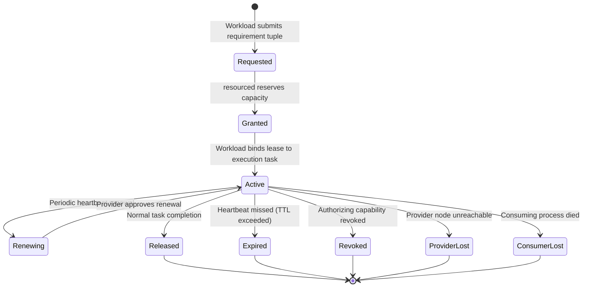
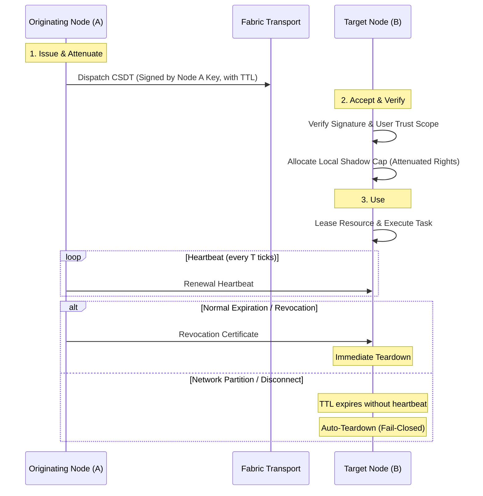
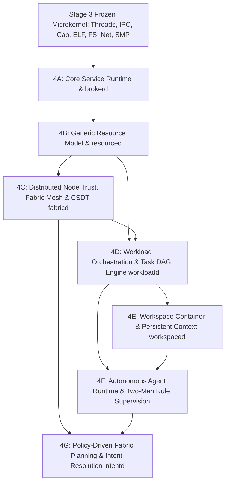

# STAGE 4 ARCHITECTURE SPECIFICATION (REV 3)

## Distributed Compute Fabric, Generic Resource Sharing, Policy-Driven Optimization & Semantic Substrate

**Status:** 🟡 PROPOSED (Rev3) — AWAITING ADVERSARIAL ARCHITECTURAL REVIEW  
**Author:** ZeroOS Architecture Team  
**Date:** 2026-09-18  
**Target Milestone:** Stage 4 (Distributed Compute Fabric & Semantic Substrate)  

---

## 1. Executive Summary & Architectural Clarifications

Following an adversarial review of Revision 2, **Revision 3** resolves all outstanding structural deficiencies in the Stage 4 architecture. Specifically, Rev3:
1. **Replaces the Prescriptive Energy Invariant** with a policy-driven optimization contract (`I-ENERGY-POLICY-RESPECTED`). Energy is an optimization preference and constraint; it does not override capability authority, privacy policies, hard latency deadlines, or resource availability.
2. **Normalizes the Multi-Variable Cost Model**: Decouples the decision pipeline into **Phase 1: Hard Constraints (Eligibility Filtering)** and **Phase 2: Dimensionless Soft Objectives (Placement Optimization)**. Privacy and capability bounds are non-negotiable boolean filters, not arbitrary penalty numbers.
3. **Formalizes Node Identity Assurance Levels (IAL)**: Replaces mandatory hardware-sealed keys with a 3-tier identity model (Software-Backed, Hardware-Backed, Hardware-Attested), preventing specific hardware security modules from becoming a blocker for ZeroOS.
4. **Establishes the Complete CSDT Capability Lifecycle**: Fully specifies remote capability states (`Issued`, `Attenuated`, `Accepted`, `Active`, `Renewing`, `Revoking`, `Expired`, `Severed`, `Reclaimed`) and guarantees fail-closed revocation across network partitions via bounded TTLs (`I-REMOTE-CAP-TTL-1`).
5. **Replaces "Universal Rollback" with Conditional Recovery**: Formally classifies workloads into Pure/Idempotent, Checkpointed Stateful, and Irreversible External Side Effects. Irreversible side effects are never falsely promised transparent rollback.
6. **Decouples Workload Orchestration into Clean Operational Layers**: Separates DAG scheduling, resource placement, process creation, state migration, and capability delegation, preventing `workloadd` from degenerating into a monolithic distributed kernel.

---

## 2. Stage 4 Boundary & Hard Freeze of Stage 3

### 2.1 The Architectural Boundary
> **Stage 4 is the user-space system-services, compute-fabric, and resource-orchestration layer that transforms the deterministic Stage 3 capability microkernel into a unified, distributed, energy-aware workload, resource, workspace, and agent environment.**

Stage 4 executes strictly in **Ring 3 User Space**. The kernel nucleus remains a lean, deterministic, capability-verifying substrate.

### 2.2 Stage 3 Boundary: Absolute Freeze
Stages 3A through 3N are **COMPLETE, VERIFIED, COMMITTED, AND AUTHORITATIVELY FROZEN**:
- **Frozen ABIs**: `Process` (128 B), `KernelThread` (176 B), `PerCpu` (48 B), `HandleTable` (520 B), `CapabilityNode` (24 B), `KernelObjectSlot` (40 B), `SyscallFrame` (144 B).
- **Frozen Kernel Properties**: 13-level monotonic lock hierarchy, 4 MiB bootstrap window (`__kernel_end <= 0xFFFFFFFF80400000`), zero dynamic kernel heap allocations, exactly 10 core syscalls.
- **Stage 3 Dependency Conflicts**: **NONE**. Stage 3 provides all required execution, memory, synchronization, IPC, capability, and networking primitives.

---

## 3. The ZeroOS North Star: Capabilities, Policies, and Workloads

The foundational separation of concerns in ZeroOS is defined by the following architectural axiom:

$$\begin{aligned}
\mathbf{Capabilities} &\quad\implies\quad \text{Determine what is \textbf{PERMITTED}.} \\
\mathbf{Policies} &\quad\implies\quad \text{Determine what is \textbf{ACCEPTABLE}.} \\
\mathbf{Resource\ Graph} &\quad\implies\quad \text{Describes what \textbf{EXISTS}.} \\
\mathbf{Fabric\ Planner} &\quad\implies\quad \text{Determines where work \textbf{SHOULD RUN}.} \\
\mathbf{Resource\ Leases} &\quad\implies\quad \text{Reserve bounded \textbf{CAPACITY}.} \\
\mathbf{Workloads} &\quad\implies\quad \text{Describe what should be \textbf{ACCOMPLISHED}.}
\end{aligned}$$

```text
                               +-----------------------------+
                               |         USER INTENT         |
                               +--------------+--------------+
                                              |
                               +--------------v--------------+
                               |          WORKSPACE          |
                               | (Context, Policy, Security) |
                               +--------------+--------------+
                                              |
                               +--------------v--------------+
                               |     WORKLOADS + AGENTS      |
                               +--------------+--------------+
                                              |
                     +------------------------+------------------------+
                     |                                                 |
       +-------------v-------------+                     +-------------v-------------+
       |     CAPABILITY SYSTEM     |                     |      RESOURCE GRAPH       |
       |  (What is PERMITTED)      |                     |    (What EXISTS & State)  |
       +-------------+-------------+                     +-------------+-------------+
                     |                                                 |
                     +------------------------+------------------------+
                                              |
                               +--------------v--------------+
                               |       FABRIC PLANNER        |
                               |  Phase 1: Hard Constraints  |
                               |  Phase 2: Soft Optimization |
                               +--------------+--------------+
                                              |
                               +--------------v--------------+
                               |       RESOURCE LEASES       |
                               | (Bounded Physical Capacity) |
                               +--------------+--------------+
                                              |
                               +--------------v--------------+
                               |      STAGE 3 PROCESSES      |
                               |   (Ring 3 Execution on HW)  |
                               +-----------------------------+
```

---

## 4. Generic Resource Model

Every computational, physical, and environmental asset is modeled under a canonical `ResourceDescriptor`:

```rust
#[repr(C)]
pub struct ResourceDescriptor {
    // 1. Identity & Provenance
    pub resource_id: ResourceId,          // 8 B: Globally unique monotonic identifier
    pub provider_node: NodeId,            // 8 B: Truncated cryptographic Node UUID
    
    // 2. Typing & Capacity
    pub resource_type: ResourceType,      // 2 B: Enum (Cpu, Gpu, Npu, Ram, Storage, Net, Dev, Sensor, Energy)
    pub allocation_granularity: u16,      // 2 B: Allocation unit (cores, 4 KiB frames, MB disk)
    pub flags: u32,                       // 4 B: Flags (SHARED, EXCLUSIVE, PINNED, VOLATILE, REMOTE)
    pub total_capacity: u64,              // 8 B: Absolute physical capacity
    pub allocated_capacity: u64,          // 8 B: Capacity currently leased
    pub reserved_capacity: u64,           // 8 B: Capacity held for real-time/system reserves
    pub available_capacity: u64,          // 8 B: total - (allocated + reserved)

    // 3. Locality & Topology
    pub locality_tier: LocalityTier,      // 1 B: Enum (OnDie, OnBus, LocalNode, LocalLan, RemoteWan)
    pub numa_node: u8,                    // 1 B: NUMA index
    pub bus_address: u16,                 // 2 B: Device slot or bus identifier
    pub network_rtt_us: u32,              // 4 B: Monitored round-trip latency (0 for local)
    pub bandwidth_mbps: u32,              // 4 B: Monitored throughput bandwidth
    pub _reserved_topo: [u8; 4],

    // 4. Energy & Thermal Profile
    pub idle_power_mw: u32,               // 4 B: Static dissipation in milliwatts
    pub peak_power_mw: u32,               // 4 B: Peak operational dissipation in milliwatts
    pub current_temp_c: u16,              // 2 B: Temperature in Celsius
    pub thermal_headroom_c: u16,          // 2 B: Delta to thermal throttling boundary
    pub energy_cost_microjoules: u32,     // 4 B: Microjoules per compute quantum / transfer unit

    // 5. Authorization & Health
    pub owning_workspace: WorkspaceId,    // 8 B: Boundary container (0 = node global)
    pub required_rights: CapabilityRights,// 8 B: Rights required to lease
    pub health_status: ResourceHealth,    // 1 B: Enum (Healthy, Degraded, Throttling, Faulted, Offline)
    pub active_lease_count: u16,          // 2 B: Active lease count
    pub generation: u32,                  // 4 B: Incremented on state mutation
    pub _pad: u8,
}
```

---

## 5. Resource Sharing & The Lease Abstraction

### 5.1 Decoupling Authority from Allocation
$$\mathbf{Capability} \neq \mathbf{Lease}$$
- **Capability**: Grants unforgeable mathematical authority to act on an object.
- **Lease**: Grants time-bounded, metered physical capacity of that object.

$$\mathbf{Invariant\ I-LEASE-AUTH-BOUNDED:}\quad \text{Lease Authority} \subseteq \text{Capability Authority}$$
A resource lease cannot be acquired without presenting a valid, unrevoked capability whose rights cover the resource's `required_rights`. A lease can **never amplify** capability authority.

### 5.2 Canonical Lease Lifecycle


---

## 6. Distributed Fabric Trust & Node Identity

### 6.1 Three-Tier Identity Assurance Levels (IAL)
ZeroOS does NOT mandate TPM or hardware-sealed key storage for all nodes. Instead, every node advertises its **Identity Assurance Level**:

| Level | Classification | Key Storage & Provenance | Permitted Workloads |
| :--- | :--- | :--- | :--- |
| **IAL-1** | **Software-Backed** | Asymmetric keypair stored in encrypted ZeroFS volume. | General compute, non-sensitive batch tasks, public workloads. |
| **IAL-2** | **Hardware-Backed** | Keypair generated/stored in secure hardware (TPM 2.0, Apple SE, ARM CryptoCell). | Workspace-private compute, user credential handling, device access. |
| **IAL-3** | **Hardware-Attested**| Keypair protected by hardware attestation proof & measured boot integrity. | Biometric verification, cryptographic roots, sovereign vault tasks. |

### 6.2 Fabric Trust & Key Architecture
The relationship between cryptographic keys is strictly layered:
1. **User Root Identity Key ($K_{\text{user}}$)**: Offline master keypair owning the personal fabric.
2. **Node Identity Key ($K_{\text{node}}$)**: Long-term node keypair with certified IAL.
3. **Device Trust Certificate**: Signed by $K_{\text{user}}$, binding $K_{\text{node}}^{\text{pub}}$ to a `NodeId` and authorized capability scope.
4. **Ephemeral Pairing Session Keys**: Derived via mutual authenticated Diffie-Hellman handshake over Stage 3M network sockets. Specific wire framing is defined in protocol ADRs.

---

## 7. Remote Capability Delegation (CSDT) Lifecycle

Local Stage 3H capability integers cannot cross physical network boundaries. They are converted into **Cryptographically Signed Delegation Tokens (CSDT)**.



### 7.1 CSDT State Machine
1. **`Issued`**: Node A attenuates local capability $C_{\text{local}}$ and signs CSDT with monotonic nonce and expiration tick ($TTL$).
2. **`Accepted`**: Node B validates signature against Node A's trust certificate, creates an internal shadow capability with rights strictly $\subseteq \text{CSDT rights}$.
3. **`Active`**: Node B leases local resources against the shadow capability.
4. **`Renewing`**: Node A transmits periodic renewal tokens before $TTL$ expiration.
5. **`Revoking`**: Node A broadcasts a signed Revocation Certificate. Node B invalidates the shadow capability, cascades revocation down its local Stage 3H tree, and halts executing tasks.
6. **`Expired`**: If Node A disconnects or partitions, the $TTL$ expires on Node B without renewal. Node B unconditionally reclaims all leased resources and tears down shadow capabilities (`I-REMOTE-CAP-TTL-1`).

---

## 8. Distributed Workload Model & Operational Layers

$$\mathbf{Process} \neq \mathbf{Workload}$$

To prevent `workloadd` from degenerating into an unmaintainable distributed monolithic kernel, execution is decomposed into five orthogonal operational layers:

```text
+-----------------------------------------------------------------------------+
| 1. DAG Scheduling (workloadd)                                               |
|    - Logical dependency resolution between tasks in the workload graph      |
|    - Milestone tracking and task state transitions                          |
+-----------------------------------------------------------------------------+
                                       ↓
+-----------------------------------------------------------------------------+
| 2. Resource Placement & Planning (fabricd / resourced)                      |
|    - Evaluates hard constraints (eligibility) & soft objectives (costs)     |
|    - Selects target execution nodes (Local vs. Remote)                      |
+-----------------------------------------------------------------------------+
                                       ↓
+-----------------------------------------------------------------------------+
| 3. Capability Delegation (brokerd / fabricd)                                |
|    - Serializes and signs CSDTs; installs shadow capabilities on target     |
+-----------------------------------------------------------------------------+
                                       ↓
+-----------------------------------------------------------------------------+
| 4. Capacity Lease Acquisition (resourced)                                   |
|    - Obtains bounded physical resource leases on target nodes               |
+-----------------------------------------------------------------------------+
                                       ↓
+-----------------------------------------------------------------------------+
| 5. Process Creation & Local Execution (Stage 3 Kernel Nucleus)              |
|    - Spawns local ELF processes (AddressSpace, threads, handles) on target  |
+-----------------------------------------------------------------------------+
```

### 8.1 Process Migration Prohibition Invariant
ZeroOS explicitly **rejects live process/thread migration** (moving active registers and uncommitted dirty virtual memory pages) across packet-switched network links. It is mathematically inefficient and brittle.

$$\mathbf{Invariant\ I-NO-LIVE-PROCESS-MIGRATION:}\quad \text{Processes are strictly local to their host kernel instance.}$$
Workload distribution occurs via **Task Dispatch** (stateless or packaged inputs) or **Checkpoint State Migration**, never via live memory paging across the network.

---

## 9. Failure Model & Conditional Workload Recovery

ZeroOS rejects the illusion that all remote failures can be transparently "rolled back." Computation is classified into three explicit recovery classes:

### 9.1 The Three Recovery Classes

| Workload Class | Nature of Work | Failure Behavior & Recovery Semantics |
| :--- | :--- | :--- |
| **Class 1: Pure / Idempotent** | Stateless compute, compilation, neural inference, data filter. | **Safe Re-execution**: Discard partial results; reschedule task on another eligible node or locally. Zero side-effect risk. |
| **Class 2: Checkpointed Stateful** | Large data transformations, database builds, model fine-tuning. | **Resume from Checkpoint**: Roll back state to the latest durable, verified ZeroFS checkpoint generation; resume execution. Intermediate uncheckpointed work is lost. |
| **Class 3: Irreversible External** | Network packet transmission to 3rd party, sensor control, device output. | **Compensate / Fail**: Transparent rollback is impossible. State transitions to `FailedAtMilestone(M)`. Executes explicit user-defined compensation handler or prompts user. |

---

## 10. The 2-Stage Fabric Planning Model

Rev2 conflated hard security boundaries with numerical soft penalties. Rev3 establishes a rigorous **2-Stage Fabric Planning Model**:

```text
                       CANDIDATE NODES (All Fabric Peers)
                                       │
                                       ▼
+-----------------------------------------------------------------------------+
|                         PHASE 1: HARD CONSTRAINTS                           |
|                         (Boolean Eligibility Filter)                        |
|                                                                             |
|  1. Capability Authorization: Does workload hold CAP_NET_EXPORT?            |
|  2. Privacy Policy: Does workspace policy permit data to leave device?      |
|  3. Hardware Requirements: Required CPU architecture, GPU compute, NPU TOPS?|
|  4. Memory & Storage Headroom: Target has sufficient unallocated capacity?  |
|  5. Hard Latency Deadline: Can RTT physically meet deadline (RTT < D_hard)? |
|  6. Identity Assurance Level: Target node meets required IAL?               |
+-----------------------------------------------------------------------------+
                                       │
                                       ▼
                       ELIGIBLE NODES SET (Filtered Subset)
                                       │
                                       ▼
+-----------------------------------------------------------------------------+
|                         PHASE 2: SOFT OBJECTIVES                            |
|                     (Dimensionless Placement Optimization)                  |
|                                                                             |
|  Evaluate normalized cost J(Node_i) across eligible nodes:                  |
|                                                                             |
|      J(i) = w_lat * N_lat(i) + w_eng * N_eng(i) + w_cost * N_cost(i)        |
|                                                                             |
|  Where:                                                                     |
|    - N_lat(i) in [0, 1]: Normalized latency (RTT + Serialization + Compute) |
|    - N_eng(i) in [0, 1]: Normalized local battery impact                    |
|    - N_cost(i) in [0, 1]: Normalized queue contention / thermal impact      |
|    - w_lat + w_eng + w_cost = 1.0 (Dynamic weights from Workload Policy)    |
+-----------------------------------------------------------------------------+
                                       │
                                       ▼
                           OPTIMAL TARGET SELECTION
```

---

## 11. Energy Policy Semantics

### 11.1 Rejection of the Prescriptive Energy Invariant
Rev2's unconditional invariant ("must not dispatch to battery-constrained nodes if AC is reachable") is formally replaced. A battery-powered node may legitimately execute locally when:
1. Hard privacy policy forbids data export ($P_{\text{export}} = \text{false}$).
2. Hard latency deadline requires sub-millisecond local execution.
3. Network connection is degraded, congested, or partitioned.
4. Serialization and transmission consume more battery than local computation ($E_{\text{tx}} \ge E_{\text{local}}$).
5. User policy explicitly mandates local execution.

### 11.2 The Authoritative Energy Invariant
$$\mathbf{Invariant\ I-ENERGY-POLICY-RESPECTED:}\quad \text{Placement must respect declared energy policies and node constraints.}$$
$$\text{Energy preference MUST NOT override capability authority, privacy policy, explicit locality, hard deadlines, or resource availability.}$$

---

## 12. Workspace & Agent Subsystems

### 12.1 Workspace Container
A **Workspace** is the persistent context home on ZeroFS:
- Holds a unique UUID and User Root cryptographic signature.
- Holds the **Capability Security Envelope**: Defines the absolute ceiling of rights any workload or agent within the workspace may acquire.
- Stores persistent context graphs, task histories, and code trees on ZeroFS.

### 12.2 Autonomous Agent Model
An **Agent** is an OS-level autonomous actor executing in an unprivileged sandbox:
- Operates under the **Principle of Strict Containment**: Zero ambient authority.
- Driven by a perception loop listening on waitable event queues (file changes, IPC signals, timers).
- Dispatches actions solely by submitting structured Workload specifications to `workloadd`.
- **The Two-Man Rule (Escalation)**: Any action exceeding its delegated capability envelope is intercepted by `brokerd` and requires cryptographic visual approval from the user.

---

## 13. Service Boundaries & Responsibilities

| Service | Execution Domain | Primary Responsibility | State Owned |
| :--- | :--- | :--- | :--- |
| **`init`** | Ring 3 (Supervisor) | System service bootstrap, supervision, crash restart. | Service process table. |
| **`brokerd`** | Ring 3 (System Daemon) | Namespace directory, service IPC discovery, Two-Man Rule escalation. | Service endpoint registry, pending prompt tokens. |
| **`resourced`** | Ring 3 (System Daemon) | Canonical Resource Graph, local quotas, lease allocations, energy monitoring. | Local `ResourceDescriptor` table, active lease table. |
| **`fabricd`** | Ring 3 (System Daemon) | Node pairing, Noise transport mesh, CSDT serialization, Fabric Planning. | Peer node table, CSDT shadow cap registry, telemetry cache. |
| **`workloadd`** | Ring 3 (System Daemon) | Workload DAG scheduling, milestone tracking, process group supervision. | Workload table, task DAG status, lease bindings. |
| **`workspaced`** | Ring 3 (System Daemon) | Workspace containers, ZeroFS context engine, capability security envelopes. | Workspace registry, context index cache. |
| **`intentd`** | Ring 3 (Unprivileged) | Natural language intent translation to deterministic Workload DAGs. | Model inference session state, plan templates. |
| **`agentsandbox`** | Ring 3 (Unprivileged) | Sandboxed agent execution runtime and perception event loops. | Agent persistent memory store. |

---

## 14. Revised Stage 4 Dependency Graph



---

## 15. Authoritative Stage 4 Invariant Catalog

- `I-RES-ID-UNIQUE`: Every resource, lease, and node identifier is globally unique and monotonic.
- `I-RES-NODE-OWNERSHIP`: Every resource is bound to exactly one authoritative provider node.
- `I-LEASE-AUTH-BOUNDED`: A lease cannot confer authority exceeding the authorizing capability token.
- `I-LEASE-CLEANUP`: When a consumer process, workload, or node disconnects, all associated leases are reclaimed without leaks.
- `I-REMOTE-CAP-NO-AMPLIFICATION`: Cross-node capability delegation enforces monotonic attenuation: $\text{ChildRights} \subseteq \text{ParentRights}$.
- `I-REMOTE-CAP-TTL-1`: Remote delegated capabilities enforce a bounded TTL; on network partition or missed heartbeats, remote shadow capabilities and leases expire fail-closed.
- `I-NODE-IDENTITY-UNIQUE`: Node IDs are derived cryptographically from long-term public keys with certified Identity Assurance Levels (IAL-1..3).
- `I-WORKLOAD-DISTINCT-FROM-PROCESS`: A process is an isolated local execution container; a workload is a goal-oriented computation DAG.
- `I-NO-LIVE-PROCESS-MIGRATION`: Processes are strictly local to their host kernel instance; workload distribution occurs via task dispatch or checkpoint state migration.
- `I-WORKLOAD-RESOURCE-BOUNDED`: No workload may execute without holding active, unexpired resource leases.
- `I-WORKSPACE-POLICY-BOUNDS`: Workloads and agents within a workspace cannot exceed the workspace's capability security envelope.
- `I-ENERGY-POLICY-RESPECTED`: Schedulers and planners must respect declared energy policies; energy optimization must never violate capability authority, privacy, or hard deadlines.
- `I-PRIVACY-CONSTRAINT-RESPECTED`: Memory or files lacking `CAP_NET_EXPORT` are strictly prohibited from leaving the local physical enclosure (enforced at Phase 1 hard constraint filter).
- `I-REMOTE-FAILURE-CONTAINED`: Disconnection or crash of a remote node cannot crash local kernel instances or corrupt local ZeroFS storage.
- `I-PARTITION-SAFETY`: Network partitions cleanly transition remote leases to expired states without deadlock.
- `I-STALE-TELEMETRY-NOT-AUTHORITY`: Telemetry estimates inform cost optimization but cannot override capability boundaries.
- `I-RECOVERY-CLASS-RESPECTED`: Workloads with irreversible external side effects are never rolled back; they transition to `FailedAtMilestone` and trigger compensation handlers.

---

## 16. Document History

- **2026-09-18 (Rev 1)**: Initial architecture discovery; established Stage 3 boundary and baseline service roles.
- **2026-09-18 (Rev 2)**: Incorporated Distributed OS, Generic Resource Descriptors, Capability vs. Lease decoupling, and first-class energy.
- **2026-09-18 (Rev 3)**: Adversarial review revisions: normalized 2-stage planner (Hard Constraints vs. Dimensionless Soft Objectives), policy-driven energy invariant, 3-tier Identity Assurance Levels, complete CSDT lifecycle with fail-closed TTLs, 3-class workload recovery model, and formal process migration prohibition.
