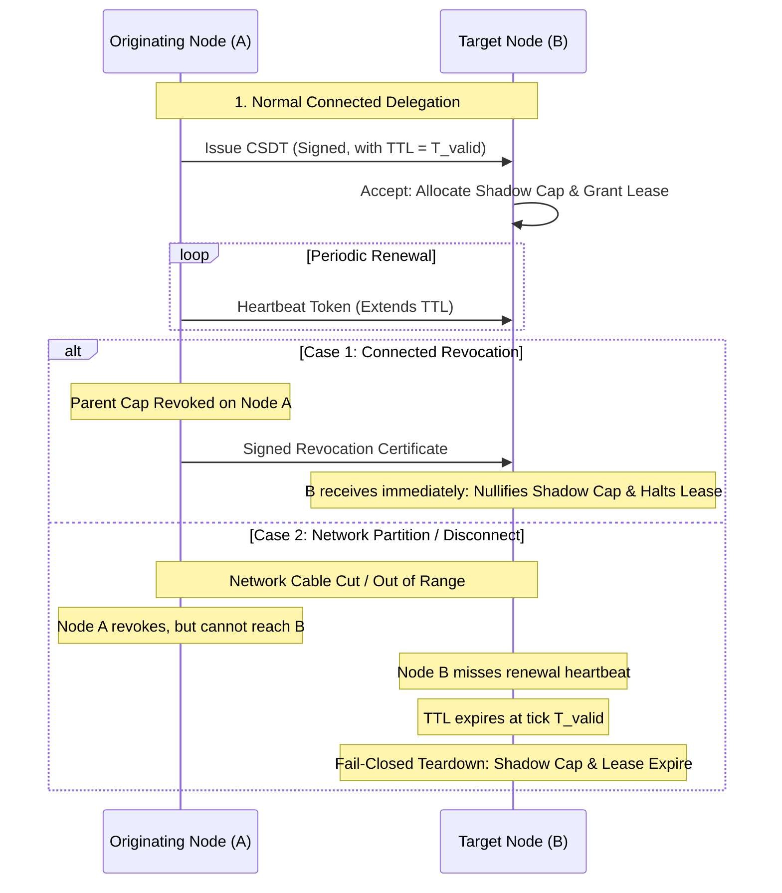
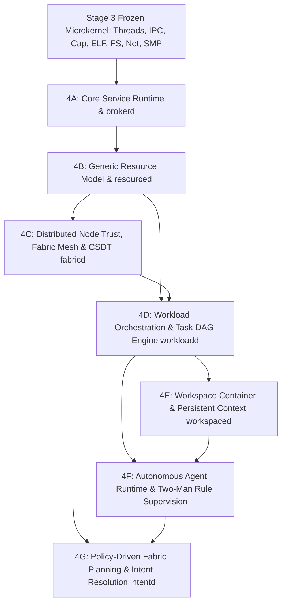

# STAGE 4 ARCHITECTURE SPECIFICATION (REV 4)

## Distributed Compute Fabric, Generic Resource Sharing, Policy-Driven Optimization & Semantic Substrate

**Status:** 🟡 PROPOSED (Rev4) — FINAL ARCHITECTURAL FREEZE GATE REVIEW  
**Author:** ZeroOS Architecture Team  
**Date:** 2026-09-18  
**Target Milestone:** Stage 4 (Distributed Compute Fabric & Semantic Substrate)  

---

## 1. Executive Summary & Rev4 Architectural Refinements

Following the fourth round of adversarial architecture review, **Revision 4** establishes the definitive, mathematically sound, and physically realistic specification for ZeroOS Stage 4. 

Rev4 specifically resolves the four remaining architectural ambiguities identified in Rev3:
1. **Network-Realistic CSDT Revocation Semantics**: Explicitly decouples revocation propagation across **connected** states (immediate cryptographic invalidation via Revocation Certificates) from **partitioned** states (fail-closed invalidation bounded strictly by the finite CSDT TTL, `I-REMOTE-CAP-PARTITION-BOUNDED`). Capability security does not claim stronger real-time guarantees than network physics provide.
2. **Decomposition of Distributed Identifier Properties**: Eliminates the false assumption of cross-node global monotonicity. Formally separates `I-ID-UNIQUE` (global non-collision via composite `(NodeId, LocalMonotonicId)`), `I-ID-NONREUSE` (terminal lifecycle), and `I-ID-LOCAL-MONOTONIC` (local allocator monotonicity) without requiring distributed consensus clocks.
3. **Formal Separation of Resource Graph vs. Task DAG**: Establishes that the **Resource Graph** is a **general directed typed graph** that legitimately models circular authority, hosting, and lease relationships (`Node → Resource → Lease → Workload → Node`). The **DAG** abstraction is reserved strictly for the **Workload Task Graph** (acyclic execution dependency graphs).
4. **Energy Telemetry Authority Classification**: Establishes `I-ENERGY-MEASUREMENT-CLASSIFIED`, categorizing all energy telemetry into `MEASURED` (hardware counters/PMIC), `ESTIMATED` (analytical models), and `DECLARED` (workload predictions). Soft optimization may leverage estimates, but security, capability bounds, and hard resource limits must never depend on untrusted predictions.
5. **Precise Data Export Enforcement Boundary**: Clarifies the exact layer where `CAP_NET_EXPORT` is enforced ($\text{Object} \to \text{Export Authority Verification} \to \text{Remote Delegation} \to \text{Transport}$). Serialization into the network tunnel is physically impossible without passing export capability validation.

---

## 2. Stage 4 Boundary & Hard Freeze of Stage 3

### 2.1 Stage 4 Boundary Definition
> **Stage 4 is the user-space system-services, compute-fabric, and resource-orchestration layer that transforms the deterministic Stage 3 capability microkernel into a unified, distributed, energy-aware workload, resource, workspace, and agent environment.**

Stage 4 executes strictly in **Ring 3 User Space**. The kernel nucleus remains a lean, deterministic, capability-verifying substrate.

### 2.2 Stage 3 Boundary: Hard Freeze
Stages 3A through 3N are **COMPLETE, VERIFIED, COMMITTED, AND AUTHORITATIVELY FROZEN**:
- **Frozen ABIs**: `Process` (128 B), `KernelThread` (176 B), `PerCpu` (48 B), `HandleTable` (520 B), `CapabilityNode` (24 B), `KernelObjectSlot` (40 B), `SyscallFrame` (144 B).
- **Frozen Kernel Constraints**: 13-level monotonic lock hierarchy, 4 MiB bootstrap window (`__kernel_end <= 0xFFFFFFFF80400000`), zero dynamic kernel heap allocations, exactly 10 core syscalls.
- **Stage 3 Dependency Conflicts**: **NONE**. Stage 3 primitives fully support all Stage 4 user-space services.

---

## 3. The Core Separation of Concerns

The foundational separation of concerns in ZeroOS is defined by the following architectural axiom:

$$\begin{aligned}
\mathbf{Capabilities} &\quad\implies\quad \text{Determine what is \textbf{PERMITTED}.} \\
\mathbf{Policies} &\quad\implies\quad \text{Determine what is \textbf{ACCEPTABLE}.} \\
\mathbf{Resource\ Graph} &\quad\implies\quad \text{Describes what \textbf{EXISTS} and how it is connected.} \\
\mathbf{Fabric\ Planner} &\quad\implies\quad \text{Determines where work \textbf{SHOULD RUN}.} \\
\mathbf{Resource\ Leases} &\quad\implies\quad \text{Reserve bounded physical \textbf{CAPACITY}.} \\
\mathbf{Workloads} &\quad\implies\quad \text{Describe what should be \textbf{ACCOMPLISHED}.} \\
\mathbf{Processes} &\quad\implies\quad \text{Provide isolated local \textbf{EXECUTION}.}
\end{aligned}$$

```text
                               +-----------------------------+
                               |         USER INTENT         |
                               +--------------+--------------+
                                              |
                               +--------------v--------------+
                               |          WORKSPACE          |
                               | (Context, Policy, Security) |
                               +--------------+--------------+
                                              |
                               +--------------v--------------+
                               |     WORKLOADS + AGENTS      |
                               +--------------+--------------+
                                              |
                     +------------------------+------------------------+
                     |                                                 |
       +-------------v-------------+                     +-------------v-------------+
       |     CAPABILITY SYSTEM     |                     |      RESOURCE GRAPH       |
       |  (What is PERMITTED)      |                     | (What EXISTS / Typed Graph|
       +-------------+-------------+                     +-------------+-------------+
                     |                                                 |
                     +------------------------+------------------------+
                                              |
                               +--------------v--------------+
                               |       FABRIC PLANNER        |
                               |  Phase 1: Hard Constraints  |
                               |  Phase 2: Soft Optimization |
                               +--------------+--------------+
                                              |
                               +--------------v--------------+
                               |       RESOURCE LEASES       |
                               | (Bounded Physical Capacity) |
                               +--------------+--------------+
                                              |
                               +--------------v--------------+
                               |      STAGE 3 PROCESSES      |
                               |   (Ring 3 Execution on HW)  |
                               +-----------------------------+
```

---

## 4. Distributed Identifier Architecture

Rev4 formally eliminates the assumption of cross-node global monotonicity. In a decentralized, distributed personal fabric, independent nodes allocate identifiers autonomously without distributed locks or synchronized clocks.

### 4.1 Identifier Structure
All identifiers in Stage 4 (NodeId, ResourceId, LeaseId, WorkloadId, CSDTId) are represented as a 128-bit composite structure:

```rust
#[repr(C)]
pub struct DistributedId {
    pub node_id: NodeId,          // 64 bits: Hash of Node Identity Public Key
    pub local_seq: u64,           // 64 bits: Monotonically incrementing local sequence
}
```

### 4.2 Formal Identifier Invariants
- `I-ID-UNIQUE`: Any `DistributedId` is globally non-colliding across all nodes for all time, because `node_id` is cryptographically unique and `local_seq` is monotonic within that node.
- `I-ID-NONREUSE`: Once allocated, a `DistributedId` is never reissued or recycled by the local allocator.
- `I-ID-LOCAL-MONOTONIC`: Within an authoritative allocator on node $N$, identifiers satisfy:
  $$\forall k_1 < k_2,\quad \text{local\_seq}(k_1) < \text{local\_seq}(k_2)$$
- `I-ID-NO-GLOBAL-ORDER`: No global total ordering is established or assumed across identifiers generated by distinct nodes.

---

## 5. Generic Resource Model & The Typed Resource Graph

### 5.1 Resource Descriptor
The authoritative `ResourceDescriptor` models all assets:

```rust
#[repr(C)]
pub struct ResourceDescriptor {
    // 1. Identity & Provenance
    pub resource_id: DistributedId,       // 16 B: Composite unique ID (NodeId + LocalSeq)
    pub provider_node: NodeId,            // 8 B: Authoritative host node
    
    // 2. Typing & Capacity
    pub resource_type: ResourceType,      // 2 B: Enum (Cpu, Gpu, Npu, Ram, Storage, Net, Dev, Sensor, Energy)
    pub allocation_granularity: u16,      // 2 B: Unit of allocation (cores, frames, MB disk)
    pub flags: u32,                       // 4 B: Flags (SHARED, EXCLUSIVE, PINNED, VOLATILE, REMOTE)
    pub total_capacity: u64,              // 8 B: Absolute physical capacity
    pub allocated_capacity: u64,          // 8 B: Capacity currently leased
    pub reserved_capacity: u64,           // 8 B: Capacity held for system/real-time reserve
    pub available_capacity: u64,          // 8 B: total - (allocated + reserved)

    // 3. Locality & Topology
    pub locality_tier: LocalityTier,      // 1 B: Enum (OnDie, OnBus, LocalNode, LocalLan, RemoteWan)
    pub numa_node: u8,                    // 1 B: NUMA domain index
    pub bus_address: u16,                 // 2 B: Device slot or bus identifier
    pub network_rtt_us: u32,              // 4 B: Monitored round-trip latency (0 for local)
    pub bandwidth_mbps: u32,              // 4 B: Monitored throughput bandwidth
    pub _reserved_topo: [u8; 4],

    // 4. Energy & Thermal Profile (Classified per I-ENERGY-MEASUREMENT-CLASSIFIED)
    pub idle_power_mw: u32,               // 4 B: Static power dissipation
    pub peak_power_mw: u32,               // 4 B: Peak operational power
    pub current_temp_c: u16,              // 2 B: Current temperature (°C)
    pub thermal_headroom_c: u16,          // 2 B: Delta to thermal throttling boundary
    pub energy_cost_microjoules: u32,     // 4 B: Cost per compute/transfer quantum
    pub energy_telemetry_tier: TelemetryTier, // 1 B: Enum (Measured, Estimated, Declared)

    // 5. Authorization & Health
    pub owning_workspace: WorkspaceId,    // 8 B: Boundary container (0 = node global)
    pub required_rights: CapabilityRights,// 8 B: Capability mask required to lease
    pub health_status: ResourceHealth,    // 1 B: Enum (Healthy, Degraded, Throttling, Faulted, Offline)
    pub active_lease_count: u16,          // 2 B: Active concurrent leases
    pub generation: u32,                  // 4 B: Mutation sequence
    pub _pad: [u8; 6],
}
```

### 5.2 Resource Graph vs. Task DAG Formal Distinction
$$\mathbf{Resource\ Graph} \neq \mathbf{Task\ DAG}$$

1. **The Resource Graph is a General Directed Typed Graph**:
   - Represents physical topology, network links, capability delegations, and active leases.
   - **Permits Cycles**: Legitimate cyclic dependencies exist naturally:
     $$\text{Node A} \xrightarrow{\text{hosts}} \text{Resource R} \xrightarrow{\text{leased to}} \text{Workload W} \xrightarrow{\text{executes on}} \text{Node A}$$
     $$\text{Workspace K} \xrightarrow{\text{contains}} \text{Workload W} \xrightarrow{\text{acquires}} \text{Cap C} \xrightarrow{\text{grants}} \text{Resource R} \xrightarrow{\text{owned by}} \text{Workspace K}$$
   - Maintained dynamically by `resourced` and `fabricd`.
2. **The Task Graph is a Directed Acyclic Graph (DAG)**:
   - Represents the causal execution dependencies between computational steps within a Workload.
   - **Strictly Acyclic**: Task $T_2$ cannot depend on Task $T_1$ if $T_1$ depends on $T_2$. Cycles in task graphs represent deadlocks and are rejected at admission time by `workloadd` (`I-TASK-DAG-ACYCLIC`).

---

## 6. Resource Leases & Decoupled Authority

### 6.1 Authority vs. Allocation Invariant
$$\mathbf{Capability} \neq \mathbf{Lease}$$
- **Capability**: Mathematical authorization to act on an object.
- **Lease**: Time-bounded, metered physical capacity of that object.

$$\mathbf{Invariant\ I-LEASE-AUTH-BOUNDED:}\quad \text{Lease Authority} \subseteq \text{Capability Authority}$$
A resource lease cannot be granted without presenting a valid, unrevoked capability whose rights cover the resource's `required_rights`. A lease can **never amplify** capability authority.

### 6.2 Canonical Lease State Machine
$$\text{Requested} \longrightarrow \text{Granted} \longrightarrow \text{Active} \longrightarrow \text{Renewing} \longrightarrow \text{Released}$$
$$\text{Active} \longrightarrow \begin{cases} \text{Expired} & (\text{missed heartbeat TTL}) \\ \text{Revoked} & (\text{parent capability revoked}) \\ \text{ProviderLost} & (\text{provider node unreachable}) \\ \text{ConsumerLost} & (\text{consumer process crashed}) \end{cases}$$

All terminal states execute deterministic reclamation without orphan frame or block leaks (`I-LEASE-CLEANUP`).

---

## 7. Distributed Fabric Trust & Node Identity

### 7.1 Three-Tier Identity Assurance Levels (IAL)

| Level | Classification | Key Storage & Provenance | Permitted Workloads |
| :--- | :--- | :--- | :--- |
| **IAL-1** | **Software-Backed** | Keypair stored in encrypted ZeroFS volume. | Batch compute, non-sensitive public workloads. |
| **IAL-2** | **Hardware-Backed** | Keypair sealed in hardware security module (TPM 2.0, Apple SE, ARM CryptoCell). | Workspace-private compute, user credential handling, device access. |
| **IAL-3** | **Hardware-Attested**| Keypair protected by hardware attestation proof & measured boot integrity. | Biometric verification, cryptographic roots, sovereign vault tasks. |

### 7.2 Cryptographic Key Hierarchy
1. **User Root Identity Key ($K_{\text{user}}$)**: Offline master keypair owning the personal fabric.
2. **Node Identity Key ($K_{\text{node}}$)**: Long-term node keypair with certified IAL.
3. **Device Trust Certificate**: Signed by $K_{\text{user}}$, binding $K_{\text{node}}^{\text{pub}}$ to a `NodeId` and authorized capability scope.
4. **Ephemeral Pairing Session Keys**: Derived via mutual authenticated Diffie-Hellman handshake over Stage 3M network sockets. Specific wire framing is defined in protocol ADRs.

---

## 8. Remote Capability Delegation (CSDT) Lifecycle & Partition Semantics

### 8.1 CSDT State Machine & Network Reality
A Cryptographically Signed Delegation Token (CSDT) allows capabilities to cross node boundaries. The architecture explicitly distinguishes between **connected** revocation and **partitioned** revocation:



### 8.2 The Authoritative Partition Invariant
$$\mathbf{Invariant\ I-REMOTE-CAP-PARTITION-BOUNDED:}$$
$$\text{When connected, revocation propagates immediately via signed Revocation Certificates.}$$
$$\text{Under network partition, stale execution on the target node is strictly bounded by the finite CSDT TTL: } \Delta t_{\text{stale}} \le T_{\text{TTL}}.$$
$$\text{Upon TTL expiration without a verified renewal heartbeat, the target node reclaims all leases and invalidates shadow capabilities fail-closed.}$$

---

## 9. Data Export Authorization Boundary

ZeroOS prevents data exfiltration by enforcing `CAP_NET_EXPORT` at an explicit architectural boundary.

```text
+-----------------------------------------------------------------------------+
| 1. Storage / Memory Object (ZeroFS Inode / VMO / SHM Frame)                 |
+-----------------------------------------------------------------------------+
                                       ↓
+-----------------------------------------------------------------------------+
| 2. Capability Verification Layer (brokerd / resourced)                      |
|    - Inspects holding process / workload capability token                   |
|    - Verifies: Does capability mask contain CAP_NET_EXPORT?                |
|    - IF NO: Operation fails closed (SyscallError::PermissionDenied).        |
|             Data is strictly forbidden from entering the serialization queue|
+-----------------------------------------------------------------------------+
                                       ↓
+-----------------------------------------------------------------------------+
| 3. Remote Delegation & Serialization (fabricd)                              |
|    - Serializes approved payload into encrypted CSDT container              |
+-----------------------------------------------------------------------------+
                                       ↓
+-----------------------------------------------------------------------------+
| 4. Fabric Transport Layer (Stage 3M Network Sockets)                        |
|    - Transmits encrypted Noise packet across network link                   |
+-----------------------------------------------------------------------------+
```

$$\mathbf{Invariant\ I-DATA-EXPORT-ENFORCED:}\quad \text{The network transport layer cannot accept or transmit data}$$
$$\text{without proof of authorization evaluated at the Capability Verification Layer.}$$

---

## 10. Energy Telemetry Authority Classification

Energy values cannot be treated as a uniform authoritative number. Rev4 establishes the **Energy Measurement Authority Classification**:

### 10.1 Telemetry Tiers
1. **`MEASURED`**: Hardware-grounded data from battery fuel gauges, PMIC hardware registers, Intel RAPL, or AMD APM. Represents authoritative physical reality.
2. **`ESTIMATED`**: Analytical software models (e.g., $E_{\text{tx}} = \text{Bytes} \times \text{PowerModel}(\text{LinkType})$). Useful for cost planning, but subject to variance.
3. **`DECLARED`**: Estimates predicted or requested by workload developers, intent planners, or user heuristics.

### 10.2 The Authoritative Telemetry Invariant
$$\mathbf{Invariant\ I-ENERGY-MEASUREMENT-CLASSIFIED:}$$
$$\text{All energy telemetry must carry its authoritative classification tier (Measured, Estimated, Declared).}$$
$$\text{Optimization planners MAY leverage Estimated and Declared telemetry for placement decisions.}$$
$$\text{Security boundaries, capability validation, and hard resource allocation MUST NOT depend on untrusted estimates.}$$

---

## 11. The Two-Stage Fabric Planning Model

Rev4 formally structures fabric planning into:

$$\begin{aligned}
\text{Candidate Peers} \quad\xrightarrow{\text{Phase 1: Hard Constraints Filter}}\quad \text{Eligible Nodes} \quad\xrightarrow{\text{Phase 2: Dimensionless Soft Optimization}}\quad \text{Target Selection}
\end{aligned}$$

### Phase 1: Hard Constraints (Boolean Eligibility Filter)
Every candidate node $i$ must satisfy:
1. $\text{ExportPermitted} = (\text{Workload holds } \text{CAP\_NET\_EXPORT}) \lor (\text{Node}_i == \text{LocalNode})$.
2. $\text{PrivacyPermitted} = (\text{Workspace Privacy Policy permits export to Node}_i)$.
3. $\text{HardwareCompatible} = (\text{Node}_i \text{ provides required ISA, GPU compute, NPU TOPS})$.
4. $\text{CapacityAvailable} = (\text{Unallocated RAM/Disk}_i \ge \text{Workload Minimum Bounds})$.
5. $\text{DeadlineFeasible} = (\text{Estimated RTT}_i + \text{ExecutionTime}_i \le T_{\text{deadline}})$.
6. $\text{AssuranceAcceptable} = (\text{IAL}(\text{Node}_i) \ge \text{Workload Minimum IAL})$.

Nodes failing any hard condition are pruned immediately.

### Phase 2: Dimensionless Soft Optimization
Across all nodes in $\text{EligibleNodes}$, the planner evaluates the normalized objective function:
$$J(\text{Node}_i) = w_{\text{lat}} \cdot N_{\text{lat}}(i) + w_{\text{eng}} \cdot N_{\text{eng}}(i) + w_{\text{cost}} \cdot N_{\text{cost}}(i)$$
Where:
- $N_{\text{lat}}(i) \in [0, 1]$: Normalized latency (RTT + Serialization + Estimated Compute).
- $N_{\text{eng}}(i) \in [0, 1]$: Normalized local battery depletion impact.
- $N_{\text{cost}}(i) \in [0, 1]$: Normalized remote queue contention and thermal penalty.
- $w_{\text{lat}} + w_{\text{eng}} + w_{\text{cost}} = 1.0$ (Policy-configured dynamic weights).

---

## 12. Conditional Workload Recovery & Side-Effect Classification

ZeroOS rejects universal rollback promises for operations with external effects:

| Workload Class | Nature of Computation | Recovery Semantics on Remote Failure / Partition |
| :--- | :--- | :--- |
| **Class 1: Pure / Idempotent** | Stateless compute, compilation, neural inference, functional filter. | **Safe Re-execution**: Discard partial state; reschedule task locally or on another eligible peer. Zero side-effect risk. |
| **Class 2: Checkpointed Stateful**| Large database builds, model fine-tuning, stateful data pipelines. | **Resume from Checkpoint**: Roll back state to the latest durable, verified ZeroFS checkpoint generation; resume task. Intermediate uncheckpointed work is lost. |
| **Class 3: Irreversible External**| Network send to 3rd-party API, sensor actuation, hardware device trigger. | **Compensate / Fail**: Transparent rollback is physically impossible. State transitions to `FailedAtMilestone(M)`. Executes registered compensation handler or prompts user. |

$$\mathbf{Invariant\ I-RECOVERY-CLASS-RESPECTED:}\quad \text{Class 3 workloads are never rolled back; they execute explicit compensation handlers.}$$

---

## 13. Process vs. Workload Formal Distinction

$$\mathbf{Process} \neq \mathbf{Workload}$$

| Dimension | Process (Stage 3) | Workload (Stage 4) |
| :--- | :--- | :--- |
| **Execution Domain** | Local CPU core and address space (`CR3`). | Multi-process, potentially distributed across fabric nodes. |
| **Lifetime** | Ephemeral; tied to thread execution and exit code. | Milestone-driven; tracks task DAG completion. |
| **Resource Binding** | Fixed handle table (up to 32 slots). | Dynamic multi-resource lease envelope. |
| **Fault Boundary** | Unhandled exception terminates the process. | Process failure triggers task-level retry or milestone compensation. |
| **Migration Policy** | **Cannot migrate across machines (`I-NO-LIVE-PROCESS-MIGRATION`).** | Migrates via task re-dispatch or checkpoint state transfer. |

---

## 14. Workspace & Autonomous Agent Subsystems

### 14.1 Workspace Container
- Authoritative context and authority boundary on ZeroFS.
- Holds unique UUID, User Root signature, persistent file tree, and the **Capability Security Envelope**.
- Workloads and agents executing within a workspace cannot exceed this envelope (`I-WORKSPACE-POLICY-BOUNDS`).

### 14.2 Sandboxed Agent Model
- OS-level autonomous actor executing in an unprivileged sandbox.
- Driven by a perception loop over waitable event queues (file modifications, IPC signals, timers).
- Submits structured Workload DAGs to `workloadd`; possesses zero ambient system authority.
- **The Two-Man Rule (Escalation)**: Any action exceeding its delegated capability envelope is intercepted by `brokerd` and requires cryptographic visual approval from the user.

---

## 15. Service Boundaries & System Architecture

```text
+-----------------------------------------------------------------------------+
|                               USER SPACE DOMAIN                             |
|                                                                             |
|   +-------------+  +-------------+  +-------------+  +-------------+        |
|   |   intentd   |  |  agents     |  |  workspaced |  |  spatiald   |        |
|   | (Plan Gen)  |  | (Goal Loops)|  | (Context)   |  | (Compositor)|        |
|   +------+------+  +------+------+  +------+------+  +------+------+        |
|          |                |                |                |               |
|   +------v----------------v----------------v----------------v------+        |
|   |                           brokerd                              |        |
|   |       (Service Discovery, Namespace, Capability Delegation)    |        |
|   +------+--------------------------------------------------+------+        |
|          |                                                  |               |
|   +------v------+                                    +------v------+        |
|   |  workloadd  |                                    |   fabricd   |        |
|   | (Task DAGs) |                                    | (P2P Mesh)  |        |
|   +------+------+                                    +------+------+        |
|          |                                                  |               |
|   +------v--------------------------------------------------v------+        |
|   |                          resourced                              |        |
|   |             (Generic Resource Graph, Quotas & Leases)           |        |
|   +---------------------------------+-------------------------------+        |
+-------------------------------------|---------------------------------------+
                                      | Syscalls / IPC
+-------------------------------------v---------------------------------------+
|                    STAGE 3 KERNEL NUCLEUS (FROZEN RING 0)                   |
+-----------------------------------------------------------------------------+
```

---

## 16. Revised Stage 4 Dependency Graph



---

## 17. Authoritative Stage 4 Invariant Catalog (18 Invariants)

1. `I-ID-UNIQUE`: Every `DistributedId` is globally non-colliding via composite `(NodeId, LocalSeq)` tuples.
2. `I-ID-NONREUSE`: Identifiers are never reissued or recycled across system lifetime.
3. `I-ID-LOCAL-MONOTONIC`: Identifiers increment monotonically within their authoritative local allocator.
4. `I-RES-NODE-OWNERSHIP`: Every resource is bound to exactly one authoritative provider node in the Resource Graph.
5. `I-TASK-DAG-ACYCLIC`: Task dependency graphs within a Workload are strictly acyclic; cycles are rejected at admission.
6. `I-LEASE-AUTH-BOUNDED`: A lease cannot confer authority exceeding the authorizing capability token.
7. `I-LEASE-CLEANUP`: When a consumer process, workload, or node disconnects, all associated leases are reclaimed without leaks.
8. `I-REMOTE-CAP-NO-AMPLIFICATION`: Cross-node capability delegation enforces monotonic attenuation: $\text{ChildRights} \subseteq \text{ParentRights}$.
9. `I-REMOTE-CAP-PARTITION-BOUNDED`: Remote capability revocation propagates immediately when connected; under partition, stale execution is strictly bounded by CSDT TTL ($T_{\text{TTL}}$).
10. `I-NODE-IDENTITY-ASSURANCE`: Nodes advertise certified Identity Assurance Levels (IAL-1..3); workloads enforce minimum IAL requirements.
11. `I-WORKLOAD-DISTINCT-FROM-PROCESS`: A process is an isolated local execution container; a workload is a goal-oriented computation DAG.
12. `I-NO-LIVE-PROCESS-MIGRATION`: Processes are strictly local to their host kernel instance; workload distribution occurs via task dispatch or checkpoint state migration.
13. `I-WORKSPACE-POLICY-BOUNDS`: Workloads and agents within a workspace cannot exceed the workspace's capability security envelope.
14. `I-ENERGY-POLICY-RESPECTED`: Schedulers and planners must respect declared energy policies; energy optimization must never violate capability authority, privacy, or hard deadlines.
15. `I-ENERGY-MEASUREMENT-CLASSIFIED`: Telemetry must identify whether it is Measured, Estimated, or Declared; hard limits cannot depend on untrusted estimates.
16. `I-DATA-EXPORT-ENFORCED`: The network transport cannot transmit data without proof of authorization verified at the capability evaluation layer (`CAP_NET_EXPORT`).
17. `I-REMOTE-FAILURE-CONTAINED`: Disconnection or crash of a remote node cannot crash local kernel instances or corrupt local ZeroFS storage.
18. `I-RECOVERY-CLASS-RESPECTED`: Workloads with irreversible external side effects are never rolled back; they transition to `FailedAtMilestone` and trigger compensation handlers.

---

## 18. Document History

- **2026-09-18 (Rev 1)**: Initial architecture discovery; established Stage 3 boundary and baseline service roles.
- **2026-09-18 (Rev 2)**: Incorporated Distributed OS, Generic Resource Descriptors, Capability vs. Lease decoupling, and first-class energy.
- **2026-09-18 (Rev 3)**: Adversarial review revisions: normalized 2-stage planner, policy-driven energy invariant, 3-tier IAL, 3-class workload recovery, and process migration prohibition.
- **2026-09-18 (Rev 4)**: Final freeze gate revisions: network-partition bounded CSDT revocation, distributed ID decomposition (uniqueness without cross-node global order), Resource Graph (general directed graph) vs. Task DAG (acyclic), energy telemetry authority classification (Measured/Estimated/Declared), and precise `CAP_NET_EXPORT` enforcement boundary.
