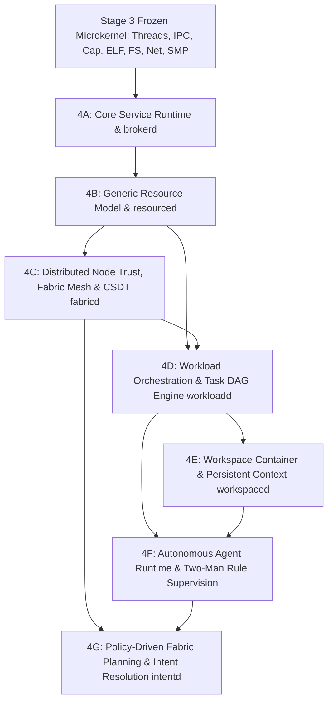

# STAGE 4 ARCHITECTURE SPECIFICATION (REV 6)

## Distributed Compute Fabric, Generic Resource Sharing, Policy-Driven Optimization & Semantic Substrate

**Status:** 🟢 FINAL ARCHITECTURAL SPECIFICATION — APPROVED FREEZE CANDIDATE  
**Author:** ZeroOS Architecture Team  
**Date:** 2026-09-18  
**Target Milestone:** Stage 4 (Distributed Compute Fabric & Semantic Substrate)  

---

## 1. Executive Summary & Rev6 Architectural Finalization

Following the sixth round of adversarial architecture review, **Revision 6** delivers the definitive, closed-form architectural specification for ZeroOS Stage 4. Rev6 resolves the final two distributed-systems contracts:

1. **Durable DistributedId Allocator State (`I-ID-DURABLE-ALLOCATOR-STATE`)**: Establishes that the monotonic sequence `local_seq` within a `DistributedId = (NodeId, LocalSeq)` must survive reboots, crashes, filesystem recovery, service restarts, and power loss. Allocator state persistence on ZeroFS (or batch sequence reservations) must be durably committed *before* any identifier is externally observable. Clarifies that NodeId rotation is reserved strictly for certified cryptographic lifecycle transitions, never as an escape mechanism for unpersisted state.
2. **Monotonic Local Expiration Authority (`I-CSDT-EXPIRATION-MONOTONIC`)**: Guarantees that CSDT expiration and TTL intervals are evaluated strictly against the **receiving node's local monotonic hardware timer** (LAPIC periodic ticks from Stage 3B). Eliminates any dependency on distributed wall-clock synchronization (NTP/PTP), rendering remote capability expiration immune to clock skew, manipulation, or drift.

---

## 2. Stage 4 Boundary & Hard Freeze of Stage 3

### 2.1 Stage 4 Boundary Definition
> **Stage 4 is the user-space system-services, compute-fabric, and resource-orchestration layer that transforms the deterministic Stage 3 capability microkernel into a unified, distributed, energy-aware workload, resource, workspace, and agent environment.**

Stage 4 executes strictly in **Ring 3 User Space**. The kernel nucleus remains a lean, deterministic, capability-verifying substrate.

### 2.2 Stage 3 Boundary: Hard Freeze
Stages 3A through 3N are **COMPLETE, VERIFIED, COMMITTED, AND AUTHORITATIVELY FROZEN**:
- **Frozen ABIs**: `Process` (128 B), `KernelThread` (176 B), `PerCpu` (48 B), `HandleTable` (520 B), `CapabilityNode` (24 B), `KernelObjectSlot` (40 B), `SyscallFrame` (144 B).
- **Frozen Kernel Constraints**: 13-level monotonic lock hierarchy, 4 MiB bootstrap window (`__kernel_end <= 0xFFFFFFFF80400000`), zero dynamic kernel heap allocations, exactly 10 core syscalls.
- **Stage 3 Dependency Conflicts**: **NONE**. Stage 3 primitives fully support all Stage 4 user-space services.

---

## 3. The Core Separation of Concerns

The foundational separation of concerns in ZeroOS is defined by the following architectural axiom:

$$\begin{aligned}
\mathbf{Capabilities} &\quad\implies\quad \text{Determine what is \textbf{PERMITTED}.} \\
\mathbf{Policies} &\quad\implies\quad \text{Determine what is \textbf{ACCEPTABLE}.} \\
\mathbf{Resource\ Graph} &\quad\implies\quad \text{Describes what \textbf{EXISTS} and how it is connected.} \\
\mathbf{Fabric\ Planner} &\quad\implies\quad \text{Determines where work \textbf{SHOULD RUN}.} \\
\mathbf{Resource\ Leases} &\quad\implies\quad \text{Reserve bounded physical \textbf{CAPACITY}.} \\
\mathbf{Workloads} &\quad\implies\quad \text{Describe what should be \textbf{ACCOMPLISHED}.} \\
\mathbf{Processes} &\quad\implies\quad \text{Provide isolated local \textbf{EXECUTION}.}
\end{aligned}$$

```text
                               +-----------------------------+
                               |         USER INTENT         |
                               +--------------+--------------+
                                              |
                               +--------------v--------------+
                               |          WORKSPACE          |
                               | (Context, Policy, Security) |
                               +--------------+--------------+
                                              |
                               +--------------v--------------+
                               |     WORKLOADS + AGENTS      |
                               +--------------+--------------+
                                              |
                     +------------------------+------------------------+
                     |                                                 |
       +-------------v-------------+                     +-------------v-------------+
       |     CAPABILITY SYSTEM     |                     |      RESOURCE GRAPH       |
       |  (What is PERMITTED)      |                     | (What EXISTS / Typed Graph|
       +-------------+-------------+                     +-------------+-------------+
                     |                                                 |
                     +------------------------+------------------------+
                                              |
                               +--------------v--------------+
                               |       FABRIC PLANNER        |
                               |  Phase 1: Hard Constraints  |
                               |  Phase 2: Soft Optimization |
                               +--------------+--------------+
                                              |
                               +--------------v--------------+
                               |       RESOURCE LEASES       |
                               | (Bounded Physical Capacity) |
                               +--------------+--------------+
                                              |
                               +--------------v--------------+
                               |      STAGE 3 PROCESSES      |
                               |   (Ring 3 Execution on HW)  |
                               +-----------------------------+
```

---

## 4. Distributed Identifier Architecture & Durability

### 4.1 Identifier Structure
Identifiers in Stage 4 (NodeId, ResourceId, LeaseId, WorkloadId, CSDTId) are composite 128-bit structures:

```rust
#[repr(C)]
pub struct DistributedId {
    pub node_id: NodeId,          // 64 bits: Hash of Node Identity Public Key
    pub local_seq: u64,           // 64 bits: Monotonically incrementing local sequence
}
```

### 4.2 Durability & Allocation Crash Ordering
To guarantee that identifiers never collide across node reboots, crashes, or power loss, sequence allocation is governed by an explicit write-ahead durability contract:

$$\begin{aligned}
\text{Step 1: Reserve Sequence Range} &\quad\implies\quad \text{Write batch sequence ceiling to ZeroFS persistent journal.} \\
\text{Step 2: Commit Durability} &\quad\implies\quad \text{Synchronize journal block to non-volatile storage via ZeroFS.} \\
\text{Step 3: Issue Identifier} &\quad\implies\quad \text{Identifier becomes externally observable to processes/peers.} \\
\text{Step 4: Resource Publication} &\quad\implies\quad \text{Bind identifier to active resource, lease, or workload.}
\end{aligned}$$

Upon recovery from a crash, the allocator loads the highest persisted sequence ceiling $S_{\text{ceil}}$, discards uncommitted intermediate states, and resumes strictly at $S_{\text{resume}} > S_{\text{ceil}}$, guaranteeing zero reissuance of previously observed identifiers.

### 4.3 Identifier Invariants
- `I-ID-UNIQUE`: Every `DistributedId` is globally non-colliding via composite `(NodeId, LocalSeq)` tuples.
- `I-ID-LOCAL-MONOTONIC`: Identifiers increment monotonically within their authoritative local allocator.
- `I-ID-NO-GLOBAL-ORDER`: No cross-node total ordering is required or assumed.
- `I-ID-EXHAUSTION-FAIL-CLOSED`: When `local_seq` reaches `u64::MAX`, allocation fails permanently for that `NodeId` namespace without wrap or reuse.
- `I-ID-DURABLE-ALLOCATOR-STATE`: For every authoritative `NodeId` namespace, the allocator's next sequence state must survive process restart, kernel restart, crash recovery, and power loss. A successfully issued `DistributedId` must never be reissued. Allocator persistence must be committed before an identifier is externally observable.
- `I-NODE-ID-ROTATION-FORMAL`: Changing a `NodeId` establishes an entirely new cryptographic identifier namespace with a newly certified identity keypair. NodeId rotation cannot be used to circumvent ordinary allocator bugs or unpersisted reboot loss.

---

## 5. Authoritative vs. Observed Resource Graph State

The Resource Graph is a **general directed typed graph** modeling physical topology, capabilities, and leases. Legitimate graph cycles exist naturally ($\text{Node} \to \text{Resource} \to \text{Lease} \to \text{Workload} \to \text{Node}$).

### 5.1 State Separation
ZeroOS partitions graph state into three distinct authority domains:
1. **Authoritative Provider State (`resourced` on Provider Node)**: Authoritative physical capacity, active local leases, hardware health, and PMIC telemetry. Sole authority permitted to commit capacity and issue Lease Tokens.
2. **Observed / Advertised State (`fabricd` on Consumer Nodes)**: Cached remote capacity and measured link properties. Strictly advisory; used exclusively for Phase 2 optimization planning.
3. **Contractual Lease State (Binding between Provider and Consumer)**: Monotonic lease generation, signed LeaseToken, and bounded expiration tick.

$$\mathbf{Invariant\ I-GRAPH-AUTHORITY-LOCAL:}\quad \text{A node is authoritative solely over its locally hosted resources.}$$
$$\text{Observed remote graph entries are advisory. A remote node cannot mutate provider capacity without a verified lease commit.}$$

### 5.2 Task DAG Acyclicity Invariant
$$\mathbf{Invariant\ I-TASK-DAG-ACYCLIC:}\quad \text{The Workload Task Graph is strictly acyclic. Cycles represent deadlocks}$$
$$\text{and are rejected at admission time by \texttt{workloadd}.}$$

---

## 6. Resource Leases & Decoupled Authority

### 6.1 Authority vs. Allocation Invariant
$$\mathbf{Capability} \neq \mathbf{Lease}$$
- **Capability**: Mathematical authorization to act on an object.
- **Lease**: Time-bounded, metered physical capacity of that object.

$$\mathbf{Invariant\ I-LEASE-AUTH-BOUNDED:}\quad \text{Lease Authority} \subseteq \text{Capability Authority}$$
A resource lease cannot be acquired without presenting a valid, unrevoked capability whose rights cover the resource's `required_rights`. A lease can **never amplify** capability authority.

### 6.2 Canonical Lease Lifecycle
$$\text{Requested} \longrightarrow \text{Granted} \longrightarrow \text{Active} \longrightarrow \text{Renewing} \longrightarrow \text{Released}$$
$$\text{Active} \longrightarrow \begin{cases} \text{Expired} & (\text{missed heartbeat TTL}) \\ \text{Revoked} & (\text{parent capability revoked}) \\ \text{ProviderLost} & (\text{provider node unreachable}) \\ \text{ConsumerLost} & (\text{consumer process crashed}) \end{cases}$$

All terminal states execute deterministic reclamation without orphan frame or block leaks (`I-LEASE-CLEANUP`).

---

## 7. Distributed Fabric Trust & Node Identity

### 7.1 Three-Tier Identity Assurance Levels (IAL)

| Level | Classification | Key Storage & Provenance | Permitted Workloads |
| :--- | :--- | :--- | :--- |
| **IAL-1** | **Software-Backed** | Keypair stored in encrypted ZeroFS volume. | Batch compute, non-sensitive public workloads. |
| **IAL-2** | **Hardware-Backed** | Keypair sealed in hardware security module (TPM 2.0, Apple SE, ARM CryptoCell). | Workspace-private compute, user credential handling, device access. |
| **IAL-3** | **Hardware-Attested**| Keypair protected by hardware attestation proof & measured boot integrity. | Biometric verification, cryptographic roots, sovereign vault tasks. |

### 7.2 Cryptographic Key Hierarchy
1. **User Root Identity Key ($K_{\text{user}}$)**: Offline master keypair owning the personal fabric.
2. **Node Identity Key ($K_{\text{node}}$)**: Long-term node keypair with certified IAL.
3. **Device Trust Certificate**: Signed by $K_{\text{user}}$, binding $K_{\text{node}}^{\text{pub}}$ to a `NodeId` and authorized capability scope.
4. **Ephemeral Pairing Session Keys**: Derived via mutual authenticated Diffie-Hellman handshake over Stage 3M network sockets. Specific wire framing is defined in protocol ADRs.

---

## 8. Remote Capability Delegation (CSDT) Lifecycle & Monotonic Expiration

### 8.1 Monotonic Local Expiration Authority
To prevent clock skew, manipulation, or synchronization failures from compromising security, CSDT validity is governed strictly by the **receiving node's local monotonic hardware timer**:

$$\mathbf{Invariant\ I-CSDT-EXPIRATION-MONOTONIC:}$$
$$\text{CSDT expiration MUST be evaluated using the monotonic local clock on the receiving node (LAPIC timer ticks).}$$
$$\text{Wall-clock synchronization (NTP/PTP) MUST NOT be required for security expiration.}$$
$$\text{Renewal MUST establish a new bounded expiration interval relative to the receiver's current monotonic tick: } T_{\text{expire}} = T_{\text{local\_tick}} + \Delta T_{\text{TTL}}.$$

### 8.2 Realistic Revocation Guarantees
$$\mathbf{Invariant\ I-REMOTE-CAP-REVOCATION-BOUNDED:}$$
$$\text{On an active authenticated channel, revocation invalidates remote shadow capabilities immediately upon verified receipt.}$$
$$\text{Under network partition, packet loss, or unacknowledged delivery, stale authorization on the target node is strictly}$$
$$\text{bounded by the finite CSDT TTL: } \Delta t_{\text{stale}} \le \Delta T_{\text{TTL}}.$$
$$\text{Upon TTL expiration without a verified renewal token, the target node invalidates shadow capabilities and reclaims leases fail-closed.}$$

---

## 9. Dual-Path Network Security & Data Export Boundary

```text
+-----------------------------------------------------------------------------+
| PATH A: UNPRIVILEGED SOCKET COMMUNICATION (Stage 3M Syscalls)              |
|                                                                             |
|  [User Process] ───(sys_net_send)───> [Raw TCP/UDP Socket] ───> [Internet]   |
|                                                                             |
|  * Requires NET_SEND / NET_CONNECT capability.                              |
|  * Transmits unprivileged process byte streams.                             |
|  * CANNOT access ZeroFS files, memory frames, or capabilities of others.    |
|  * CANNOT inject payloads into remote ZeroOS capability/workspace domains.  |
+-----------------------------------------------------------------------------+

+-----------------------------------------------------------------------------+
| PATH B: FABRIC-MEDIATED DATA EXPORT (ZeroOS Semantic Substrate)             |
|                                                                             |
|  [Workspace Object (Inode / SHM)]                                           |
|                │                                                            |
|                ▼                                                            |
|  [Export Authority Verification (brokerd / resourced)]                      |
|    - Evaluates: Does capability token hold CAP_NET_EXPORT?                  |
|    - IF NO: Fails closed. Blocked from serialization.                       |
|                │                                                            |
|                ▼ (Authorized)                                               |
|  [Fabric Tunnel Serialization (fabricd)]                                    |
|    - Packages object into CSDT container signed by Node Identity Key        |
|                │                                                            |
|                ▼                                                            |
|  [Authenticated Mutual Noise Mesh Session] ───> [Remote fabricd Daemon]     |
|                                                                             |
|  * Injects validated capabilities into remote workspace domain.             |
|  * Non-bypassable: Remote fabricd rejects payloads lacking valid CSDT.      |
+-----------------------------------------------------------------------------+
```

$$\mathbf{Invariant\ I-DATA-EXPORT-ENFORCED:}\quad \text{Workspace data cannot enter the fabric serialization pipeline}$$
$$\text{without explicit proof of \texttt{CAP\_NET\_EXPORT} verified at the Capability Evaluation Layer.}$$

$$\mathbf{Invariant\ I-FABRIC-NAMESPACE-ISOLATION:}\quad \text{Unprivileged raw socket traffic cannot create, modify, or}$$
$$\text{inject objects into any remote ZeroOS capability table, workspace context, or resource graph.}$$

---

## 10. Energy Telemetry Authority Classification

### 10.1 Telemetry Tiers
1. **`MEASURED`**: Hardware-grounded physical telemetry from battery fuel gauges, PMIC registers, or CPU energy counters (e.g., RAPL).
2. **`ESTIMATED`**: Deterministic analytical models (e.g., $E_{\text{tx}} = \text{Bytes} \times \text{TransceiverModel}(\text{LinkType})$).
3. **`DECLARED`**: Estimates predicted or requested by workload planners or developers.

### 10.2 The Authoritative Telemetry Invariant
$$\mathbf{Invariant\ I-ENERGY-MEASUREMENT-CLASSIFIED:}$$
$$\text{All energy telemetry must carry its authoritative classification tier (Measured, Estimated, Declared).}$$
$$\text{Optimization planners MAY leverage Estimated and Declared telemetry for placement decisions.}$$
$$\text{Security boundaries, capability validation, and hard resource allocation MUST NOT depend on untrusted estimates.}$$

---

## 11. The Two-Stage Fabric Planning Model

Fabric planning strictly separates non-negotiable security constraints from soft optimization preferences:

$$\begin{aligned}
\text{Candidate Peers} \quad\xrightarrow{\text{Phase 1: Hard Constraints Filter}}\quad \text{Eligible Nodes} \quad\xrightarrow{\text{Phase 2: Dimensionless Soft Optimization}}\quad \text{Target Selection}
\end{aligned}$$

### Phase 1: Hard Constraints (Boolean Eligibility Filter)
Every candidate node $i$ must satisfy:
1. $\text{ExportPermitted} = (\text{Workload holds } \text{CAP\_NET\_EXPORT}) \lor (\text{Node}_i == \text{LocalNode})$.
2. $\text{PrivacyPermitted} = (\text{Workspace Privacy Policy permits export to Node}_i)$.
3. $\text{HardwareCompatible} = (\text{Node}_i \text{ provides required ISA, GPU compute, NPU TOPS})$.
4. $\text{CapacityAvailable} = (\text{Unallocated RAM/Disk}_i \ge \text{Workload Minimum Bounds})$.
5. $\text{DeadlineFeasible} = (\text{Estimated RTT}_i + \text{ExecutionTime}_i \le T_{\text{deadline}})$.
6. $\text{AssuranceAcceptable} = (\text{IAL}(\text{Node}_i) \ge \text{Workload Minimum IAL})$.

Nodes failing any hard condition are pruned immediately.

### Phase 2: Dimensionless Soft Optimization
Across all nodes in $\text{EligibleNodes}$, the planner evaluates the normalized objective function:
$$J(\text{Node}_i) = w_{\text{lat}} \cdot N_{\text{lat}}(i) + w_{\text{eng}} \cdot N_{\text{eng}}(i) + w_{\text{cost}} \cdot N_{\text{cost}}(i)$$
Where:
- $N_{\text{lat}}(i) \in [0, 1]$: Normalized latency (RTT + Serialization + Estimated Compute).
- $N_{\text{eng}}(i) \in [0, 1]$: Normalized local battery depletion impact.
- $N_{\text{cost}}(i) \in [0, 1]$: Normalized remote queue contention and thermal penalty.
- $w_{\text{lat}} + w_{\text{eng}} + w_{\text{cost}} = 1.0$ (Policy-configured dynamic weights).

$$\mathbf{Invariant\ I-ENERGY-POLICY-RESPECTED:}\quad \text{Placement must respect declared energy policies and node constraints.}$$
$$\text{Energy preference MUST NOT override capability authority, privacy policy, explicit locality, hard deadlines, or resource availability.}$$

---

## 12. Conditional Workload Recovery & Side-Effect Classification

ZeroOS rejects universal rollback promises for operations with external effects:

| Workload Class | Nature of Computation | Recovery Semantics on Remote Failure / Partition |
| :--- | :--- | :--- |
| **Class 1: Pure / Idempotent** | Stateless compute, compilation, neural inference, functional filter. | **Safe Re-execution**: Discard partial state; reschedule task locally or on another eligible peer. Zero side-effect risk. |
| **Class 2: Checkpointed Stateful**| Large database builds, model fine-tuning, stateful data pipelines. | **Resume from Checkpoint**: Roll back state to the latest durable, verified ZeroFS checkpoint generation; resume task. Intermediate uncheckpointed work is lost. |
| **Class 3: Irreversible External**| Network send to 3rd-party API, sensor actuation, hardware device trigger. | **Compensate / Fail**: Transparent rollback is physically impossible. State transitions to `FailedAtMilestone(M)`. Executes registered compensation handler or prompts user. |

$$\mathbf{Invariant\ I-RECOVERY-CLASS-RESPECTED:}\quad \text{Class 3 workloads are never rolled back; they execute explicit compensation handlers.}$$

---

## 13. Process vs. Workload Formal Distinction

$$\mathbf{Process} \neq \mathbf{Workload}$$

| Dimension | Process (Stage 3) | Workload (Stage 4) |
| :--- | :--- | :--- |
| **Execution Domain** | Local CPU core and address space (`CR3`). | Multi-process, potentially distributed across fabric nodes. |
| **Lifetime** | Ephemeral; tied to thread execution and exit code. | Milestone-driven; tracks task DAG completion. |
| **Resource Binding** | Fixed handle table (up to 32 slots). | Dynamic multi-resource lease envelope. |
| **Fault Boundary** | Unhandled exception terminates the process. | Process failure triggers task-level retry or milestone compensation. |
| **Migration Policy** | **Cannot migrate across machines (`I-NO-LIVE-PROCESS-MIGRATION`).** | Migrates via task re-dispatch or checkpoint state transfer. |

---

## 14. Workspace & Autonomous Agent Subsystems

### 14.1 Workspace Container
- Authoritative context and authority boundary on ZeroFS.
- Holds unique UUID, User Root signature, persistent file tree, and the **Capability Security Envelope**.
- Workloads and agents executing within a workspace cannot exceed this envelope (`I-WORKSPACE-POLICY-BOUNDS`).

### 14.2 Sandboxed Agent Model
- OS-level autonomous actor executing in an unprivileged sandbox.
- Driven by a perception loop over waitable event queues (file modifications, IPC signals, timers).
- Submits structured Workload DAGs to `workloadd`; possesses zero ambient system authority.
- **The Two-Man Rule (Escalation)**: Any action exceeding its delegated capability envelope is intercepted by `brokerd` and requires cryptographic visual approval from the user.

---

## 15. Service Boundaries & System Architecture

```text
+-----------------------------------------------------------------------------+
|                               USER SPACE DOMAIN                             |
|                                                                             |
|   +-------------+  +-------------+  +-------------+  +-------------+        |
|   |   intentd   |  |  agents     |  |  workspaced |  |  spatiald   |        |
|   | (Plan Gen)  |  | (Goal Loops)|  | (Context)   |  | (Compositor)|        |
|   +------+------+  +------+------+  +------+------+  +------+------+        |
|          |                |                |                |               |
|   +------v----------------v----------------v----------------v------+        |
|   |                           brokerd                              |        |
|   |       (Service Discovery, Namespace, Capability Delegation)    |        |
|   +------+--------------------------------------------------+------+        |
|          |                                                  |               |
|   +------v------+                                    +------v------+        |
|   |  workloadd  |                                    |   fabricd   |        |
|   | (Task DAGs) |                                    | (P2P Mesh)  |        |
|   +------+------+                                    +------+------+        |
|          |                                                  |               |
|   +------v--------------------------------------------------v------+        |
|   |                          resourced                              |        |
|   |             (Generic Resource Graph, Quotas & Leases)           |        |
|   +---------------------------------+-------------------------------+        |
+-------------------------------------|---------------------------------------+
                                      | Syscalls / IPC
+-------------------------------------v---------------------------------------+
|                    STAGE 3 KERNEL NUCLEUS (FROZEN RING 0)                   |
+-----------------------------------------------------------------------------+
```

---

## 16. Revised Stage 4 Dependency Graph



---

## 17. Authoritative Stage 4 Invariant Catalog (21 Invariants)

1. `I-ID-UNIQUE`: Every `DistributedId` is globally non-colliding via composite `(NodeId, LocalSeq)` tuples.
2. `I-ID-LOCAL-MONOTONIC`: Identifiers increment monotonically within their authoritative local allocator.
3. `I-ID-NO-GLOBAL-ORDER`: No cross-node total ordering is required or assumed.
4. `I-ID-EXHAUSTION-FAIL-CLOSED`: When `local_seq` reaches `u64::MAX`, allocation fails permanently for that `NodeId` namespace without wrap or reuse.
5. `I-ID-DURABLE-ALLOCATOR-STATE`: For every authoritative `NodeId` namespace, sequence persistence must be committed to durable storage before any issued identifier becomes externally observable.
6. `I-NODE-ID-ROTATION-FORMAL`: Changing `NodeId` establishes a new cryptographic identifier namespace and trust certificate; rotation cannot be used to escape unpersisted crash state.
7. `I-GRAPH-AUTHORITY-LOCAL`: A node is authoritative solely over its locally hosted resources; remote graph entries are advisory.
8. `I-TASK-DAG-ACYCLIC`: Task dependency graphs within a Workload are strictly acyclic; cycles are rejected at admission.
9. `I-LEASE-AUTH-BOUNDED`: A lease cannot confer authority exceeding the authorizing capability token.
10. `I-LEASE-CLEANUP`: When a consumer process, workload, or node disconnects, all associated leases are reclaimed without leaks.
11. `I-REMOTE-CAP-NO-AMPLIFICATION`: Cross-node capability delegation enforces monotonic attenuation: $\text{ChildRights} \subseteq \text{ParentRights}$.
12. `I-REMOTE-CAP-REVOCATION-BOUNDED`: Revocation propagates immediately on active channels; under packet loss or partition, stale authorization is strictly bounded by CSDT TTL ($\Delta T_{\text{TTL}}$).
13. `I-CSDT-EXPIRATION-MONOTONIC`: CSDT expiration is evaluated strictly against the receiving node's local monotonic clock; wall-clock synchronization is not required.
14. `I-NODE-IDENTITY-ASSURANCE`: Nodes advertise certified Identity Assurance Levels (IAL-1..3); workloads enforce minimum IAL requirements.
15. `I-WORKLOAD-DISTINCT-FROM-PROCESS`: A process is an isolated local execution container; a workload is a goal-oriented computation DAG.
16. `I-NO-LIVE-PROCESS-MIGRATION`: Processes are strictly local to their host kernel instance; workload distribution occurs via task dispatch or checkpoint state migration.
17. `I-WORKSPACE-POLICY-BOUNDS`: Workloads and agents within a workspace cannot exceed the workspace's capability security envelope.
18. `I-ENERGY-POLICY-RESPECTED`: Schedulers and planners must respect declared energy policies; energy optimization must never violate capability authority, privacy, or hard deadlines.
19. `I-ENERGY-MEASUREMENT-CLASSIFIED`: Telemetry must identify whether it is Measured, Estimated, or Declared; hard limits cannot depend on untrusted estimates.
20. `I-DATA-EXPORT-ENFORCED`: The fabric transport cannot transmit data without proof of authorization verified at the capability evaluation layer (`CAP_NET_EXPORT`).
21. `I-FABRIC-NAMESPACE-ISOLATION`: Unprivileged raw socket traffic cannot create, modify, or inject objects into remote ZeroOS capability tables or workspaces.
22. `I-RECOVERY-CLASS-RESPECTED`: Workloads with irreversible external side effects are never rolled back; they transition to `FailedAtMilestone` and trigger compensation handlers.

---

## 18. Document History

- **2026-09-18 (Rev 1)**: Initial architecture discovery; established Stage 3 boundary and baseline service roles.
- **2026-09-18 (Rev 2)**: Incorporated Distributed OS, Generic Resource Descriptors, Capability vs. Lease decoupling, and first-class energy.
- **2026-09-18 (Rev 3)**: Adversarial review revisions: normalized 2-stage planner, policy-driven energy invariant, 3-tier IAL, 3-class workload recovery, and process migration prohibition.
- **2026-09-18 (Rev 4)**: Partition-bounded revocation, distributed ID decomposition, Resource Graph vs. Task DAG, and energy telemetry classification.
- **2026-09-18 (Rev 5)**: Terminal ID exhaustion, network-realistic revocation delivery, dual-path network export isolation, and authoritative vs. observed Resource Graph state.
- **2026-09-18 (Rev 6)**: Final freeze candidate: durable ID allocator crash ordering (`I-ID-DURABLE-ALLOCATOR-STATE`), formal NodeId rotation rules, and monotonic local timer authority for CSDT expiration (`I-CSDT-EXPIRATION-MONOTONIC`).
