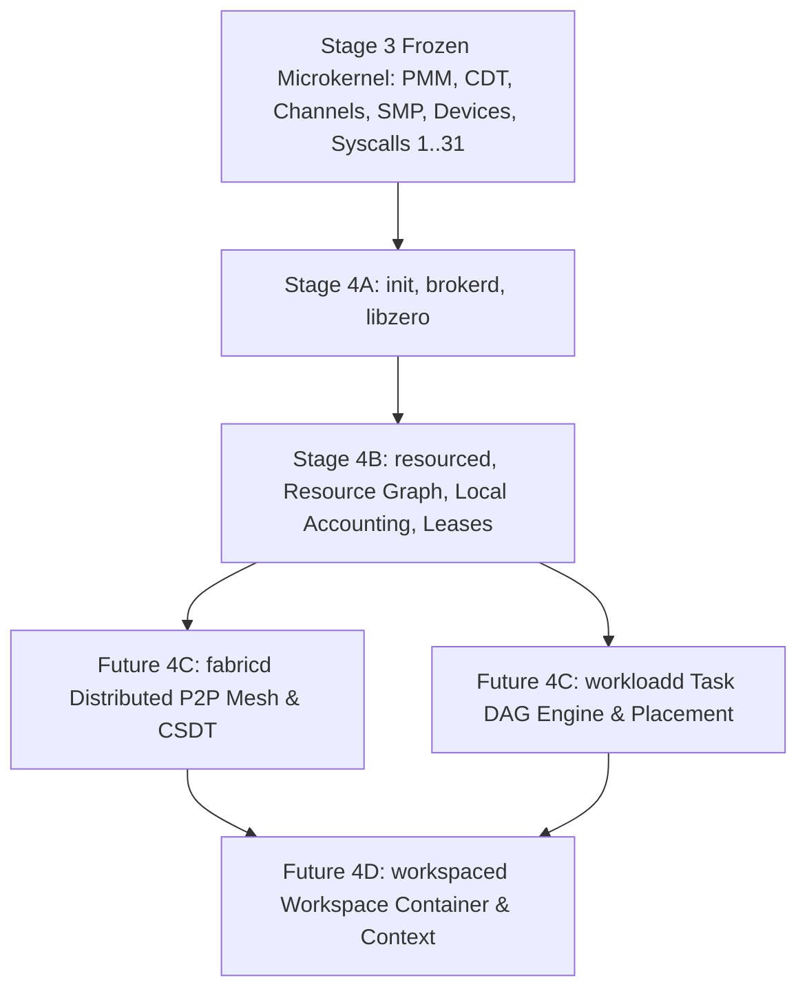

# STAGE 4B ARCHITECTURE SPECIFICATION (REV 1)

## Unified Resource Graph & Local Node Accounting (`resourced`)

**Status:** 🟡 PROPOSED ARCHITECTURAL SPECIFICATION — PENDING ADVERSARIAL REVIEW  
**Author:** ZeroOS Architecture Team  
**Date:** 2026-09-22  
**Target Milestone:** Stage 4B (Unified Resource Graph & Local Node Accounting)  
**Parent Specifications:** Stage 4 Architecture Rev6 (`STAGE4-ARCHITECTURE-REV6.md`), ADR-0024 Rev6  
**Kernel Baseline:** Stage 3A–3N Hard Frozen & Inviolate  
**System Service Baseline:** Stage 4A (`init`, `brokerd`, `libzero`) Implemented, Verified, Frozen  

---

## 1. Scope

Phase 4B defines the architecture, data structures, invariants, failure contracts, and interfaces for **Local Node Resource Management** in ZeroOS. Specifically, it establishes:
1. The **Canonical Resource Model** representing all physical and logical execution resources (CPU, GPU, NPU, RAM, Storage, Network, Peripherals, Sensors, Energy).
2. The **Unified Resource Graph** capturing physical topology, provider relationships, containment hierarchies, and lease attachments on a single node.
3. The **Local Node Accounting Engine** maintaining hard conservation of resources across Capacity, Available, Reserved, Allocated, and Consumed dimensions.
4. The **Resource Lease Contract** providing time-bounded, capability-authorized, auto-reclaiming resource capacity allocations.
5. The **`resourced` Daemon** running as an unprivileged, capability-constrained Ring 3 system service supervised by `init` and discovered via `brokerd`.

Phase 4B is strictly **local node infrastructure**. It establishes the ground-truth resource substrate upon which higher-level workload dispatch (4C), workspace context (4D), and autonomous agents (4E) will execute.

---

## 2. Goals

1. **Generic Resource Abstraction**: Provide a uniform, typed, and mathematically bounded abstraction for heterogeneous hardware and synthetic resources without erasing hardware-specific constraints.
2. **Strict Authority Decoupling**: Maintain absolute separation:
   $$\begin{aligned}
   \mathbf{Capabilities} &\implies \text{What operations are \textbf{PERMITTED} (Kernel Authoritative)} \\
   \mathbf{Leases} &\implies \text{What bounded capacity is \textbf{COMMITTED} (\texttt{resourced} Authoritative)} \\
   \mathbf{Policies} &\implies \text{What allocation distributions are \textbf{ACCEPTABLE} (User/Workspace Policy)}
   \end{aligned}$$
3. **Local Node Self-Sovereignty**: Establish that a node is the sole authoritative source of truth for its own physical capacity, telemetry, and leases (`I-GRAPH-AUTHORITY-LOCAL`).
4. **Hard Conservation & Monotonicity**: Guarantee that capacity cannot be leaked, double-allocated, or generated from nothing ($C_{\text{avail}} + C_{\text{resv}} + C_{\text{alloc}} \le C_{\text{total}}$).
5. **Deterministic Bounded Reclamation**: Guarantee that consumer termination, provider failure, or lease TTL expiration automatically reclaims capacity fail-closed without orphan leaks (`I-LEASE-CLEANUP`).
6. **Zero Kernel Mutation**: Consume frozen Stage 3 syscalls, handle tables, and capability models without modifying a single byte of the kernel nucleus.
7. **Zero Dynamic Memory Allocation**: Enforce static tables, bounded arrays, and deterministic memory limits in `#![no_std]` userspace.

---

## 3. Non-Goals

1. **NOT Workload Orchestration (Deferred to Phase 4C)**: `resourced` does NOT parse workload manifests, construct task execution plans, or schedule computational jobs. Workload orchestration belongs to `workloadd`.
2. **NOT Task DAG Scheduling (Deferred to Phase 4C)**: The Resource Graph describes what hardware exists and how it is connected; it is NOT a directed acyclic graph (DAG) of task dependencies.
3. **NOT Distributed Mesh Offloading (Deferred to Phase 4C)**: Phase 4B does not implement peer-to-peer Noise tunnels, remote capability delegation (CSDTs), or multi-node consensus. It only exposes local telemetry and local lease endpoints that `fabricd` will consume.
4. **NOT Workspace Container Management (Deferred to Phase 4D)**: `resourced` does not manage user workspaces, persistent contexts, or visual surfaces.
5. **NOT Agent Perception or Intent Resolution (Deferred to Phase 4E/4F)**: `resourced` does not interpret human language, optimize multi-variable utility functions, or evaluate Two-Man Rule approvals.
6. **NOT Live Process Migration**: Precluded by Stage 4 Rev6 invariant `I-NO-LIVE-PROCESS-MIGRATION`.

---

## 4. Terminology

| Term | Definition |
| :--- | :--- |
| **`resourced`** | The Ring 3 system service daemon responsible for local resource discovery, topology, accounting, and leases. |
| **`ResourceId`** | A globally unique 128-bit composite identifier `(NodeId, LocalSeq)` identifying a specific resource. |
| **`LeaseId`** | A globally unique 128-bit composite identifier `(NodeId, LocalSeq)` identifying an active capacity grant. |
| **Resource Provider** | An entity (kernel driver, hardware daemon, or platform service) authoritative for a hardware or logical resource. |
| **Resource Consumer** | A process, system service, or future workload that requests and holds a resource lease. |
| **Resource Descriptor** | A bounded, fixed-size structure describing resource identity, type, total capacity, health, and policy. |
| **Resource Lease** | A time-bounded, capability-backed commitment of physical capacity granted to a specific consumer. |
| **Resource Graph** | A directed, typed, potentially cyclic graph capturing physical containment, backing, and lease attachments. |
| **Monotonic Expiration Tick** | Local LAPIC timer tick at which a lease or state token expires fail-closed without network synchronization. |
| **Energy Tier** | The formal provenance of energy data: `MEASURED` (hardware PMIC/RAPL), `ESTIMATED` (physics model), or `DECLARED` (intent). |

---

## 5. Authority Model: Boundaries Between Subsystems

```text
+-----------------------------------------------------------------------------+
|                               STAGE 3 KERNEL                                |
|                        (Frozen Ring 0 Microkernel)                          |
|                                                                             |
|  * Physical Memory Management (PMM 4-state bitmap: Free, Alloc, Resv, Bad)  |
|  * Kernel Object Lifecycles (Channel, ShmObject, Event, Process, Device)     |
|  * Capability Derivation Tree (CDT) & Monotonic Rights Enforcement          |
|  * Thread Scheduling & SMP Core Dispatch (MAX_CPUS = 4)                     |
|  * MMIO Window Virtual Mapping & DMA Physical Frame Pinning                 |
+--------------------------------------┬--------------------------------------+
                                       │ Syscalls 1..31 & IPC Channels
+--------------------------------------v--------------------------------------+
|                           STAGE 4A SYSTEM RUNTIME                           |
|                                                                             |
|  * init: Supervised Process Lifecycles & Bounded Restart Policies (retries=3)|
|  * brokerd: Service Directory & Capability-Mediated IPC Rendezvous          |
|  * libzero: Freestanding #![no_std] Runtime & 80-Byte IpcMessage Layout     |
+--------------------------------------┬--------------------------------------+
                                       │ Service Registration & Supervision
+--------------------------------------v--------------------------------------+
|                           STAGE 4B resourced                                |
|                         (Local Node Accounting)                             |
|                                                                             |
|  * Authoritative Local Resource Registry & Dynamic State Machines           |
|  * Unified Resource Graph (Nodes, Containment, Backing, Interconnects)      |
|  * Multidimensional Capacity Accounting (Capacity, Avail, Resv, Alloc)      |
|  * Capability-Authorized Resource Leases & Auto-Reclamation Sweeper         |
|  * Local Process Quota Enforcement                                          |
|  * Energy & Thermal Telemetry Ingestion (Classified by Provenance Tier)     |
+--------------------------------------┬--------------------------------------+
                                       │ Lease Issuance & Telemetry Readout
+--------------------------------------v--------------------------------------+
|                       FUTURE CONSUMERS (4C, 4D, 4E, 4F)                     |
|                                                                             |
|  * 4C workloadd: Task DAG Construction, Task Dispatch, Failure Compensation  |
|  * 4C fabricd: Peer-to-Peer Mesh, Remote Advertisement, CSDT Delegation     |
|  * 4D workspaced: User Context, Inode Tree, Capability Security Envelopes   |
|  * 4E/4F Agents & intentd: Goal Perception Loops, Intent Planners           |
+-----------------------------------------------------------------------------+
```

### 5.1 Subsystem Authority Matrix

| Authority Domain | Stage 3 Kernel | Stage 4A `brokerd`/`init` | Stage 4B `resourced` | Stage 4C `workloadd` |
| :--- | :---: | :---: | :---: | :---: |
| **Physical Frame Ownership (PMM)** | **Authoritative** | None | Client / Observer | None |
| **Kernel Capability Validation** | **Authoritative** | None | Client Policy | None |
| **Hardware Register / MMIO Access** | **Authoritative** | None | Mediator / Verifier | None |
| **Process Lifetime & Death Signaling** | **Authoritative** | Supervisor | Client / Observer | None |
| **Service Discovery Directory** | None | **Authoritative** | Registered Service | Client |
| **Resource Topology & Attributes** | None | None | **Authoritative** | Consumer |
| **Capacity Accounting & Headroom** | None | None | **Authoritative** | Consumer |
| **Lease Creation & Renewal** | None | None | **Authoritative** | Consumer |
| **Local Quota Accounting** | None | None | **Authoritative** | Consumer |
| **Task DAG Admission & Dispatch** | None | None | None | **Authoritative** |
| **Workload Milestone Compensation** | None | None | None | **Authoritative** |

---

## 6. Resource Model

### 6.1 Canonical Resource Classes
To prevent ad-hoc resource structs, ZeroOS classifies all physical and logical resources into 9 canonical types:

```rust
#[repr(u8)]
#[derive(Debug, Clone, Copy, PartialEq, Eq)]
pub enum ResourceType {
    ComputeCpu     = 1, // Physical cores, logical threads, SIMD/ISA extensions
    ComputeGpu     = 2, // Graphics & compute units, VRAM, command ring buffers
    ComputeNpu     = 3, // Neural processing tensor engines, weight cache, TOPS
    MemoryRam      = 4, // Physical memory frames, NUMA nodes, DMA pool
    StorageVolume  = 5, // Block devices, partitions, ZeroFS volumes, IOPS
    NetworkLink    = 6, // Network interfaces, MAC ports, bandwidth, queue pairs
    HardwareDevice = 7, // Raw PCIe/MMIO peripherals, accelerators, sensors
    SensorStream   = 8, // Hardware telemetry (fuel gauge, temperature, IMU)
    EnergyBudget   = 9, // Battery capacity, power draw ceilings, thermal envelope
}
```

### 6.2 Conceptual Distinctions
ZeroOS rigorously separates seven concepts that monolithic kernels routinely conflate:
1. **Resource Identity**: The immutable 128-bit `DistributedId = (NodeId, LocalSeq)` identifying the resource across space and time.
2. **Resource Capability**: The unforgeable Stage 3 kernel capability token granting legal right to interact with the resource (`INSPECT`, `DEV_READ`, `SHM_MAP_WRITE`).
3. **Resource State**: The dynamic operational lifecycle of the hardware (`Available`, `Reserved`, `Allocated`, `Degraded`, `Unavailable`).
4. **Resource Capacity**: The total quantity of physical units provided by the hardware (bytes, millicores, TOPS, milliwatts).
5. **Resource Availability**: The instantaneous unreserved, unallocated capacity available for admission:
   $$C_{\text{avail}} = C_{\text{total}} - (C_{\text{reserved}} + C_{\text{allocated}})$$
6. **Resource Ownership**: The provider process/driver that controls the device registers and registered it with `resourced`.
7. **Resource Lease**: A time-bounded, capability-backed contractual slice of $C_{\text{avail}}$ granted to a consumer.

### 6.3 Canonical Resource Descriptor Layout (Static 128 Bytes)
To adhere to the zero-dynamic-allocation rule, each resource slot is statically sized to exactly 128 bytes (8-byte aligned):

```rust
#[repr(C)]
#[derive(Debug, Clone, Copy)]
pub struct ResourceDescriptor {
    // Identity & Provenance (32 Bytes)
    pub resource_id: DistributedId,     // 16 bytes: (NodeId, LocalSeq)
    pub provider_pid: u64,              // 8 bytes: Process ID of authoritative driver
    pub generation: u32,                // 4 bytes: Slot reuse generation
    pub res_type: ResourceType,         // 1 byte: Canonical type enum
    pub locality_node: u8,              // 1 byte: NUMA domain / CPU affinity socket
    pub _pad0: [u8; 2],                 // 2 bytes: Explicit alignment padding

    // Operational State & Health (16 Bytes)
    pub state: ResourceLifecycleState,  // 1 byte: Available, Reserved, Degraded, etc.
    pub health: ResourceHealth,         // 1 byte: Healthy, Degraded, Critical, Faulted
    pub energy_tier: EnergyTier,        // 1 byte: Measured, Estimated, Declared
    pub thermal_state: ThermalState,    // 1 byte: Nominal, Throttling, Critical
    pub required_rights: u16,           // 2 bytes: Stage 3 capability rights mask
    pub active_leases_count: u16,       // 2 bytes: Number of concurrent leases
    pub bound_kernel_handle: u32,       // 4 bytes: Process-local handle to kernel object
    pub _pad1: [u8; 4],                 // 4 bytes: Explicit alignment padding

    // Dimensional Capacity Accounting (48 Bytes)
    pub total_capacity: u64,            // 8 bytes: Total physical capacity (discrete units)
    pub reserved_capacity: u64,         // 8 bytes: Headroom held for soft reservations
    pub allocated_capacity: u64,        // 8 bytes: Hard commitments to active leases
    pub consumed_capacity: u64,         // 8 bytes: Instantaneous active physical usage
    pub unit_granularity: u64,          // 8 bytes: Minimum allocation quantum (e.g. 4096)
    pub max_lease_duration_ticks: u64,  // 8 bytes: Upper bound on single lease TTL

    // Telemetry & Accounting Metadata (32 Bytes)
    pub instantaneous_power_mw: u32,    // 4 bytes: Instantaneous power dissipation
    pub temperature_celsius: i16,       // 2 bytes: Measured junction temperature
    pub _pad2: [u8; 2],                 // 2 bytes: Alignment padding
    pub last_telemetry_tick: u64,       // 8 bytes: Monotonic tick of last update
    pub accounting_epoch: u64,          // 8 bytes: Sequence counter of accounting state
    pub custom_attribute: u64,          // 8 bytes: Hardware-specific bitmask / flags
}

const _: () = assert!(core::mem::size_of::<ResourceDescriptor>() == 128);
const _: () = assert!(core::mem::align_of::<ResourceDescriptor>() == 8);
```

### 6.4 Field Authority Classification

| Field Group | Immutability | Authority | Description |
| :--- | :--- | :--- | :--- |
| `resource_id`, `res_type`, `unit_granularity` | Immutable at registration | Provider + `resourced` | Unique identity and basic physical parameters. |
| `provider_pid`, `required_rights` | Immutable at registration | Kernel / Provider | Security credentials required to lease capacity. |
| `total_capacity` | Static (Dynamic on Hotplug) | Provider Driver | Physical upper bound reported by hardware driver. |
| `reserved_capacity`, `allocated_capacity` | Mutable | `resourced` | Authoritative local accounting state. |
| `consumed_capacity` | Dynamically Observable | Provider / Telemetry | Advisory actual usage reported by hardware counters. |
| `health`, `thermal_state`, `energy_tier` | Dynamically Observable | Hardware PMIC / Sensor | Physical environment status. |

---

## 7. Resource Graph Model

### 7.1 Separation from Workload Task DAGs
$$\mathbf{Invariant\ I-GRAPH-SEPARATION:}\quad \text{Resource Graph} \neq \text{Workload Task DAG}$$
- The **Resource Graph** models *what hardware and logical capacity exists, how it is physically interconnected, and which leases bind to it*. It is a **general directed typed graph** that naturally contains cycles (e.g., Node $\to$ Device $\to$ Storage $\to$ Swap $\to$ RAM $\to$ Node).
- The **Workload Task DAG** models *what computation needs to be accomplished and the flow of data dependencies between tasks*. It is **strictly acyclic** (`I-TASK-DAG-ACYCLIC`).

### 7.2 Graph Node Types
1. `Node`: Root physical host machine.
2. `Resource`: Hardware or synthetic resource pool (e.g. CPU Socket, DRAM bank, NVMe drive).
3. `SubResource`: Granular hardware division (e.g. CPU Core within Socket, Compute Queue within GPU, Partition within Disk).
4. `Provider`: Authoritative driver process supplying the resource.
5. `Lease`: Active contractual capacity allocation granted to a consumer.

### 7.3 Graph Edge Semantics
To prevent semantic drift, `resourced` defines an explicit, closed-form set of 6 edge types:

```rust
#[repr(u8)]
#[derive(Debug, Clone, Copy, PartialEq, Eq)]
pub enum GraphEdgeType {
    Contains    = 1, // Hierarchical containment: Parent contains Child (Node -> CPU -> Core)
    Provides    = 2, // Inception: Provider process introduces Resource into the graph
    DependsOn   = 3, // Functional dependency: Resource A cannot function without Resource B
    AttachedTo  = 4, // Physical/Interconnect bus: Device attached to PCIe Bridge / Bus
    Backs       = 5, // Substrate relationship: Physical DRAM backs Virtual SHM Pool
    LeasedBy    = 6, // Capacity grant: Resource capacity leased to Consumer Process
}
```

```text
               +-------------------------------------------+
               |                Node: LocalHost             |
               +-----+-------------------------------+-----+
                     |                               |
          Contains   |                    Contains   |
                     v                               v
         +-----------+-----------+       +-----------+-----------+
         |  Resource: CPU Socket |       |  Resource: PCIe Bus 0 |
         +-----------+-----------+       +-----------+-----------+
                     |                               |
          Contains   |                    AttachedTo |
                     v                               v
         +-----------+-----------+       +-----------+-----------+
         |   SubRes: CPU Core 0  |       |   Device: NVMe SSD    |
         +-----------+-----------+       +-----------+-----------+
                     ^                               |
            LeasedBy |                      Provides |
                     |                               v
         +-----------+-----------+       +-----------+-----------+
         |    Lease: 500 mCPU    |       |  Resource: StorageVol |
         +-----------+-----------+       +-----------+-----------+
                     |                               |
            Consumer |                      Backs    |
                     v                               v
         +-----------+-----------+       +-----------+-----------+
         |   Process: worker_1   |       |  Resource: Swap Space |
         +-----------------------+       +-----------------------+
```

### 7.4 Static Edge Table Representation (32 Bytes)
```rust
#[repr(C)]
#[derive(Debug, Clone, Copy)]
pub struct GraphEdge {
    pub occupied: bool,          // 1 byte: Slot occupied flag
    pub edge_type: GraphEdgeType,// 1 byte: Edge relationship enum
    pub generation: u16,         // 2 bytes: Generation counter
    pub _pad0: [u8; 4],          // 4 bytes: Alignment padding
    pub source_id: DistributedId,// 16 bytes: Source node/resource/lease
    pub target_id: DistributedId,// 16 bytes: Target node/resource/lease
}
```

---

## 8. Local Node Authority Model

### 8.1 The Local Authority Invariant
$$\mathbf{Invariant\ I-RES-AUTHORITY-LOCAL:}$$
$$\text{A node is authoritatively sovereign solely over its locally hosted physical resources.}$$
$$\text{Remote observations cannot mutate local capacity without an authorized provider lease commit.}$$

### 8.2 Provider Authority Lifecycle
1. **Registration**: A resource provider (e.g. `virtio-net` driver) acquires an endpoint capability from `brokerd` or kernel, contacts `resourced`, and issues `OP_RES_REGISTER`.
2. **Heartbeat & Telemetry**: The provider periodically reports health, temperature, and measured power. If a provider fails to heartbeat within `PROVIDER_TIMEOUT_TICKS`, `resourced` transitions the resource to `Degraded` or `Unavailable`.
3. **Disappearance / Crash**: If the provider process terminates (detected via IPC channel `PeerClosed` signal from Stage 3 kernel), all hosted resources immediately transition to `Unavailable`. Active leases transition to `ProviderLost`.
4. **Stale State Prevention**: When a resource transitions to `Unavailable`, any pending reservation or lease renewal is rejected fail-closed.

---

## 9. Accounting Model

### 9.1 Multi-Dimensional Accounting Equations
For every managed resource $R$, `resourced` enforces the following mathematical conservation laws at all times:

$$\begin{aligned}
C_{\text{total}} &\ge 0 \\
C_{\text{reserved}} &\ge 0 \\
C_{\text{allocated}} &\ge 0 \\
C_{\text{reserved}} + C_{\text{allocated}} &\le C_{\text{total}} \\
C_{\text{avail}} &= C_{\text{total}} - (C_{\text{reserved}} + C_{\text{allocated}}) \\
C_{\text{consumed}} &\le C_{\text{total}} \quad (\text{Dynamically observed; may exceed } C_{\text{allocated}} \text{ under burst policies})
\end{aligned}$$

$$\mathbf{Invariant\ I-ACCOUNTING-CONSERVATION:}\quad C_{\text{avail}} + C_{\text{reserved}} + C_{\text{allocated}} = C_{\text{total}}$$
Capacity cannot be generated, inflated, or leaked across allocation and deallocation operations.

### 9.2 Units & Quantization

| Resource Class | Base Discrete Unit | Granularity Quantum | Burst Policy |
| :--- | :--- | :--- | :--- |
| `ComputeCpu` | Millicores ($1\text{ core} = 1000\text{ mCPU}$) | 50 mCPU | Hard cap or fair-share burst |
| `ComputeGpu` | Hardware Compute Units / VRAM KiB | 1 CU / 64 KiB | Hard quota |
| `ComputeNpu` | TOPS $\times 10^{-3}$ (MilliTOPS) / Cache KiB | 100 MilliTOPS | Non-preemptible batch |
| `MemoryRam` | Physical Frames ($4096\text{ bytes}$) | 1 Frame ($4\text{ KiB}$) | Hard limit (OOM fail-closed) |
| `StorageVolume` | Disk Sectors ($512\text{ bytes}$) / IOPS | 8 Sectors ($4\text{ KiB}$) | Bandwidth throttle |
| `NetworkLink` | Bandwidth ($1024\text{ bps}$) / Packet Buffers | 64 Kbps | Token bucket shaper |
| `EnergyBudget` | Average Power ($\text{mW}$) / Energy ($\mu\text{J}$) | $1\text{ mW}$ | Thermal throttling trigger |

### 9.3 Admission Control Logic
When a lease request for quantity $\Delta C$ arrives:
1. `resourced` checks: $\Delta C > 0$ and $\Delta C \pmod{\text{unit\_granularity}} == 0$.
2. `resourced` checks quota: $\text{CurrentAllocated}(\text{Consumer}) + \Delta C \le \text{Quota}(\text{Consumer})$.
3. `resourced` checks availability: $\Delta C \le C_{\text{avail}}$.
4. If all checks pass:
   $$C_{\text{allocated}} \leftarrow C_{\text{allocated}} + \Delta C$$
   $$C_{\text{avail}} \leftarrow C_{\text{avail}} - \Delta C$$
5. If any check fails, the request is rejected with `ZeroError::OutOfMemory` or `ZeroError::QuotaExceeded` without mutating state.

---

## 10. Resource Leases

### 10.1 Decoupling Authority from Capacity
$$\mathbf{Invariant\ I-LEASE-AUTH-BOUNDED:}\quad \text{Lease Authority} \subseteq \text{Capability Authority}$$
- A **Capability** grants unforgeable mathematical authorization to interact with an object.
- A **Lease** grants time-bounded, metered physical capacity of that object.
- Presenting a lease token to hardware WITHOUT a valid kernel capability grants zero access.
- Presenting a capability WITHOUT a valid lease grants authorization but zero committed capacity (subject to rejection by `resourced` or device driver).

### 10.2 Lease Lifecycle State Machine

```text
                 +-------------------+
                 |     Requested     |
                 +---------+---------+
                           | Validated & Capacity Committed
                           v
                 +-------------------+
                 |      Granted      |
                 +---------+---------+
                           | Consumer Acknowledged (First Use)
                           v
        +-------->+-------------------+<-------+
        |         |      Active       |        |
        |         +----+----+----+----+        |
        |              |    |    |             | Renewed
        | Renewing     |    |    +-------------+
        +--------------+    |
                            | Terminal State Transitions
                            v
       +--------------------+--------------------+--------------------+
       |                    |                    |                    |
       v                    v                    v                    v
+--------------+     +--------------+     +--------------+     +--------------+
|   Released   |     |   Expired    |     |   Revoked    |     | ProviderLost |
| (Clean exit) |     |  (TTL miss)  |     | (Cap revoke) |     | (Driver die) |
+-------+------+     +-------+------+     +-------+------+     +-------+------+
        |                    |                    |                    |
        +--------------------+--------------------+--------------------+
                             |
                             v
                 +-----------------------+
                 |       Reclaimed       |
                 | (Capacity C_avail +=) |
                 +-----------------------+
```

### 10.3 Canonical Lease Record Layout (Static 96 Bytes)

```rust
#[repr(C)]
#[derive(Debug, Clone, Copy)]
pub struct ResourceLease {
    // Identity & Binding (32 Bytes)
    pub lease_id: DistributedId,         // 16 bytes: Unique (NodeId, LocalSeq)
    pub resource_id: DistributedId,      // 16 bytes: Target Resource (NodeId, LocalSeq)

    // Ownership & Security (24 Bytes)
    pub consumer_pid: u64,               // 8 bytes: Process ID holding this lease
    pub consumer_handle: u32,            // 4 bytes: Process-local handle to transferred object
    pub generation: u32,                 // 4 bytes: Monotonic lease generation counter
    pub authorized_rights: u16,          // 2 bytes: Mask of verified capability rights
    pub state: LeaseState,               // 1 byte: Active, Expired, Revoked, etc.
    pub _pad0: [u8; 5],                  // 5 bytes: Explicit alignment padding

    // Capacity & Time Bounds (40 Bytes)
    pub allocated_amount: u64,           // 8 bytes: Committed capacity in discrete units
    pub start_tick: u64,                 // 8 bytes: Monotonic LAPIC tick at lease grant
    pub expiration_tick: u64,            // 8 bytes: Monotonic tick deadline (T_start + TTL)
    pub renewal_window_ticks: u32,       // 4 bytes: Allowable heartbeat lead time
    pub renewal_count: u32,              // 4 bytes: Number of successful renewals
    pub quota_bucket_id: u32,            // 4 bytes: Owning quota bucket
    pub _pad1: [u8; 4],                  // 4 bytes: Explicit alignment padding
}

const _: () = assert!(core::mem::size_of::<ResourceLease>() == 96);
const _: () = assert!(core::mem::align_of::<ResourceLease>() == 8);
```

### 10.4 Monotonic Expiration Authority (`I-LEASE-MONOTONIC-EXPIRATION`)
- In accordance with Stage 4 Rev6 invariant `I-CSDT-EXPIRATION-MONOTONIC`, lease expiration is evaluated **strictly against the local monotonic hardware timer** (LAPIC periodic ticks from Stage 3B).
- **Wall-clock synchronization (NTP/PTP) is prohibited** from influencing lease expiration.
- A lease is expired if:
  $$T_{\text{current\_monotonic\_tick}} \ge \text{lease.expiration\_tick}$$

---

## 11. Capability Integration

### 11.1 The Single Capability Model
$$\mathbf{Invariant\ I-RES-NO-CAP-DUPLICATION:}\quad \text{There is exactly one capability system in ZeroOS: Stage 3 Kernel CDT.}$$
`resourced` does NOT create, maintain, or evaluate a separate, parallel capability system. All authorization operations in `resourced` resolve directly to Stage 3 kernel capability handles.

### 11.2 Operation Authority Mapping

| `resourced` Operation | Required Stage 3 Kernel Right | Verification Mechanism |
| :--- | :--- | :--- |
| `OP_RES_DISCOVER` / Query | `cap_rights::INSPECT` (`0x1000`) | Caller channel handle checked for `INSPECT` |
| `OP_RES_REGISTER` (Provider) | `cap_rights::DEV_ATTACH` (`0x0080`) | Provider presents device/channel handle to kernel |
| `OP_LEASE_REQUEST` (Device) | `DEV_READ` \| `DEV_WRITE` \| `DEV_CONTROL` | Caller presents target capability; `sys_cap_derive` checks monotonic subset |
| `OP_LEASE_REQUEST` (RAM) | `SHM_MAP_READ` \| `SHM_MAP_WRITE` | Caller presents memory capability handle |
| `OP_LEASE_REQUEST` (Storage) | `FILE_READ` \| `FILE_WRITE` | Caller presents ZeroFS volume capability handle |
| `OP_LEASE_REQUEST` (Network) | `NET_SEND` \| `NET_RECV` | Caller presents network interface capability handle |
| `OP_QUOTA_OVERRIDE` (Admin) | `cap_rights::AUDIT` (`0x2000`) | Administrative authorization verification |

### 11.3 Prohibition of Authority Amplification
$$\mathbf{Invariant\ I-RES-CAP-NO-AMPLIFICATION:}$$
$$\text{\texttt{resourced} cannot grant rights exceeding the caller's presented capability.}$$
$$\text{If a client presents a handle with } R_{\text{caller}} \subset R_{\text{required}}, \text{ \texttt{resourced} rejects the request with \texttt{PermissionDenied}.}$$

---

## 12. Quota Model

### 12.1 Purpose of Local Node Quotas
Quotas in Phase 4B prevent a single rogue, runaway, or buggy process from starving other services of RAM, CPU, or device capacity.

### 12.2 Scoping & Dimensions
In Phase 4B, quotas are scoped to **Process Identity (`ProcessId`)** and **Service Identity (`ServiceId`)**, with reserved fields for future Stage 4C `WorkloadId` and Stage 4D `WorkspaceId`.

```rust
#[repr(C)]
#[derive(Debug, Clone, Copy)]
pub struct QuotaEntry {
    pub occupied: bool,
    pub entity_type: QuotaEntityType,    // Process, Service, Workload, Workspace
    pub _pad0: [u8; 2],
    pub entity_id: u64,                  // PID or ServiceId
    pub max_cpu_millicores: u32,         // Max CPU capacity allocatable
    pub max_ram_frames: u32,             // Max 4 KiB frames allocatable
    pub max_storage_sectors: u64,        // Max persistent disk sectors
    pub max_network_bps: u64,            // Max bandwidth ceiling
    pub cur_cpu_millicores: u32,         // Currently allocated
    pub cur_ram_frames: u32,             // Currently allocated
    pub cur_storage_sectors: u64,        // Currently allocated
    pub cur_network_bps: u64,            // Currently allocated
}
```

### 12.3 Quota Invariants
1. `I-QUOTA-BOUNDED`: $\sum \text{Allocated}(\text{Entity}, R) \le \text{Quota}(\text{Entity}, R)$.
2. `I-QUOTA-FAIL-CLOSED`: When an entity reaches its quota ceiling, subsequent lease requests fail immediately with `ZeroError::QuotaExceeded`.
3. `I-QUOTA-CLEANUP`: When an entity terminates, its quota usage counters are decremented as its leases are reclaimed.

---

## 13. Energy Model

### 13.1 Authoritative Telemetry Classification
In accordance with Stage 4 Rev6 invariant `I-ENERGY-MEASUREMENT-CLASSIFIED`:
1. **`MEASURED`**: Grounded in physical hardware counters (Intel/AMD RAPL MSRs, battery fuel gauge, PMIC I2C registers). High assurance.
2. **`ESTIMATED`**: Derived from analytical physics models ($E = \text{OPS} \times \alpha + \text{StaticPower}$). Moderate assurance.
3. **`DECLARED`**: Stated by software intent manifests. Zero hardware assurance.

### 13.2 Enforcement Invariant
$$\mathbf{Invariant\ I-RES-ENERGY-LIMITS:}$$
$$\text{Security boundaries, capability validation, and hard capacity admission decisions}$$
$$\text{MUST NOT depend on untrusted \texttt{DECLARED} or unverified \texttt{ESTIMATED} telemetry.}$$
$$\text{Hard thermal/power shedding triggers strictly on \texttt{MEASURED} PMIC telemetry.}$$

---

## 14. Failure Model

### 14.1 Consumer Crash Recovery
```text
Consumer Process Terminated (Exit / Fault)
    │
    ├─> Stage 3 Kernel destroys Process HandleTable
    ├─> IPC Channel to resourced emits PeerClosed signal
    ├─> resourced detects PeerClosed or sweeps via init notification
    ├─> For every lease where consumer_pid == DeadPID:
    │     * Transition lease: Active -> Reclaimed
    │     * Advance lease generation
    │     * C_allocated -= lease.allocated_amount
    │     * C_avail     += lease.allocated_amount
    │     * Quota usage decremented
    │     * Remove GraphEdge: LeasedBy
    └─> Zero leaked capacity (I-LEASE-CLEANUP)
```

### 14.2 Provider Crash Recovery
```text
Provider Driver Terminated (Crash / Reset)
    │
    ├─> IPC Channel to resourced asserts PeerClosed
    ├─> resourced marks ResourceDescriptor: state = Unavailable, health = Faulted
    ├─> For every lease on that resource:
    │     * Transition lease: Active -> ProviderLost
    │     * Signal consumer via registered notification event/IPC
    └─> Subsequent admission on that resource rejected fail-closed
```

### 14.3 `resourced` Daemon Crash Recovery
1. **Durable Identifier Preservation (`I-ID-DURABLE-ALLOCATOR-STATE`)**: Sequence number ceiling is durably journaled to ZeroFS. Upon restart, allocator resumes strictly above the committed ceiling, guaranteeing zero `ResourceId` or `LeaseId` reuse.
2. **State Reconstruction**: Upon restart supervised by `init`:
   - `resourced` probes hardware devices via `SYS_DEV_QUERY` (syscall 17) to reconstruct baseline resource descriptors.
   - `resourced` re-registers with `brokerd`.
   - Existing consumers holding transferred channel handles to the old `resourced` instance receive `PeerClosed` and must re-discover and re-acquire leases.

---

## 15. SMP Interaction (Multicore Stage 3N)

1. **Topology Awareness**: Discovers CPU core count (`MAX_CPUS = 4`) and LAPIC IDs via kernel bootstrap inventory.
2. **Per-CPU Utilization Telemetry**: Tracks per-core idle vs. active ticks exposed by the kernel.
3. **SMP Concurrency Control**:
   - `resourced` in user space manages internal table access via atomic sequence locks and freestanding mutexes.
   - Core accounting counters use atomic fetch-add/fetch-sub operations to eliminate lock contention on high-frequency queries.

---

## 16. Distributed Fabric Boundary

Phase 4B is explicitly local. However, to ensure frictionless federation when Phase 4C (`fabricd`) is introduced, Phase 4B enforces the following boundaries:
1. **Composite Identifiers**: All `ResourceId` and `LeaseId` structures use 128-bit `DistributedId = (NodeId, LocalSeq)`. On the local node, `NodeId` is the local machine's identity hash.
2. **Local Sovereignty**: Remote nodes cannot directly invoke `resourced`. Remote access occurs solely through `fabricd`, which acts as an authorized local proxy presenting valid CSDT tokens.
3. **Advisory Telemetry Export**: Telemetry exposed by `resourced` to `fabricd` carries the local node's cryptographic attestation and energy tier.

---

## 17. IPC / API Boundary (Stage 3G Protocol)

All communication with `resourced` uses the frozen 80-byte `IpcMessage` layout over Stage 3G bidirectional channels:

```rust
#[repr(C)]
pub struct IpcMessage {
    pub tag: u64,             // Protocol Opcode
    pub payload_len: u16,     // Length of valid payload (0..48)
    pub handles_count: u16,   // Attached handles (0..4)
    pub _reserved1: u32,      // Explicit padding
    pub payload: [u8; 48],    // Inline message data
    pub handles: [u32; 4],    // Transferred capability handles
}
```

### Protocol Opcodes & Message Contracts

| Opcode Name | Tag | Request Payload | Handles In | Response Payload | Handles Out |
| :--- | :---: | :--- | :---: | :--- | :---: |
| `OP_RES_REGISTER` | `0x2001` | ResType(1B) + Locality(1B) + Cap(8B) + Gran(8B) + Rights(2B) | `[dev_cap]` | Status(4B) + ResId(16B) + Gen(4B) | None |
| `OP_RES_UNREGISTER` | `0x2003` | ResId(16B) + Gen(4B) | None | Status(4B) | None |
| `OP_RES_DISCOVER` | `0x2005` | FilterType(1B) + Offset(2B) | None | Status(4B) + Count(2B) + Total(2B) + ResIds(32B) | None |
| `OP_RES_QUERY` | `0x2007` | ResId(16B) | None | Status(4B) + State(1B) + Cap(8B) + Avail(8B) + Pwr(4B) | None |
| `OP_LEASE_REQUEST` | `0x2009` | ResId(16B) + Amount(8B) + TTLTicks(8B) | `[auth_cap]` | Status(4B) + LeaseId(16B) + Gen(4B) + ExpireTick(8B) | `[dev_handle]` |
| `OP_LEASE_RENEW` | `0x200B` | LeaseId(16B) + Gen(4B) + TTLTicks(8B) | None | Status(4B) + NewExpireTick(8B) + Gen(4B) | None |
| `OP_LEASE_RELEASE` | `0x200D` | LeaseId(16B) + Gen(4B) | None | Status(4B) | None |
| `OP_QUOTA_QUERY` | `0x200F` | EntityId(8B) + EntityType(1B) | None | Status(4B) + CpuLimit(4B) + RamLimit(4B) + CurRam(4B) | None |
| `OP_ENERGY_GET` | `0x2011` | ResId(16B) | None | Status(4B) + Tier(1B) + Pwr(4B) + Temp(2B) + LastTick(8B) | None |

---

## 18. Security Model & Threat Analysis

| Threat ID | Threat Vector | Boundary | Architectural Mitigation | Testable Invariant |
| :--- | :--- | :--- | :--- | :--- |
| **T-4B-01** | Forged `ResourceId` | Client $\to$ `resourced` | All IDs allocated monotonically by `resourced`; lookups validated against occupied table. | `I-RES-ID-UNIQUE` |
| **T-4B-02** | Identifier Reuse After Crash | `resourced` Restart | Sequence ceiling durably committed to ZeroFS prior to external observation. | `I-ID-DURABLE-ALLOCATOR-STATE` |
| **T-4B-03** | Capability Amplification | Client $\to$ `resourced` | Kernel authoritatively enforces rights subset via `sys_cap_derive`; `resourced` checks bitmask. | `I-RES-CAP-NO-AMPLIFICATION` |
| **T-4B-04** | Stale Lease Reuse | Client $\to$ `resourced` | Monotonic 32-bit `generation` counter per lease slot; mismatched generation rejected. | `I-LEASE-STALE-REJECTION` |
| **T-4B-05** | Double-Allocation / Leaks | Internal Accounting | Arithmetic invariant verified on every commit: $C_{\text{avail}} + C_{\text{resv}} + C_{\text{alloc}} = C_{\text{total}}$. | `I-ACCOUNTING-CONSERVATION` |
| **T-4B-06** | Consumer Hoarding / Starvation | Client $\to$ System | Hard per-process/service quotas enforced on admission; fail-closed rejection. | `I-QUOTA-BOUNDED` |
| **T-4B-07** | Clock Manipulation / Skew | Lease Expiration | Expiration evaluated strictly against LAPIC monotonic hardware ticks; NTP/wall-clock ignored. | `I-LEASE-MONOTONIC-EXPIRATION` |
| **T-4B-08** | Untrusted Energy Injection | Workload $\to$ System | Energy telemetry strictly classified (`MEASURED`, `ESTIMATED`, `DECLARED`); hard limits use `MEASURED` only. | `I-RES-ENERGY-LIMITS` |
| **T-4B-09** | Orphan Capacity on Crash | Consumer Exit | Kernel IPC `PeerClosed` signal triggers deterministic lease sweep and capacity reclamation. | `I-LEASE-CLEANUP` |
| **T-4B-10** | Provider Impersonation | Driver $\to$ `resourced` | Provider must present kernel-verified device capability handle (`DEV_ATTACH`). | `I-RES-AUTHORITY-LOCAL` |

---

## 19. Authoritative Phase 4B Invariant Catalog

1. `I-RES-ID-UNIQUE`: Every `ResourceId` and `LeaseId` is globally unique via composite `(NodeId, LocalSeq)` tuples.
2. `I-ID-DURABLE-ALLOCATOR-STATE`: Identifier allocator sequence ceilings must be durably committed before any identifier becomes externally observable.
3. `I-RES-AUTHORITY-LOCAL`: A node is authoritative solely over its locally hosted physical resources. Remote observations are advisory.
4. `I-RES-CAPABILITY-NO-AMPLIFICATION`: `resourced` cannot grant rights exceeding the authorizing capability token presented by the caller.
5. `I-LEASE-AUTH-BOUNDED`: A lease grants physical capacity, never capability authority: $\text{Lease Authority} \subseteq \text{Capability Authority}$.
6. `I-LEASE-MONOTONIC-EXPIRATION`: Lease expiration is evaluated strictly against the receiving node's local monotonic hardware timer (LAPIC ticks). Wall-clock synchronization is prohibited.
7. `I-LEASE-CLEANUP`: When a consumer process terminates or disconnects, all associated leases are reclaimed without leaks.
8. `I-LEASE-STALE-REJECTION`: Any operation presenting a stale lease generation counter is rejected fail-closed with `GenerationMismatch`.
9. `I-ACCOUNTING-NONNEGATIVE`: Capacity counters ($C_{\text{total}}, C_{\text{avail}}, C_{\text{reserved}}, C_{\text{allocated}}$) are strictly non-negative.
10. `I-ACCOUNTING-CONSERVATION`: For every resource, $C_{\text{avail}} + C_{\text{reserved}} + C_{\text{allocated}} = C_{\text{total}}$ holds invariant across all states.
11. `I-RES-ENERGY-LIMITS`: Hard resource limits and safety triggers cannot depend on untrusted `ESTIMATED` or `DECLARED` energy telemetry.
12. `I-QUOTA-BOUNDED`: Total capacity leased by an entity cannot exceed its provisioned quota ceiling.
13. `I-GRAPH-SEPARATION`: The Resource Graph models physical and logical topology and may contain cycles; the Workload Task DAG is strictly acyclic.
14. `I-STATIC-BOUNDS`: All internal tables in `resourced` have statically fixed maximum capacities with zero unbounded dynamic heap allocation.

---

## 20. Dependency Graph & Audit



### Dependency Audit
- **Stage 3 Dependencies**:
  - `sys_channel_create`, `sys_channel_send`, `sys_channel_receive`, `sys_channel_close` (Syscalls 3..6).
  - `sys_cap_derive` (Syscall 10) for verifying capability rights attenuation.
  - `sys_dev_query` (Syscall 17) for kernel hardware discovery.
  - `sys_yield`, `sys_exit` (Syscalls 1..2).
- **Stage 4A Dependencies**:
  - `libzero::ipc::IpcMessage` (frozen 80-byte layout).
  - `libzero::broker::register_service`, `lookup_service` (for rendezvous with `brokerd`).
  - `libzero::supervisor` (for supervision by `init`).
- **Required Freezes Before Phase 4C**:
  - ResourceDescriptor layout, LeaseDescriptor layout, GraphEdge layout, and `resourced` IPC opcodes (`0x2001..0x2012`) must be frozen before `workloadd` or `fabricd` are implemented.

---

## 21. Static / Bounded Implementation Constraints

To preserve ZeroOS's deterministic, bounded systems philosophy:
1. `MAX_RESOURCES = 64`: Up to 64 distinct physical and synthetic resources tracked per node.
2. `MAX_LEASES = 128`: Up to 128 concurrent active leases.
3. `MAX_GRAPH_EDGES = 256`: Up to 256 directed topological edges.
4. `MAX_QUOTAS = 32`: Up to 32 concurrent process/service quota profiles.
5. Static Memory Footprint:
   - Resource Table: $64 \times 128\text{ B} = 8\text{ KiB}$.
   - Lease Table: $128 \times 96\text{ B} = 12\text{ KiB}$.
   - Edge Table: $256 \times 32\text{ B} = 8\text{ KiB}$.
   - Quota Table: $32 \times 64\text{ B} = 2\text{ KiB}$.
   - Total Core Tables: $< 32\text{ KiB}$ static BSS memory footprint.

---

## 22. Verification Strategy

When Phase 4B enters implementation, it will be validated by a machine verification suite (Tests 4B-A through 4B-N) in headless QEMU:
1. **4B-A: Resource Registration & Identity**: Verify monotonic non-colliding `ResourceId` issuance and slot binding.
2. **4B-B: Topology Graph Construction**: Construct typed directed graph; verify containment and backing edge traversal.
3. **4B-C: Capability-Mediated Admission**: Verify lease request succeeds when valid capability presented; fails with `PermissionDenied` when rights insufficient.
4. **4B-D: Authority Amplification Rejection**: Verify client cannot acquire lease rights exceeding its parent capability token.
5. **4B-E: Capacity Conservation**: Perform sequential grants and releases; verify $C_{\text{avail}} + C_{\text{resv}} + C_{\text{alloc}} == C_{\text{total}}$ at every step.
6. **4B-F: Monotonic Lease Expiration**: Fast-forward local LAPIC timer ticks; verify expired lease is reclaimed fail-closed without network interaction.
7. **4B-G: Stale Generation Rejection**: Attempt renewal using pre-reclamation generation token; verify `GenerationMismatch` rejection.
8. **4B-H: Consumer Crash Cleanup**: Terminate consumer process abruptly; verify `PeerClosed` signal triggers complete lease reclamation.
9. **4B-I: Provider Crash Containment**: Terminate provider driver; verify resource transitions to `Unavailable` and consumers receive `ProviderLost`.
10. **4B-J: Local Quota Enforcement**: Request capacity exceeding quota limit; verify `QuotaExceeded` rejection while system capacity remains available.
11. **4B-K: Energy Classification Integrity**: Submit declared vs. measured telemetry; verify hard safety thresholds ignore declared telemetry.
12. **4B-L: SMP Concurrency Stress**: Issue concurrent lease requests from multiple simulated threads; verify zero accounting race conditions or negative balances.
13. **4B-M: PMM Neutrality**: Verify physical memory allocation neutrality before and after test suite (`baseline_free == current_free`).

---

## 23. Open Questions & Architectural Gaps

1. **Kernel Device Query Granularity**: Stage 3L `sys_dev_query` currently returns basic class and MMIO window count. For fine-grained GPU/NPU queue accounting, should device drivers provide specialized user-space descriptors via shared memory, or should `resourced` query the driver directly over IPC?
   - *Working Resolution*: `resourced` communicates directly with the driver process over an IPC channel; `sys_dev_query` is used solely for initial hardware bootstrap discovery.
2. **Dynamic Hotplug of Physical Hardware**: How should physical memory hot-add or PCIe hot-unplug update `total_capacity`?
   - *Working Resolution*: Hot-add triggers an atomic addition to $C_{\text{total}}$ and $C_{\text{avail}}$. Hot-unplug transitions the resource to `Degraded` or `Unavailable`, triggering graceful lease evacuation.

---

## 24. Implementation Boundary Notice

**Implementation is strictly prohibited during this discovery phase.**  
No code, table definitions, or test runners shall be added until this architecture specification is formally reviewed, adversarial-tested, and approved.
