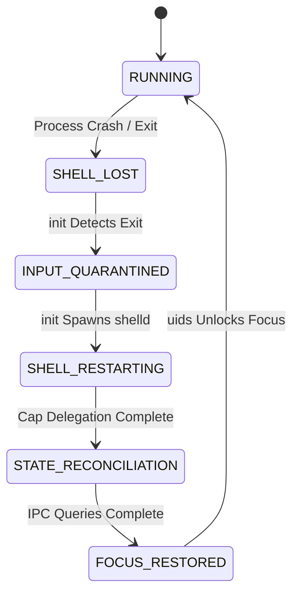

# Stage 6A Architecture Specification (Rev1)
## User Session Substrate & Human Operating Environment (`shelld`)

**Status**: 🟡 PROPOSED — PENDING REVIEW & FREEZE APPROVAL (IMPLEMENTATION NOT AUTHORIZED)  
**Author**: ZeroOS Core Architecture Team  
**Date**: 2026-10-06  
**Foundational Substrate**: Stage 3A–3N Kernel (Frozen), Stage 4A–4F Core System Services (Frozen), Stage 5 Spatial Presentation Subsystem (Frozen)

---

## 1. Executive Summary & Core Architectural Invariant

Stage 6A introduces `shelld`, the Ring 3 User Session Substrate and Human Operating Environment Daemon for ZeroOS.

```text
========================================================================================
CORE ARCHITECTURAL INVARIANT: I-SHELL-ORCHESTRATOR-NOT-AUTHORITY
========================================================================================
shelld is strictly a human-session orchestrator and spatial UI layout coordinator.
It is NOT a kernel capability authority, resource allocator, or authorization engine.
All underlying system operations (workspace lifecycle, surface registration, RAM leasing,
and agent execution) MUST continue to flow through standard Stage 3H CapabilityNode handles
and authoritative daemons (workspaced, resourced, surfaced, agentd).
shelld SHALL NOT create custom session tokens or secondary capability mechanisms.
========================================================================================
```

---

## 2. System Containment & Identity Hierarchy

ZeroOS structures human operating context through an explicit, asymmetric 1:N containment hierarchy. Identities are **distinct entities**, not interchangeable tokens.

```text
                               ┌───────────────────┐
                               │       User        │ (Human Identity)
                               └─────────┬─────────┘
                                         │ 1
                                         │
                                         │ N
                               ┌─────────▼─────────┐
                               │     Session       │ (shelld Lifetime)
                               └─────────┬─────────┘
                                         │ 1
                                         │
                                         │ N (Authorized Membership)
                               ┌─────────▼─────────┐
                               │     Workspace     │ (workspaced Graph)
                               └─────────┬─────────┘
                                         │ 1
                                         ├─────────────────────────┐
                                         │ N                       │ N
                               ┌─────────▼─────────┐     ┌─────────▼─────────┐
                               │       Agent       │     │     Workload      │
                               └───────────────────┘     └───────────────────┘
```

### 2.1 Entity Contracts

1. **`User` (`UserId`)**: A persistent identity represented by a 64-bit identifier (`u64`) authenticated via `authui` credentials validation.
2. **`Session` (`SessionId`)**: An active operating session bound to a single `UserId`, instantiated by `shelld`.
3. **`Workspace` (`WorkspaceId`)**: A persistent context graph container managed by `workspaced`. A session maintains a set of authorized workspace IDs.
4. **`Agent` / `Workload`**: Task execution units contained within a specific `WorkspaceId`.

---

## 3. Capability Models & Security Boundaries

### 3.1 `SessionManagementCap` Definition

`SessionManagementCap` is an ordinary Stage 3H service-role capability delegated by `init` to `shelld` upon daemon initialization.

```text
┌────────────────────────────────────────────────────────────────────────┐
│ Stage 3H CapabilityNode: SessionManagementCap                         │
├────────────────────────────────────────────────────────────────────────┤
│ Handle Type:        ObjectType::ServiceRole (0x0008)                  │
│ Rights Mask:        RIGHT_CALL | RIGHT_DELEGATE | RIGHT_OBSERVE (0x07)   │
│ Lineage:            Root (0) ──→ init (1) ──→ shelld (PID 6)           │
│ Holder:             shelld                                             │
│ Target Object:      SessionSubstrate                                   │
│ Permitted Ops:      OP_SESSION_INIT, OP_SESSION_ATTACH_WORKSPACE,      │
│                     OP_SESSION_DETACH_WORKSPACE, OP_SESSION_QUERY      │
└────────────────────────────────────────────────────────────────────────┘
```

### 3.2 `SystemSurfacePolicyCap` Definition

`SystemSurfacePolicyCap` separates **composition z-order layout policy** from **security authority**.

```text
┌────────────────────────────────────────────────────────────────────────┐
│ Stage 3H CapabilityNode: SystemSurfacePolicyCap                        │
├────────────────────────────────────────────────────────────────────────┤
│ Handle Type:        ObjectType::ServiceRole (0x0008)                  │
│ Rights Mask:        RIGHT_CALL | RIGHT_DELEGATE (0x03)                 │
│ Lineage:            Root (0) ──→ init (1) ──→ shelld (PID 6)           │
│ Holder:             shelld                                             │
│ Target Object:      SurfaceLayerSubstrate                              │
│ Permitted Ops:      OP_SURFACE_REGISTER_SYSTEM_LAYER (z = 100 .. 254) │
└────────────────────────────────────────────────────────────────────────┘
```

#### Layer Authority Rules:
- **Layer $z = 255$ (Trusted Auth Overlay)**: Accessible **exclusively** to `authui` via authenticated `AuthorizationTransactionRef` validation.
- **Layer $z \in [100 \dots 254]$ (System UI)**: Accessible **exclusively** to holders of `SystemSurfacePolicyCap` (`shelld`). Unprivileged workloads attempting to register $z \ge 100$ without this capability are rejected by `surfaced` with `ZeroError::PermissionDenied`.
- **Layer $z \in [0 \dots 99]$ (Workspace Applications)**: Standard application surfaces allocated under workspace capabilities.

---

## 4. `shelld` Lifecycle & Crash Recovery State Machine

To prevent input hijacking, screen flickering, or data leakage during process failure, `shelld` enforces a deterministic 7-stage state machine:



### 4.1 State Transition Matrix

| State | Trigger | System Actions | Security / Integrity Invariants |
|---|---|---|---|
| **`RUNNING`** | Normal Operation | Operates session layout, processes workspace switches, renders system HUD. | Ordinary execution state. |
| **`SHELL_LOST`** | `shelld` crash or termination | `init` intercepts thread death signal. `compositord` freezes screen on last valid frame. | No visual artifacts or unrendered VRAM corruption. |
| **`INPUT_QUARANTINED`** | `init` notifies `uids` | `uids` transitions to `FOCUS_STATE_CAPTURED`. Input events routed to dummy sink. | Prevents accidental keypress injection into background tasks. |
| **`SHELL_RESTARTING`** | `init` supervisor spawn | `init` launches new `shelld` process, re-delegating `SessionManagementCap` & `SystemSurfacePolicyCap`. | Fresh process state; no stale handles reused. |
| **`STATE_RECONCILIATION`** | `shelld` `_start` completion | `shelld` issues `OP_WORKSPACE_QUERY` to `workspaced` and `OP_SURFACE_ENUMERATE` to `surfaced`. | Reconstructs visual graph from authoritative daemons. |
| **`FOCUS_RESTORED`** | Reconciliation complete | `shelld` issues `OP_UIDS_SET_FOCUS` to `uids` for active workspace surface. | `uids` unlocks input isolation (`FOCUS_STATE_FOCUSED`). |

---

## 5. Three-Tier Session State Classification

`shelld` state is strictly partitioned into three lifetime tiers:

```text
┌────────────────────────────────────────────────────────────────────────┐
│                         SESSION STATE TIERS                            │
├────────────────────────────────────────────────────────────────────────┤
│ Tier 1: Persistent State (Backed by ZeroFS)                            │
│   ├── UserId & Salted Password/Credential Hash                         │
│   ├── Session Configuration & Authorized Workspace List                │
│   └── Spatial Layout Preferences (Grid / Tiling / Freeform Rules)      │
├────────────────────────────────────────────────────────────────────────┤
│ Tier 2: Reconstructable State (Queried via IPC on Startup/Recovery)     │
│   ├── Active Workspace Lifecycle States (from workspaced)              │
│   ├── Active Presentation Surface Descriptors (from surfaced)          │
│   └── Agent Activity Telemetry Descriptors (from agentd)               │
├────────────────────────────────────────────────────────────────────────┤
│ Tier 3: Ephemeral State (In-Memory Only; Reset on Crash)               │
│   ├── Window Drag/Resize Movement Vectors & Animation Progress         │
│   ├── Hover Highlight States & Tooltip Timers                          │
│   └── Uncommitted Shell Search Input Text Buffers                      │
└────────────────────────────────────────────────────────────────────────┘
```

---

## 6. IPC Protocol Specification (Range: `0x0801` – `0x0810`)

All Stage 6A IPC opcodes use the frozen Stage 3G 80-byte `IpcMessage` layout (`payload` buffer size = 48 bytes).

```text
0x0801: OP_SESSION_CREATE              0x0802: OP_SESSION_CREATE_RESP
0x0803: OP_SESSION_DESTROY             0x0804: OP_SESSION_DESTROY_RESP
0x0805: OP_SESSION_SWITCH_WORKSPACE    0x0806: OP_SESSION_SWITCH_WORKSPACE_RESP
0x0807: OP_SESSION_SET_LAYOUT          0x0808: OP_SESSION_SET_LAYOUT_RESP
0x0809: OP_SESSION_SUBSCRIBE_TELEMETRY 0x080A: OP_SESSION_SUBSCRIBE_TELEMETRY_RESP
0x080B: OP_SESSION_LOCK                0x080C: OP_SESSION_LOCK_RESP
0x080D: OP_SESSION_UNLOCK              0x080E: OP_SESSION_UNLOCK_RESP
0x080F: OP_SESSION_QUERY               0x0810: OP_SESSION_QUERY_RESP
```

### 6.1 `OP_SESSION_CREATE` (`0x0801`)
- **Payload Request** (32 bytes):
  - `0..8`: `user_id` (`u64`)
  - `8..16`: `credential_hash_prefix` (`u64`)
  - `16..24`: `requested_session_flags` (`u64`)
  - `24..32`: `_reserved` (`u64`)
- **Payload Response** (20 bytes):
  - `0..4`: `status` (`i32`, `ZeroError`)
  - `4..12`: `session_node_id` (`u64`)
  - `12..20`: `session_local_seq` (`u64`)

### 6.2 `OP_SESSION_SWITCH_WORKSPACE` (`0x0805`)
- **Payload Request** (32 bytes):
  - `0..8`: `session_node_id` (`u64`)
  - `8..16`: `session_local_seq` (`u64`)
  - `16..24`: `target_workspace_node_id` (`u64`)
  - `24..32`: `target_workspace_local_seq` (`u64`)
- **Payload Response** (4 bytes):
  - `0..4`: `status` (`i32`, `ZeroError`)

---

## 7. Agent Activity Telemetry ABI

Agent progress is monitored via `AgentActivityDescriptor`. The `requested_action_hash` field is **descriptive audit metadata**, NOT an authorization token.

```rust
#[repr(C)]
#[derive(Debug, Clone, Copy, PartialEq, Eq)]
pub struct AgentActivityDescriptor {
    /// Agent Monotonic Identity (16 bytes).
    pub agent_id: DistributedId,
    /// Workspace Containment Context (16 bytes).
    pub workspace_id: DistributedId,
    /// Execution State: 0=Idle, 1=Planning, 2=Executing, 3=WaitingAuth, 4=Failed (1 byte).
    pub state: u8,
    /// Execution Progress Percentage: 0 .. 100% (1 byte).
    pub progress_pct: u8,
    /// Explicit Reserved Padding (2 bytes).
    pub _pad0: [u8; 2],
    /// Current Task DAG Step Index (4 bytes).
    pub current_step_index: u32,
    /// Total Planned Task DAG Steps (4 bytes).
    pub total_step_count: u32,
    /// Descriptive Audit Hash of Current Action (32 bytes).
    pub requested_action_hash: [u8; 32],
    /// UTF-8 Human Status Summary Line (64 bytes).
    pub human_status_summary: [u8; 64],
}
```

---

## 8. Interface Contracts with Dependent Stages (6B & 6C)

### 8.1 Stage 6B Dependency Contract (Distributed Spatial Presentation)
- `shelld` defines an abstract spatial container interface `RemoteSurfaceContainer`.
- `shelld` **does not** manage network sockets, frame compression, or fabric node authentication.
- Stage 6B (`fabricd` + `netd`) streams remote frame data into local `surfaced` SHM handles; `shelld` places the resulting `surface_id` into the spatial layout grid.

### 8.2 Stage 6C Dependency Contract (Boot & Release Engineering)
- `shelld` exposes a headless autodetect flag (`FLAG_HEADLESS_SESSION`).
- Stage 6C provides the ISO multiboot image, initrd service archive, and framebuffer detection.

---

## 9. Machine-Verifiable Acceptance Gates (`6A-1` – `6A-26`)

```text
[Gate 6A-1]   shelld Daemon Startup & IPC Channel Registration
[Gate 6A-2]   SessionManagementCap Stage 3H Lineage & Rights Verification
[Gate 6A-3]   SystemSurfacePolicyCap Layer Enforcement (z=100..254 allowed for shelld)
[Gate 6A-4]   Unprivileged Surface Layer Demotion (z>=100 without cap rejected by surfaced)
[Gate 6A-5]   Exclusive Auth Overlay Layer Lock (z=255 reserved strictly for authui)
[Gate 6A-6]   Monotonic SessionId Allocation (DistributedId node/seq)
[Gate 6A-7]   User -> Session -> Authorized Workspace Containment Validation
[Gate 6A-8]   Unauthorized Workspace Switch Rejection (target_ws not in session membership)
[Gate 6A-9]   Authorized Workspace Activation Dispatch (shelld -> workspaced IPC)
[Gate 6A-10]  Spatial Viewport Grid Computation & Dispatch (shelld -> surfaced IPC)
[Gate 6A-11]  Input Focus Routing Coordination (shelld -> uids IPC)
[Gate 6A-12]  Agent Activity Telemetry Subscription & Ingestion
[Gate 6A-13]  Descriptive Audit Hash Validation (requested_action_hash non-authority)
[Gate 6A-14]  System Top-Bar & HUD Spatial Surface Registration
[Gate 6A-15]  Workspace Switch Visual Transition State Machine
[Gate 6A-16]  shelld Crash Detection & init Supervisor Recovery
[Gate 6A-17]  INPUT_QUARANTINED Fail-Safe Input Capture during shelld Restart
[Gate 6A-18]  STATE_RECONCILIATION Query Graph Reconstruction (workspaced & surfaced)
[Gate 6A-19]  FOCUS_RESTORED Input Isolation Unlock
[Gate 6A-20]  Suspended Workspace Visual State Quarantining (opacity_pct = 0)
[Gate 6A-21]  Session Lock Screen State Transition & Input Intercept
[Gate 6A-22]  Session Unlock via authui Credentials Validation
[Gate 6A-23]  Stage 4B Composition RAM Lease Compliance (MAX_SURFACE_RAM_MB = 128)
[Gate 6A-24]  Protocol Robustness & Invalid Opcode Handling (0x0801..0x0810)
[Gate 6A-25]  PMM Frame Neutrality (0 frame leaks across session lifecycle)
[Gate 6A-26]  Frozen Substrate Preservation (Stage 3A–3N kernel 0 bytes modified)
```

---

## 10. Document Status & Authorization Request

```text
Stage 3A–3N Substrate          🟢 FROZEN & VERIFIED (Byte-Identical)
Stage 4A–4F Core Services      🟢 FROZEN & VERIFIED
Stage 5 User Interaction       🟢 FROZEN & VERIFIED
Stage 6A Architecture Spec     🟢 COMPLETE — PROPOSED FOR FREEZE (Rev1)

Implementation                 🛑 NOT AUTHORIZED
```

**Submitted for review and freeze approval.** Implementation remains blocked until explicit authorization.
