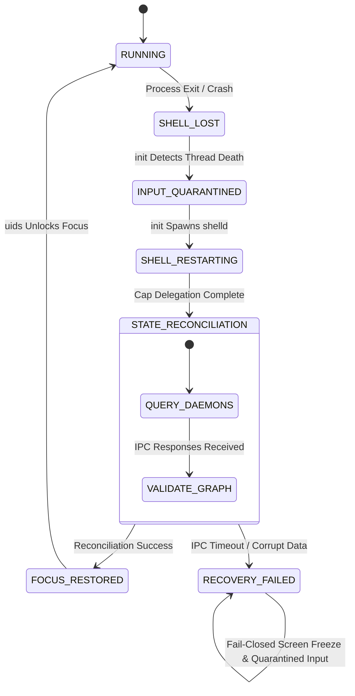

# Stage 6A Implementation Plan (Rev2)
## User Session Substrate & Human Operating Environment (`shelld`)

**Status**: 🟡 PROPOSED — PENDING REVIEW & AUTHORIZATION (CODE EXECUTION NOT AUTHORIZED)  
**Author**: ZeroOS Core Architecture Team  
**Date**: 2026-10-06  
**Authoritative Architectural Specification**: `STAGE6A-ARCHITECTURE-REV1.md` (Frozen)

---

## 1. Implementation Principles & Security Boundaries

```text
========================================================================================
STAGE 6A IMPLEMENTATION INVARIANTS
========================================================================================
1. STAGE 3 NUCLEUS PRESERVATION:
   Stage 3A–3N production kernel nucleus MUST remain 100% byte-identical (0 bytes modified in Ring 0).
   Stage 4/5 daemons retain frozen contracts with explicitly authorized integration updates.

2. INVARIANT I-SHELL-ORCHESTRATOR-NOT-AUTHORITY:
   shelld is strictly an orchestrator. It does not mint capabilities or bypass security rules.

3. INVARIANT I-SHELL-WORKSPACE-AUTH:
   Possession of SessionManagementCap alone does NOT authorize access to an arbitrary WorkspaceId.
   All workspace state transitions require explicit session membership validation by workspaced.

4. CAPABILITY-BACKED SURFACE POLICIES:
   surfaced validates actual Stage 3H CapabilityNode handles passed in IpcMessage descriptors,
   NEVER application-level boolean flags or token strings.

5. FAIL-CLOSED INPUT QUARANTINE:
   During shelld loss/restart, uids DISCARDS hardware input events (non-delivery) to prevent
   accidental keypress injection into application background tasks.
========================================================================================
```

---

## 2. Session State Authority & Lookup Architecture

```text
                                 ┌──────────────────┐
                                 │      shelld      │ (Sole Authoritative Owner of
                                 └────────┬─────────┘  SessionRecord State)
                                          │
                   IPC Membership Query   │ OP_SESSION_QUERY_WORKSPACE_MEMBERSHIP
                   (SessionId, WsId)      │ (Validated against SessionRecord)
                                          ▼
                                 ┌──────────────────┐
                                 │    workspaced    │ (Validates session membership
                                 └──────────────────┘  before executing state switch)
```

- **Authoritative Owner**: `shelld` is the **sole authoritative owner** of `SessionRecord` state. Daemons do **not** maintain duplicate session databases.
- **Session Lookup & Membership Validation**: When `workspaced` receives `OP_WORKSPACE_SET_STATE(target_ws, Active)`, it issues an IPC query `OP_SESSION_QUERY_WORKSPACE_MEMBERSHIP(session_id, target_ws)` to `shelld`.
- **Validation Check**: If `shelld` responds that `target_ws` is **not** an authorized member of `session_id`, `workspaced` rejects the transition with `ZeroError::PermissionDenied`.
- **Session Lifetime**: When a session terminates, `shelld` notifies `workspaced` via `OP_SESSION_DESTROY`, causing associated ephemeral workspace handles to quarantine.

---

## 3. Capability Definitions & Validation Contracts

### 3.1 `SystemSurfacePolicyCap` Kernel Capability Contract

```text
┌────────────────────────────────────────────────────────────────────────┐
│ Stage 3H CapabilityNode: SystemSurfacePolicyCap                        │
├────────────────────────────────────────────────────────────────────────┤
│ ObjectType:         ObjectType::ServiceRole (0x0008)                  │
│ Rights Mask:        RIGHT_CALL | RIGHT_DELEGATE (0x03)                 │
│ Lineage:            Root (0) ──→ init (1) ──→ shelld (PID 6)           │
│ Kernel Handle:      Passed via IpcMessage.handles[0]                   │
│ Surfaced Validation: Validates handle object type and rights mask against│
│                     kernel CapabilityNode table.                       │
└────────────────────────────────────────────────────────────────────────┘
```

When `surfaced` receives a surface registration request for layer $z \in [100 \dots 254]$:
1. `surfaced` dereferences the capability handle provided in `req.handles[0]`.
2. It verifies that `ObjectType == ObjectType::ServiceRole` and `(Rights & RIGHT_CALL) != 0`.
3. Requests lacking a valid Stage 3H capability handle are **demoted to $z=10$ or rejected** with `ZeroError::PermissionDenied`.

---

## 4. Input Quarantine & Recovery Fail-Closed Semantics

### 4.1 Input Quarantine Event Disposition (`INPUT_QUARANTINED`)

During `shelld` restart/quarantine:
- **Keyboard Events**: `uids` **discards** key press and key release events (non-delivery to application queues).
- **Pointer Events**: `uids` **discards** mouse button and movement events.
- **Trusted Auth Exception**: `authui` maintains an **independent trusted input channel** for active authorization transactions (`AuthorizationTransactionRef`), unaffected by `shelld` quarantine.

### 4.2 Crash Recovery State Machine with Terminal Failure Path



| Failure Mode | Action / Invariant |
|---|---|
| **Reconciliation Success** | `shelld` transitions to `FOCUS_RESTORED`. `uids` unlocks input isolation (`FOCUS_STATE_FOCUSED`). |
| **Reconciliation Failure (`RECOVERY_FAILED`)** | `shelld` enters `RECOVERY_FAILED` fail-closed terminal state. Screen remains frozen on last rendered frame, `uids` maintains input quarantine (`FOCUS_STATE_CAPTURED`), preventing system corruption. |

---

## 5. Phased Implementation Roadmap

```text
┌─────────────────────────────────────────────────────────────────────────┐
│                      STAGE 6A IMPLEMENTATION ROADMAP                    │
├─────────────────────────────────────────────────────────────────────────┤
│ Phase 6A.1: libzero/src/session.rs Abstractions & IPC Opcodes           │
│ Phase 6A.2: shelld Core Implementation & Recovery State Machine         │
│ Phase 6A.3: workspaced Session Membership Validation                    │
│ Phase 6A.4: surfaced System Surface Capability Enforcement             │
│ Phase 6A.5: uids Focus Isolation & Input Quarantine Non-Delivery        │
│ Phase 6A.6: init Supervisor Integration & Capability Delegation        │
│ Phase 6A.7: Stage 6A QEMU Machine Verification & Regression Suite       │
└─────────────────────────────────────────────────────────────────────────┘
```

---

## 6. Machine-Verifiable Acceptance Matrix (`6A-1` – `6A-26`)

All 26 gates require **concrete behavioral assertions** during QEMU machine execution (`tests/test_stage6a.py`):

```text
| Test ID | Behavioral Machine Assertion Contract                              | Explicit Verification Output Marker |
|---------|-------------------------------------------------------------------|--------------------------------------|
| 6A-1    | shelld startup and channel creation                               | [Test 6A-1: shelld Startup]: PASS    |
| 6A-2    | SessionManagementCap Stage 3H lineage validation                  | [Test 6A-2: Cap Lineage]: PASS       |
| 6A-3    | Authorized system surface registration at z=100                 | [Test 6A-3: System Surface]: PASS    |
| 6A-4    | Unprivileged surface layer demotion/rejection (z>=100 without cap)| [Test 6A-4: Layer Demotion]: PASS    |
| 6A-5    | Exclusive Auth Overlay z=255 reservation for authui                | [Test 6A-5: Auth Overlay Lock]: PASS |
| 6A-6    | Monotonic SessionId allocation                                     | [Test 6A-6: SessionId Sequence]: PASS|
| 6A-7    | User -> Session -> Workspace containment validation               | [Test 6A-7: Containment Match]: PASS |
| 6A-8    | Unauthorized workspace switch rejection by workspaced              | [Test 6A-8: Switch Rejection]: PASS  |
| 6A-9    | Authorized workspace activation dispatch                           | [Test 6A-9: Workspace Activate]: PASS|
| 6A-10   | Spatial viewport grid computation & surfaced dispatch              | [Test 6A-10: Viewport Grid]: PASS    |
| 6A-11   | Input focus routing coordination (shelld -> uids IPC)              | [Test 6A-11: Focus Routing]: PASS    |
| 6A-12   | Agent Activity Telemetry ingestion                                 | [Test 6A-12: Telemetry Ingest]: PASS |
| 6A-13   | Descriptive audit hash non-authority assertion                    | [Test 6A-13: Action Hash Audit]: PASS|
| 6A-14   | System top-bar & HUD spatial surface registration                  | [Test 6A-14: System HUD]: PASS       |
| 6A-15   | Workspace switch visual transition state machine                   | [Test 6A-15: Visual Transition]: PASS|
| 6A-16   | shelld crash detection & init supervisor recovery                 | [Test 6A-16: Shell Restart]: PASS    |
| 6A-17   | INPUT_QUARANTINED event non-delivery verification                   | [Test 6A-17: Input Quarantine]: PASS |
| 6A-18   | STATE_RECONCILIATION query graph reconstruction                    | [Test 6A-18: Graph Rebuild]: PASS    |
| 6A-19   | FOCUS_RESTORED input isolation unlock                              | [Test 6A-19: Focus Restored]: PASS   |
| 6A-20   | RECOVERY_FAILED terminal fail-closed state validation              | [Test 6A-20: Fail-Closed Recovery]: PASS|
| 6A-21   | Suspended workspace visual state quarantining                      | [Test 6A-21: Suspended Visual]: PASS |
| 6A-22   | Session lock screen state transition & input intercept            | [Test 6A-22: Session Lock]: PASS     |
| 6A-23   | Stage 4B Composition RAM Lease Compliance                          | [Test 6A-23: RAM Lease Bounds]: PASS |
| 6A-24   | Protocol robustness & invalid opcode handling (0x0801..0x0810)     | [Test 6A-24: Protocol Robustness]: PASS|
| 6A-25   | PMM Frame Neutrality (Baseline == Final Free Frames)               | [Test 6A-25: PMM Neutrality]: PASS   |
| 6A-26   | Stage 3A–3N Kernel Nucleus Byte-Identical Preservation             | [Test 6A-26: Substrate Preserved]: PASS|
```

---

## 7. Status & Authorization Request

```text
Stage 3A–3N Kernel Nucleus     🟢 FROZEN & VERIFIED (Byte-Identical)
Stage 4A–4F Core Services      🟢 FROZEN & VERIFIED
Stage 5 User Interaction       🟢 FROZEN & VERIFIED
Stage 6A Architecture Spec     🟢 FROZEN (REV1)
Stage 6A Implementation Plan   🟢 REVISED (REV2 - STAGE6A-IMPLEMENTATION.md)

Code Execution                 🛑 NOT AUTHORIZED (Awaiting Final Plan Authorization)
```

**Submitted for review and final implementation authorization.**  
Upon authorization, code execution will begin starting with **Phase 6A.1 (`libzero/src/session.rs`)**.
